{
 "cells": [
  {
   "cell_type": "markdown",
   "metadata": {},
   "source": [
    "# Term project(2021105563 강희주)\n",
    "\n",
    " **2020년도 한국 아티스트의 인기도 분석**"
   ]
  },
  {
   "cell_type": "markdown",
   "metadata": {},
   "source": [
    " # 1.주제 선정 이유 \n",
    " 인간의 삶에서 음악은 떼놓을 수 없는 존재이다. 나를 포함한 대부분의 사람들은 음악을 들으면서 휴식을 취하고 여가 시간을 보낸다.  \n",
    " 모든 음원 스트리밍 사이트에는 인기 차트가 있는데, 최근 들어 이 인기 차트가 많이 변질되어가고 있다.  \n",
    " 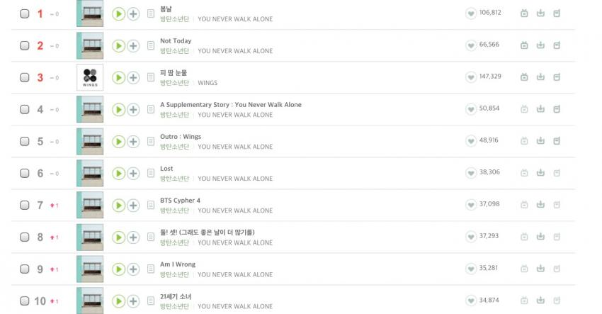\n",
    " \n",
    " 해당 사진은 방탄소년단 앨범이 발매되었을 당시, 인기차트가 방탄소년단의 곡들로 도배된 모습이다. 이는, 몇몇 팬들이 노래를 듣지 않고도 하루 종일 노래를 반복재생하여 인기차트 상단에 위치하게 된 것이다.  \n",
    " 이처럼, 나를 포함한 수많은 사람들은 이러한 몇몇 팬들 때문에 듣고 싶은 노래를 못 듣게 되는 경우가 종종 발생한다. 나는 이러한 인기차트의 문제점을 해결하고 싶어 좀 더 가중치를 부가한 인기 아티스트 차트를 만들어보고자 한다.  \n"
   ]
  },
  {
   "cell_type": "markdown",
   "metadata": {},
   "source": [
    "# 2. 주제 정의 \n",
    " 2020년 한국에서 가장 인기 있었던 아티스트들을 순위를 매겨서 국내 TOP 20아티스트를 선정해 볼 것이다.  \n",
    " 이를 위해 한국 인기차트에 언급된 횟수, 스트리밍 및 다운로드 수, 포털 사이트 검색량 등을 지표로 이용해 점수로 환산해 볼 것이다.\n"
   ]
  },
  {
   "cell_type": "markdown",
   "metadata": {},
   "source": [
    "# 3. 인터넷을 통한 데이터 획득 \n",
    "\n",
    " \n",
    "\n",
    "\n"
   ]
  },
  {
   "cell_type": "markdown",
   "metadata": {},
   "source": [
    "**1) Beautiful Soup을 활용한 벅스 차트 크롤링**  \n",
    "Url이 간편해서 사용하기 쉬운 벅스 차트를 활용하였고, 주간별로 1-40등까지 크롤링해보았다. 다음은 해당 코드이다. \n",
    "\n"
   ]
  },
  {
   "cell_type": "code",
   "execution_count": 2,
   "metadata": {},
   "outputs": [
    {
     "name": "stdout",
     "output_type": "stream",
     "text": [
      "날짜:  20200107\n",
      "1 Red Velvet (레드벨벳)\n",
      "2 윤하(Younha/ユンナ)\n",
      "3 창모(CHANGMO)\n",
      "4 윤하(Younha/ユンナ)\n",
      "5 pH-1\n",
      "6 백현(BAEKHYUN)\n",
      "7 아이유(IU)\n",
      "8 백예린 (Yerin Baek)\n",
      "9 마마무(Mamamoo)\n",
      "10 노을\n",
      "11 Idina Menzel(이디나 멘젤)\n",
      "12 장범준\n",
      "13 백지영\n",
      "14 아이유(IU)\n",
      "15 염따\n",
      "16 AKMU (악동뮤지션)\n",
      "17 창모(CHANGMO)\n",
      "18 다비치\n",
      "19 Maroon 5(마룬 파이브)\n",
      "20 윤하(Younha/ユンナ)\n",
      "21 에이오에이(AOA)\n",
      "22 염따\n",
      "23 윤미래\n",
      "24 윤하(Younha/ユンナ)\n",
      "25 아이유(IU)\n",
      "26 Idina Menzel(이디나 멘젤)\n",
      "27 (여자)아이들\n",
      "28 백예린 (Yerin Baek)\n",
      "29 폴킴(Paul Kim)\n",
      "30 윤하(Younha/ユンナ)\n",
      "31 방탄소년단\n",
      "32 마크툽(MAKTUB)\n",
      "33 염따\n",
      "34 Anne-Marie(앤 마리)\n",
      "35 태연 (TAEYEON)\n",
      "36 다비치\n",
      "37 Red Velvet (레드벨벳)\n",
      "38 폴킴(Paul Kim)\n",
      "39 유산슬\n",
      "40 TWICE (트와이스)\n",
      "날짜:  20200114\n",
      "1 지코\n",
      "2 Red Velvet (레드벨벳)\n",
      "3 백예린 (Yerin Baek)\n",
      "4 창모(CHANGMO)\n",
      "5 태연 (TAEYEON)\n",
      "6 pH-1\n",
      "7 아이유(IU)\n",
      "8 볼빨간사춘기\n",
      "9 백예린 (Yerin Baek)\n",
      "10 윤하(Younha/ユンナ)\n",
      "11 백현(BAEKHYUN)\n",
      "12 마마무(Mamamoo)\n",
      "13 방탄소년단\n",
      "14 태연 (TAEYEON)\n",
      "15 장범준\n",
      "16 노을\n",
      "17 윤하(Younha/ユンナ)\n",
      "18 아이유(IU)\n",
      "19 태연 (TAEYEON)\n",
      "20 Idina Menzel(이디나 멘젤)\n",
      "21 AKMU (악동뮤지션)\n",
      "22 Maroon 5(마룬 파이브)\n",
      "23 염따\n",
      "24 백지영\n",
      "25 창모(CHANGMO)\n",
      "26 방탄소년단\n",
      "27 다비치\n",
      "28 윤미래\n",
      "29 거미\n",
      "30 DAY6 (데이식스)\n",
      "31 폴킴(Paul Kim)\n",
      "32 아이유(IU)\n",
      "33 마크툽(MAKTUB)\n",
      "34 다비치\n",
      "35 (여자)아이들\n",
      "36 에이오에이(AOA)\n",
      "37 Anne-Marie(앤 마리)\n",
      "38 폴킴(Paul Kim)\n",
      "39 Idina Menzel(이디나 멘젤)\n",
      "40 태연 (TAEYEON)\n",
      "날짜:  20200121\n",
      "1 지코\n",
      "2 Red Velvet (레드벨벳)\n",
      "3 창모(CHANGMO)\n",
      "4 백예린 (Yerin Baek)\n",
      "5 폴킴(Paul Kim)\n",
      "6 아이유(IU)\n",
      "7 태연 (TAEYEON)\n",
      "8 pH-1\n",
      "9 백예린 (Yerin Baek)\n",
      "10 마마무(Mamamoo)\n",
      "11 볼빨간사춘기\n",
      "12 방탄소년단\n",
      "13 장범준\n",
      "14 노을\n",
      "15 백현(BAEKHYUN)\n",
      "16 Maroon 5(마룬 파이브)\n",
      "17 윤하(Younha/ユンナ)\n",
      "18 AKMU (악동뮤지션)\n",
      "19 아이유(IU)\n",
      "20 Idina Menzel(이디나 멘젤)\n",
      "21 태연 (TAEYEON)\n",
      "22 창모(CHANGMO)\n",
      "23 염따\n",
      "24 윤하(Younha/ユンナ)\n",
      "25 윤미래\n",
      "26 다비치\n",
      "27 백지영\n",
      "28 방탄소년단\n",
      "29 Anne-Marie(앤 마리)\n",
      "30 폴킴(Paul Kim)\n",
      "31 프리스타일(Free Style)\n",
      "32 Lauv(라우브)\n",
      "33 마크툽(MAKTUB)\n",
      "34 솔라 (마마무)\n",
      "35 (여자)아이들\n",
      "36 다비치\n",
      "37 폴킴(Paul Kim)\n",
      "38 김재환\n",
      "39 찬열 (CHANYEOL)\n",
      "40 아이유(IU)\n",
      "날짜:  20200128\n",
      "1 지코\n",
      "2 Red Velvet (레드벨벳)\n",
      "3 창모(CHANGMO)\n",
      "4 아이유(IU)\n",
      "5 백예린 (Yerin Baek)\n",
      "6 폴킴(Paul Kim)\n",
      "7 pH-1\n",
      "8 백예린 (Yerin Baek)\n",
      "9 태연 (TAEYEON)\n",
      "10 마마무(Mamamoo)\n",
      "11 이해리\n",
      "12 장범준\n",
      "13 방탄소년단\n",
      "14 볼빨간사춘기\n",
      "15 노을\n",
      "16 백현(BAEKHYUN)\n",
      "17 Maroon 5(마룬 파이브)\n",
      "18 AKMU (악동뮤지션)\n",
      "19 아이유(IU)\n",
      "20 윤하(Younha/ユンナ)\n",
      "21 Idina Menzel(이디나 멘젤)\n",
      "22 창모(CHANGMO)\n",
      "23 윤미래\n",
      "24 Lauv(라우브)\n",
      "25 방탄소년단\n",
      "26 Billie Eilish(빌리 아일리시)\n",
      "27 다비치\n",
      "28 염따\n",
      "29 백지영\n",
      "30 윤하(Younha/ユンナ)\n",
      "31 Anne-Marie(앤 마리)\n",
      "32 마크툽(MAKTUB)\n",
      "33 폴킴(Paul Kim)\n",
      "34 Arizona Zervas\n",
      "35 태연 (TAEYEON)\n",
      "36 New Hope Club(뉴 호프 클럽)\n",
      "37 폴킴(Paul Kim)\n",
      "38 (여자)아이들\n",
      "39 다비치\n",
      "40 태연 (TAEYEON)\n",
      "날짜:  20200204\n",
      "1 지코\n",
      "2 Red Velvet (레드벨벳)\n",
      "3 여자친구(GFRIEND)\n",
      "4 문별(마마무)\n",
      "5 창모(CHANGMO)\n",
      "6 백예린 (Yerin Baek)\n",
      "7 아이유(IU)\n",
      "8 선미\n",
      "9 에이트(8Eight)\n",
      "10 김세정\n",
      "11 백예린 (Yerin Baek)\n",
      "12 장범준\n",
      "13 마마무(Mamamoo)\n",
      "14 pH-1\n",
      "15 폴킴(Paul Kim)\n",
      "16 노을\n",
      "17 Maroon 5(마룬 파이브)\n",
      "18 태연 (TAEYEON)\n",
      "19 방탄소년단\n",
      "20 백현(BAEKHYUN)\n",
      "21 AKMU (악동뮤지션)\n",
      "22 Lauv(라우브)\n",
      "23 아이유(IU)\n",
      "24 볼빨간사춘기\n",
      "25 여자친구(GFRIEND)\n",
      "26 이해리\n",
      "27 iKON\n",
      "28 거미\n",
      "29 Arizona Zervas\n",
      "30 윤미래\n",
      "31 창모(CHANGMO)\n",
      "32 Idina Menzel(이디나 멘젤)\n",
      "33 New Hope Club(뉴 호프 클럽)\n",
      "34 윤하(Younha/ユンナ)\n",
      "35 Anne-Marie(앤 마리)\n",
      "36 마크툽(MAKTUB)\n",
      "37 방탄소년단\n",
      "38 Dua Lipa(두아 리파)\n",
      "39 Billie Eilish(빌리 아일리시)\n",
      "40 폴킴(Paul Kim)\n",
      "날짜:  20200211\n",
      "1 Anne-Marie(앤 마리)\n",
      "2 지코\n",
      "3 Crush\n",
      "4 Red Velvet (레드벨벳)\n",
      "5 에이트(8Eight)\n",
      "6 창모(CHANGMO)\n",
      "7 아이유(IU)\n",
      "8 백예린 (Yerin Baek)\n",
      "9 아이유(IU)\n",
      "10 문별(마마무)\n",
      "11 선미\n",
      "12 여자친구(GFRIEND)\n",
      "13 백예린 (Yerin Baek)\n",
      "14 장범준\n",
      "15 Maroon 5(마룬 파이브)\n",
      "16 마마무(Mamamoo)\n",
      "17 Lauv(라우브)\n",
      "18 김세정\n",
      "19 노을\n",
      "20 pH-1\n",
      "21 가호(Gaho)\n",
      "22 폴킴(Paul Kim)\n",
      "23 거미\n",
      "24 백현(BAEKHYUN)\n",
      "25 AKMU (악동뮤지션)\n",
      "26 아이유(IU)\n",
      "27 태연 (TAEYEON)\n",
      "28 방탄소년단\n",
      "29 Arizona Zervas\n",
      "30 윤미래\n",
      "31 Anne-Marie(앤 마리)\n",
      "32 Dua Lipa(두아 리파)\n",
      "33 볼빨간사춘기\n",
      "34 iKON\n",
      "35 New Hope Club(뉴 호프 클럽)\n",
      "36 마크툽(MAKTUB)\n",
      "37 창모(CHANGMO)\n",
      "38 송가인\n",
      "39 Idina Menzel(이디나 멘젤)\n",
      "40 방탄소년단\n",
      "날짜:  20200218\n",
      "1 아이유(IU)\n",
      "2 IZ*ONE(아이즈원)\n",
      "3 지코\n",
      "4 Anne-Marie(앤 마리)\n",
      "5 김필(Kim Feel)\n",
      "6 방탄소년단\n",
      "7 Red Velvet (레드벨벳)\n",
      "8 Crush\n",
      "9 창모(CHANGMO)\n",
      "10 백예린 (Yerin Baek)\n",
      "11 아이유(IU)\n",
      "12 가호(Gaho)\n",
      "13 에이트(8Eight)\n",
      "14 장범준\n",
      "15 방탄소년단\n",
      "16 백예린 (Yerin Baek)\n",
      "17 Maroon 5(마룬 파이브)\n",
      "18 마마무(Mamamoo)\n",
      "19 방탄소년단\n",
      "20 노을\n",
      "21 여자친구(GFRIEND)\n",
      "22 방탄소년단\n",
      "23 pH-1\n",
      "24 방탄소년단\n",
      "25 김세정\n",
      "26 Lauv(라우브)\n",
      "27 문별(마마무)\n",
      "28 AKMU (악동뮤지션)\n",
      "29 아이유(IU)\n",
      "30 윤미래\n",
      "31 선미\n",
      "32 백현(BAEKHYUN)\n",
      "33 방탄소년단\n",
      "34 방탄소년단\n",
      "35 Dua Lipa(두아 리파)\n",
      "36 거미\n",
      "37 Anne-Marie(앤 마리)\n",
      "38 Arizona Zervas\n",
      "39 김재환\n",
      "40 다비치\n",
      "날짜:  20200225\n",
      "1 개코\n",
      "2 IZ*ONE(아이즈원)\n",
      "3 아이유(IU)\n",
      "4 방탄소년단\n",
      "5 지코\n",
      "6 Anne-Marie(앤 마리)\n",
      "7 김필(Kim Feel)\n",
      "8 씨야(SeeYa)\n",
      "9 Red Velvet (레드벨벳)\n",
      "10 창모(CHANGMO)\n",
      "11 가호(Gaho)\n",
      "12 아이유(IU)\n",
      "13 방탄소년단\n",
      "14 백예린 (Yerin Baek)\n",
      "15 Crush\n",
      "16 장범준\n",
      "17 백예린 (Yerin Baek)\n",
      "18 방탄소년단\n",
      "19 청하\n",
      "20 Maroon 5(마룬 파이브)\n",
      "21 노을\n",
      "22 마마무(Mamamoo)\n",
      "23 씨야(SeeYa)\n",
      "24 에이트(8Eight)\n",
      "25 창모(CHANGMO)\n",
      "26 Dua Lipa(두아 리파)\n",
      "27 방탄소년단\n",
      "28 AKMU (악동뮤지션)\n",
      "29 씨야(SeeYa)\n",
      "30 백현(BAEKHYUN)\n",
      "31 pH-1\n",
      "32 아이유(IU)\n",
      "33 Lauv(라우브)\n",
      "34 방탄소년단\n",
      "35 방탄소년단\n",
      "36 거미\n",
      "37 백현(BAEKHYUN)\n",
      "38 Anne-Marie(앤 마리)\n",
      "39 여자친구(GFRIEND)\n",
      "40 Arizona Zervas\n",
      "날짜:  20200304\n",
      "1 IZ*ONE(아이즈원)\n",
      "2 아이유(IU)\n",
      "3 방탄소년단\n",
      "4 지코\n",
      "5 청하\n",
      "6 가호(Gaho)\n",
      "7 개코\n",
      "8 김필(Kim Feel)\n",
      "9 창모(CHANGMO)\n",
      "10 Red Velvet (레드벨벳)\n",
      "11 Anne-Marie(앤 마리)\n",
      "12 아이유(IU)\n",
      "13 하현우(국카스텐)\n",
      "14 씨야(SeeYa)\n",
      "15 장범준\n",
      "16 백예린 (Yerin Baek)\n",
      "17 오반 (OVAN)\n",
      "18 백예린 (Yerin Baek)\n",
      "19 Conan Gray\n",
      "20 Crush\n",
      "21 Maroon 5(마룬 파이브)\n",
      "22 노을\n",
      "23 백현(BAEKHYUN)\n",
      "24 방탄소년단\n",
      "25 마마무(Mamamoo)\n",
      "26 Sam Smith(샘 스미스)\n",
      "27 Dua Lipa(두아 리파)\n",
      "28 AKMU (악동뮤지션)\n",
      "29 아이유(IU)\n",
      "30 백현(BAEKHYUN)\n",
      "31 NCT 127\n",
      "32 pH-1\n",
      "33 Lauv(라우브)\n",
      "34 Ruel(루엘)\n",
      "35 방탄소년단\n",
      "36 에이트(8Eight)\n",
      "37 Anne-Marie(앤 마리)\n",
      "38 씨야(SeeYa)\n",
      "39 진민호\n",
      "40 Arizona Zervas\n",
      "날짜:  20200311\n",
      "1 ITZY (있지)\n",
      "2 하현우(국카스텐)\n",
      "3 가호(Gaho)\n",
      "4 오반 (OVAN)\n",
      "5 IZ*ONE(아이즈원)\n",
      "6 지코\n",
      "7 아이유(IU)\n",
      "8 김필(Kim Feel)\n",
      "9 방탄소년단\n",
      "10 노을\n",
      "11 창모(CHANGMO)\n",
      "12 아이유(IU)\n",
      "13 Red Velvet (레드벨벳)\n",
      "14 개코\n",
      "15 장범준\n",
      "16 Anne-Marie(앤 마리)\n",
      "17 Sam Smith(샘 스미스)\n",
      "18 청하\n",
      "19 씨야(SeeYa)\n",
      "20 Conan Gray\n",
      "21 백예린 (Yerin Baek)\n",
      "22 백예린 (Yerin Baek)\n",
      "23 NCT 127\n",
      "24 Maroon 5(마룬 파이브)\n",
      "25 마마무(Mamamoo)\n",
      "26 노을\n",
      "27 V\n",
      "28 Dua Lipa(두아 리파)\n",
      "29 Crush\n",
      "30 AKMU (악동뮤지션)\n",
      "31 영탁\n",
      "32 아이유(IU)\n",
      "33 진민호\n",
      "34 Anne-Marie(앤 마리)\n",
      "35 Ruel(루엘)\n",
      "36 방탄소년단\n",
      "37 pH-1\n",
      "38 마크툽(MAKTUB)\n",
      "39 백현(BAEKHYUN)\n",
      "40 Lauv(라우브)\n",
      "날짜:  20200318\n",
      "1 ITZY (있지)\n",
      "2 가호(Gaho)\n",
      "3 Dua Lipa(두아 리파)\n",
      "4 하현우(국카스텐)\n",
      "5 오반 (OVAN)\n",
      "6 조이 (JOY)\n",
      "7 지코\n",
      "8 장범준\n",
      "9 IZ*ONE(아이즈원)\n",
      "10 김필(Kim Feel)\n",
      "11 노을\n",
      "12 아이유(IU)\n",
      "13 김세정\n",
      "14 Sam Smith(샘 스미스)\n",
      "15 박경\n",
      "16 방탄소년단\n",
      "17 창모(CHANGMO)\n",
      "18 아이유(IU)\n",
      "19 Red Velvet (레드벨벳)\n",
      "20 Anne-Marie(앤 마리)\n",
      "21 영탁\n",
      "22 Conan Gray\n",
      "23 백예린 (Yerin Baek)\n",
      "24 개코\n",
      "25 마마무(Mamamoo)\n",
      "26 Maroon 5(마룬 파이브)\n",
      "27 씨야(SeeYa)\n",
      "28 노을\n",
      "29 Dua Lipa(두아 리파)\n",
      "30 백예린 (Yerin Baek)\n",
      "31 NCT 127\n",
      "32 청하\n",
      "33 영탁\n",
      "34 AKMU (악동뮤지션)\n",
      "35 V\n",
      "36 Anne-Marie(앤 마리)\n",
      "37 진민호\n",
      "38 아이유(IU)\n",
      "39 Ruel(루엘)\n",
      "40 Crush\n",
      "날짜:  20200325\n",
      "1 조이 (JOY)\n",
      "2 가호(Gaho)\n",
      "3 엠씨더맥스 (M.C the MAX)\n",
      "4 ITZY (있지)\n",
      "5 장범준\n",
      "6 조정석\n",
      "7 하현우(국카스텐)\n",
      "8 Dua Lipa(두아 리파)\n",
      "9 지코\n",
      "10 김필(Kim Feel)\n",
      "11 WINNER\n",
      "12 IZ*ONE(아이즈원)\n",
      "13 오반 (OVAN)\n",
      "14 아이유(IU)\n",
      "15 Sam Smith(샘 스미스)\n",
      "16 아이유(IU)\n",
      "17 창모(CHANGMO)\n",
      "18 Red Velvet (레드벨벳)\n",
      "19 방탄소년단\n",
      "20 노을\n",
      "21 Anne-Marie(앤 마리)\n",
      "22 Conan Gray\n",
      "23 백예린 (Yerin Baek)\n",
      "24 Dua Lipa(두아 리파)\n",
      "25 박경\n",
      "26 Maroon 5(마룬 파이브)\n",
      "27 노을\n",
      "28 마마무(Mamamoo)\n",
      "29 김세정\n",
      "30 개코\n",
      "31 백예린 (Yerin Baek)\n",
      "32 영탁\n",
      "33 씨야(SeeYa)\n",
      "34 Anne-Marie(앤 마리)\n",
      "35 AKMU (악동뮤지션)\n",
      "36 버스커 버스커(Busker Busker)\n",
      "37 권진아\n",
      "38 아이유(IU)\n",
      "39 NCT 127\n",
      "40 Ruel(루엘)\n",
      "날짜:  20200401\n",
      "1 조정석\n",
      "2 조이 (JOY)\n",
      "3 가호(Gaho)\n",
      "4 ITZY (있지)\n",
      "5 엠씨더맥스 (M.C the MAX)\n",
      "6 장범준\n",
      "7 하현우(국카스텐)\n",
      "8 지코\n",
      "9 김필(Kim Feel)\n",
      "10 WINNER\n",
      "11 Dua Lipa(두아 리파)\n",
      "12 아이유(IU)\n",
      "13 IZ*ONE(아이즈원)\n",
      "14 권진아\n",
      "15 아이유(IU)\n",
      "16 오반 (OVAN)\n",
      "17 창모(CHANGMO)\n",
      "18 Sam Smith(샘 스미스)\n",
      "19 Red Velvet (레드벨벳)\n",
      "20 Anne-Marie(앤 마리)\n",
      "21 버스커 버스커(Busker Busker)\n",
      "22 임영웅\n",
      "23 Dua Lipa(두아 리파)\n",
      "24 방탄소년단\n",
      "25 규현 (KYUHYUN)\n",
      "26 Conan Gray\n",
      "27 백예린 (Yerin Baek)\n",
      "28 노을\n",
      "29 수호 (SUHO)\n",
      "30 Maroon 5(마룬 파이브)\n",
      "31 노을\n",
      "32 마마무(Mamamoo)\n",
      "33 AKMU (악동뮤지션)\n",
      "34 Anne-Marie(앤 마리)\n",
      "35 HYNN(박혜원)\n",
      "36 유산슬\n",
      "37 백예린 (Yerin Baek)\n",
      "38 잔나비\n",
      "39 씨야(SeeYa)\n",
      "40 영탁\n",
      "날짜:  20200408\n",
      "1 (여자)아이들\n",
      "2 조정석\n",
      "3 조이 (JOY)\n",
      "4 가호(Gaho)\n",
      "5 ITZY (있지)\n",
      "6 엠씨더맥스 (M.C the MAX)\n",
      "7 장범준\n",
      "8 하현우(국카스텐)\n",
      "9 어반자카파\n",
      "10 규현 (KYUHYUN)\n",
      "11 권진아\n",
      "12 지코\n",
      "13 아이유(IU)\n",
      "14 김필(Kim Feel)\n",
      "15 WINNER\n",
      "16 IZ*ONE(아이즈원)\n",
      "17 임영웅\n",
      "18 아이유(IU)\n",
      "19 Dua Lipa(두아 리파)\n",
      "20 Sam Smith(샘 스미스)\n",
      "21 창모(CHANGMO)\n",
      "22 WINNER\n",
      "23 오반 (OVAN)\n",
      "24 Red Velvet (레드벨벳)\n",
      "25 Dua Lipa(두아 리파)\n",
      "26 Anne-Marie(앤 마리)\n",
      "27 Conan Gray\n",
      "28 백예린 (Yerin Baek)\n",
      "29 방탄소년단\n",
      "30 MC몽\n",
      "31 Maroon 5(마룬 파이브)\n",
      "32 Tones And I\n",
      "33 버스커 버스커(Busker Busker)\n",
      "34 (여자)아이들\n",
      "35 노을\n",
      "36 Etham\n",
      "37 마마무(Mamamoo)\n",
      "38 Anne-Marie(앤 마리)\n",
      "39 노을\n",
      "40 AKMU (악동뮤지션)\n",
      "날짜:  20200415\n",
      "1 Apink (에이핑크)\n",
      "2 조정석\n",
      "3 어반자카파\n",
      "4 조이 (JOY)\n",
      "5 (여자)아이들\n",
      "6 ITZY (있지)\n",
      "7 가호(Gaho)\n",
      "8 장범준\n",
      "9 엠씨더맥스 (M.C the MAX)\n",
      "10 곽진언\n",
      "11 권진아\n",
      "12 하현우(국카스텐)\n",
      "13 지코\n",
      "14 규현 (KYUHYUN)\n",
      "15 아이유(IU)\n",
      "16 김필(Kim Feel)\n",
      "17 Dua Lipa(두아 리파)\n",
      "18 IZ*ONE(아이즈원)\n",
      "19 창모(CHANGMO)\n",
      "20 MC몽\n",
      "21 Tones And I\n",
      "22 아이유(IU)\n",
      "23 Red Velvet (레드벨벳)\n",
      "24 오반 (OVAN)\n",
      "25 Dua Lipa(두아 리파)\n",
      "26 Sam Smith(샘 스미스)\n",
      "27 WINNER\n",
      "28 백예린 (Yerin Baek)\n",
      "29 임영웅\n",
      "30 Anne-Marie(앤 마리)\n",
      "31 Conan Gray\n",
      "32 Maroon 5(마룬 파이브)\n",
      "33 WINNER\n",
      "34 방탄소년단\n",
      "35 Etham\n",
      "36 노을\n",
      "37 Anne-Marie(앤 마리)\n",
      "38 영탁\n",
      "39 마마무(Mamamoo)\n",
      "40 AKMU (악동뮤지션)\n",
      "날짜:  20200422\n",
      "1 조정석\n",
      "2 Apink (에이핑크)\n",
      "3 폴킴(Paul Kim)\n",
      "4 에이프릴(APRIL)\n",
      "5 조이 (JOY)\n",
      "6 곽진언\n",
      "7 어반자카파\n",
      "8 ITZY (있지)\n",
      "9 (여자)아이들\n",
      "10 가호(Gaho)\n",
      "11 장범준\n",
      "12 펭수\n",
      "13 엠씨더맥스 (M.C the MAX)\n",
      "14 권진아\n",
      "15 규현 (KYUHYUN)\n",
      "16 아이유(IU)\n",
      "17 하현우(국카스텐)\n",
      "18 지코\n",
      "19 Dua Lipa(두아 리파)\n",
      "20 창모(CHANGMO)\n",
      "21 솔라 (마마무)\n",
      "22 Red Velvet (레드벨벳)\n",
      "23 Tones And I\n",
      "24 IZ*ONE(아이즈원)\n",
      "25 김필(Kim Feel)\n",
      "26 아이유(IU)\n",
      "27 오반 (OVAN)\n",
      "28 Conan Gray\n",
      "29 Dua Lipa(두아 리파)\n",
      "30 Sam Smith(샘 스미스)\n",
      "31 Maroon 5(마룬 파이브)\n",
      "32 백예린 (Yerin Baek)\n",
      "33 Anne-Marie(앤 마리)\n",
      "34 Etham\n",
      "35 Anne-Marie(앤 마리)\n",
      "36 임영웅\n",
      "37 노을\n",
      "38 폴킴(Paul Kim)\n",
      "39 GOT7 (갓세븐)\n",
      "40 방탄소년단\n",
      "날짜:  20200429\n"
     ]
    },
    {
     "name": "stdout",
     "output_type": "stream",
     "text": [
      "1 오마이걸(OH MY GIRL)\n",
      "2 청하\n",
      "3 조정석\n",
      "4 에이프릴(APRIL)\n",
      "5 Apink (에이핑크)\n",
      "6 오마이걸(OH MY GIRL)\n",
      "7 조이 (JOY)\n",
      "8 폴킴(Paul Kim)\n",
      "9 어반자카파\n",
      "10 장범준\n",
      "11 가호(Gaho)\n",
      "12 ITZY (있지)\n",
      "13 벤\n",
      "14 곽진언\n",
      "15 휘인(Whee In)\n",
      "16 (여자)아이들\n",
      "17 아이유(IU)\n",
      "18 규현 (KYUHYUN)\n",
      "19 권진아\n",
      "20 엠씨더맥스 (M.C the MAX)\n",
      "21 지코\n",
      "22 하현우(국카스텐)\n",
      "23 창모(CHANGMO)\n",
      "24 Dua Lipa(두아 리파)\n",
      "25 솔라 (마마무)\n",
      "26 Tones And I\n",
      "27 Red Velvet (레드벨벳)\n",
      "28 Conan Gray\n",
      "29 Maroon 5(마룬 파이브)\n",
      "30 IZ*ONE(아이즈원)\n",
      "31 김필(Kim Feel)\n",
      "32 아이유(IU)\n",
      "33 오반 (OVAN)\n",
      "34 백예린 (Yerin Baek)\n",
      "35 Sam Smith(샘 스미스)\n",
      "36 Anne-Marie(앤 마리)\n",
      "37 NCT DREAM\n",
      "38 제이레빗(J Rabbit)\n",
      "39 Dua Lipa(두아 리파)\n",
      "40 Anne-Marie(앤 마리)\n",
      "날짜:  20200506\n",
      "1 아이유(IU)\n",
      "2 태연 (TAEYEON)\n",
      "3 오마이걸(OH MY GIRL)\n",
      "4 오마이걸(OH MY GIRL)\n",
      "5 볼빨간사춘기\n",
      "6 조정석\n",
      "7 에이프릴(APRIL)\n",
      "8 Apink (에이핑크)\n",
      "9 휘인(Whee In)\n",
      "10 청하\n",
      "11 조이 (JOY)\n",
      "12 어반자카파\n",
      "13 장범준\n",
      "14 ITZY (있지)\n",
      "15 가호(Gaho)\n",
      "16 아이유(IU)\n",
      "17 폴킴(Paul Kim)\n",
      "18 규현 (KYUHYUN)\n",
      "19 곽진언\n",
      "20 권진아\n",
      "21 (여자)아이들\n",
      "22 지코\n",
      "23 Dua Lipa(두아 리파)\n",
      "24 창모(CHANGMO)\n",
      "25 엠씨더맥스 (M.C the MAX)\n",
      "26 성시경\n",
      "27 Conan Gray\n",
      "28 Tones And I\n",
      "29 Red Velvet (레드벨벳)\n",
      "30 하현우(국카스텐)\n",
      "31 Maroon 5(마룬 파이브)\n",
      "32 IZ*ONE(아이즈원)\n",
      "33 오반 (OVAN)\n",
      "34 아이유(IU)\n",
      "35 벤\n",
      "36 김필(Kim Feel)\n",
      "37 백예린 (Yerin Baek)\n",
      "38 Anne-Marie(앤 마리)\n",
      "39 Sam Smith(샘 스미스)\n",
      "40 Anne-Marie(앤 마리)\n",
      "날짜:  20200513\n",
      "1 아이유(IU)\n",
      "2 볼빨간사춘기\n",
      "3 오마이걸(OH MY GIRL)\n",
      "4 DAY6 (데이식스)\n",
      "5 볼빨간사춘기\n",
      "6 오마이걸(OH MY GIRL)\n",
      "7 조정석\n",
      "8 태연 (TAEYEON)\n",
      "9 뉴이스트\n",
      "10 에이프릴(APRIL)\n",
      "11 DAY6 (데이식스)\n",
      "12 조이 (JOY)\n",
      "13 Apink (에이핑크)\n",
      "14 휘인(Whee In)\n",
      "15 미도와 파라솔\n",
      "16 어반자카파\n",
      "17 청하\n",
      "18 규현 (KYUHYUN)\n",
      "19 장범준\n",
      "20 ITZY (있지)\n",
      "21 가호(Gaho)\n",
      "22 아이유(IU)\n",
      "23 DAY6 (데이식스)\n",
      "24 Ariana Grande(아리아나 그란데)\n",
      "25 볼빨간사춘기\n",
      "26 권진아\n",
      "27 곽진언\n",
      "28 Dua Lipa(두아 리파)\n",
      "29 폴킴(Paul Kim)\n",
      "30 Tones And I\n",
      "31 Red Velvet (레드벨벳)\n",
      "32 지코\n",
      "33 Maroon 5(마룬 파이브)\n",
      "34 DAY6 (데이식스)\n",
      "35 창모(CHANGMO)\n",
      "36 Conan Gray\n",
      "37 엠씨더맥스 (M.C the MAX)\n",
      "38 (여자)아이들\n",
      "39 하현우(국카스텐)\n",
      "40 DAY6 (데이식스)\n",
      "날짜:  20200520\n",
      "1 아이유(IU)\n",
      "2 오마이걸(OH MY GIRL)\n",
      "3 볼빨간사춘기\n",
      "4 전미도\n",
      "5 조정석\n",
      "6 Crush\n",
      "7 볼빨간사춘기\n",
      "8 오마이걸(OH MY GIRL)\n",
      "9 미도와 파라솔\n",
      "10 DAY6 (데이식스)\n",
      "11 태연 (TAEYEON)\n",
      "12 조이 (JOY)\n",
      "13 규현 (KYUHYUN)\n",
      "14 에이프릴(APRIL)\n",
      "15 어반자카파\n",
      "16 뉴이스트\n",
      "17 휘인(Whee In)\n",
      "18 Apink (에이핑크)\n",
      "19 장범준\n",
      "20 Ariana Grande(아리아나 그란데)\n",
      "21 아이유(IU)\n",
      "22 청하\n",
      "23 신효범\n",
      "24 가호(Gaho)\n",
      "25 ITZY (있지)\n",
      "26 권진아\n",
      "27 DAY6 (데이식스)\n",
      "28 Red Velvet (레드벨벳)\n",
      "29 곽진언\n",
      "30 Dua Lipa(두아 리파)\n",
      "31 Maroon 5(마룬 파이브)\n",
      "32 Tones And I\n",
      "33 지코\n",
      "34 창모(CHANGMO)\n",
      "35 볼빨간사춘기\n",
      "36 Conan Gray\n",
      "37 엠씨더맥스 (M.C the MAX)\n",
      "38 Lizzo\n",
      "39 제이레빗(J Rabbit)\n",
      "40 폴킴(Paul Kim)\n",
      "날짜:  20200527\n",
      "1 전미도\n",
      "2 아이유(IU)\n",
      "3 조정석\n",
      "4 오마이걸(OH MY GIRL)\n",
      "5 미도와 파라솔\n",
      "6 오마이걸(OH MY GIRL)\n",
      "7 볼빨간사춘기\n",
      "8 미도와 파라솔\n",
      "9 볼빨간사춘기\n",
      "10 규현 (KYUHYUN)\n",
      "11 조이 (JOY)\n",
      "12 Crush\n",
      "13 백현(BAEKHYUN)\n",
      "14 어반자카파\n",
      "15 휘인(Whee In)\n",
      "16 태연 (TAEYEON)\n",
      "17 로이킴\n",
      "18 펀치 (Punch)\n",
      "19 DAY6 (데이식스)\n",
      "20 에이프릴(APRIL)\n",
      "21 장범준\n",
      "22 아이유(IU)\n",
      "23 Apink (에이핑크)\n",
      "24 Ariana Grande(아리아나 그란데)\n",
      "25 권진아\n",
      "26 가호(Gaho)\n",
      "27 곽진언\n",
      "28 ITZY (있지)\n",
      "29 Dua Lipa(두아 리파)\n",
      "30 Tones And I\n",
      "31 청하\n",
      "32 Maroon 5(마룬 파이브)\n",
      "33 Red Velvet (레드벨벳)\n",
      "34 신효범\n",
      "35 Lizzo\n",
      "36 백현(BAEKHYUN)\n",
      "37 창모(CHANGMO)\n",
      "38 지코\n",
      "39 Conan Gray\n",
      "40 제이레빗(J Rabbit)\n",
      "날짜:  20200603\n",
      "1 TWICE (트와이스)\n",
      "2 미도와 파라솔\n",
      "3 전미도\n",
      "4 아이유(IU)\n",
      "5 조정석\n",
      "6 오마이걸(OH MY GIRL)\n",
      "7 식케이 (Sik-K)\n",
      "8 오마이걸(OH MY GIRL)\n",
      "9 미도와 파라솔\n",
      "10 볼빨간사춘기\n",
      "11 조이 (JOY)\n",
      "12 볼빨간사춘기\n",
      "13 규현 (KYUHYUN)\n",
      "14 어반자카파\n",
      "15 휘인(Whee In)\n",
      "16 에이프릴(APRIL)\n",
      "17 장범준\n",
      "18 Crush\n",
      "19 아이유(IU)\n",
      "20 태연 (TAEYEON)\n",
      "21 DAY6 (데이식스)\n",
      "22 Dua Lipa(두아 리파)\n",
      "23 펀치 (Punch)\n",
      "24 Maroon 5(마룬 파이브)\n",
      "25 권진아\n",
      "26 Apink (에이핑크)\n",
      "27 가호(Gaho)\n",
      "28 Ariana Grande(아리아나 그란데)\n",
      "29 비\n",
      "30 Tones And I\n",
      "31 곽진언\n",
      "32 ITZY (있지)\n",
      "33 Lizzo\n",
      "34 백현(BAEKHYUN)\n",
      "35 로이킴\n",
      "36 지코\n",
      "37 창모(CHANGMO)\n",
      "38 Red Velvet (레드벨벳)\n",
      "39 Conan Gray\n",
      "40 오반 (OVAN)\n",
      "날짜:  20200610\n",
      "1 TWICE (트와이스)\n",
      "2 아이유(IU)\n",
      "3 전미도\n",
      "4 헤이즈(Heize)\n",
      "5 조정석\n",
      "6 오마이걸(OH MY GIRL)\n",
      "7 미도와 파라솔\n",
      "8 식케이 (Sik-K)\n",
      "9 오마이걸(OH MY GIRL)\n",
      "10 헤이즈(Heize)\n",
      "11 볼빨간사춘기\n",
      "12 미도와 파라솔\n",
      "13 청하\n",
      "14 조이 (JOY)\n",
      "15 볼빨간사춘기\n",
      "16 규현 (KYUHYUN)\n",
      "17 어반자카파\n",
      "18 아이유(IU)\n",
      "19 에이프릴(APRIL)\n",
      "20 장범준\n",
      "21 헤이즈(Heize)\n",
      "22 Maroon 5(마룬 파이브)\n",
      "23 Dua Lipa(두아 리파)\n",
      "24 휘인(Whee In)\n",
      "25 블루(BLOO)\n",
      "26 태연 (TAEYEON)\n",
      "27 오반 (OVAN)\n",
      "28 우주소녀\n",
      "29 Tones And I\n",
      "30 DAY6 (데이식스)\n",
      "31 Crush\n",
      "32 Apink (에이핑크)\n",
      "33 가호(Gaho)\n",
      "34 지코\n",
      "35 Lizzo\n",
      "36 창모(CHANGMO)\n",
      "37 Red Velvet (레드벨벳)\n",
      "38 ITZY (있지)\n",
      "39 권진아\n",
      "40 Ariana Grande(아리아나 그란데)\n",
      "날짜:  20200617\n",
      "1 블루(BLOO)\n",
      "2 TWICE (트와이스)\n",
      "3 아이유(IU)\n",
      "4 IZ*ONE(아이즈원)\n",
      "5 백아연\n",
      "6 전미도\n",
      "7 정승환\n",
      "8 아이유(IU)\n",
      "9 오마이걸(OH MY GIRL)\n",
      "10 조정석\n",
      "11 헤이즈(Heize)\n",
      "12 오마이걸(OH MY GIRL)\n",
      "13 미도와 파라솔\n",
      "14 식케이 (Sik-K)\n",
      "15 볼빨간사춘기\n",
      "16 조이 (JOY)\n",
      "17 볼빨간사춘기\n",
      "18 미도와 파라솔\n",
      "19 Maroon 5(마룬 파이브)\n",
      "20 규현 (KYUHYUN)\n",
      "21 아이유(IU)\n",
      "22 헤이즈(Heize)\n",
      "23 장범준\n",
      "24 Dua Lipa(두아 리파)\n",
      "25 오반 (OVAN)\n",
      "26 에이프릴(APRIL)\n",
      "27 Tones And I\n",
      "28 어반자카파\n",
      "29 IZ*ONE(아이즈원)\n",
      "30 Lizzo\n",
      "31 휘인(Whee In)\n",
      "32 태연 (TAEYEON)\n",
      "33 창모(CHANGMO)\n",
      "34 Red Velvet (레드벨벳)\n",
      "35 가호(Gaho)\n",
      "36 지코\n",
      "37 ITZY (있지)\n",
      "38 Conan Gray\n",
      "39 Apink (에이핑크)\n",
      "40 Ariana Grande(아리아나 그란데)\n",
      "날짜:  20200624\n",
      "1 블루(BLOO)\n",
      "2 BLACKPINK\n",
      "3 아이유(IU)\n",
      "4 아이유(IU)\n",
      "5 TWICE (트와이스)\n",
      "6 헤이즈(Heize)\n",
      "7 오마이걸(OH MY GIRL)\n",
      "8 오마이걸(OH MY GIRL)\n",
      "9 전미도\n",
      "10 조정석\n",
      "11 정승환\n",
      "12 IZ*ONE(아이즈원)\n",
      "13 백아연\n",
      "14 미도와 파라솔\n",
      "15 헤이즈(Heize)\n",
      "16 세븐틴(Seventeen)\n",
      "17 Maroon 5(마룬 파이브)\n",
      "18 아이유(IU)\n",
      "19 조이 (JOY)\n",
      "20 식케이 (Sik-K)\n",
      "21 장범준\n",
      "22 Dua Lipa(두아 리파)\n",
      "23 볼빨간사춘기\n",
      "24 오반 (OVAN)\n",
      "25 Tones And I\n",
      "26 볼빨간사춘기\n",
      "27 규현 (KYUHYUN)\n",
      "28 미도와 파라솔\n",
      "29 Lizzo\n",
      "30 창모(CHANGMO)\n",
      "31 에이프릴(APRIL)\n",
      "32 Red Velvet (레드벨벳)\n",
      "33 어반자카파\n",
      "34 Lauv(라우브)\n",
      "35 가호(Gaho)\n",
      "36 지코\n",
      "37 휘인(Whee In)\n",
      "38 Conan Gray\n",
      "39 태연 (TAEYEON)\n",
      "40 ITZY (있지)\n",
      "날짜:  20200701\n",
      "1 BLACKPINK\n",
      "2 화사(Hwa Sa)\n",
      "3 선미\n",
      "4 블루(BLOO)\n",
      "5 지코\n",
      "6 아이유(IU)\n",
      "7 아이유(IU)\n",
      "8 오마이걸(OH MY GIRL)\n",
      "9 샘김(Sam Kim)\n",
      "10 TWICE (트와이스)\n",
      "11 오마이걸(OH MY GIRL)\n",
      "12 조정석\n",
      "13 전미도\n",
      "14 헤이즈(Heize)\n",
      "15 IZ*ONE(아이즈원)\n",
      "16 정승환\n",
      "17 Tones And I\n",
      "18 Maroon 5(마룬 파이브)\n",
      "19 미도와 파라솔\n",
      "20 백아연\n",
      "21 아이유(IU)\n",
      "22 Dua Lipa(두아 리파)\n",
      "23 오반 (OVAN)\n",
      "24 장범준\n",
      "25 조이 (JOY)\n",
      "26 세븐틴(Seventeen)\n",
      "27 Lizzo\n",
      "28 헤이즈(Heize)\n",
      "29 볼빨간사춘기\n",
      "30 볼빨간사춘기\n",
      "31 ASH ISLAND\n",
      "32 식케이 (Sik-K)\n",
      "33 창모(CHANGMO)\n",
      "34 Lauv(라우브)\n",
      "35 화사(Hwa Sa)\n",
      "36 Red Velvet (레드벨벳)\n",
      "37 규현 (KYUHYUN)\n",
      "38 미도와 파라솔\n",
      "39 DAY6 (데이식스)\n",
      "40 에이프릴(APRIL)\n",
      "날짜:  20200708\n",
      "1 BLACKPINK\n",
      "2 레드벨벳-아이린&슬기\n",
      "3 청하\n",
      "4 화사(Hwa Sa)\n",
      "5 선미\n",
      "6 지코\n",
      "7 블루(BLOO)\n",
      "8 아이유(IU)\n",
      "9 오마이걸(OH MY GIRL)\n",
      "10 아이유(IU)\n",
      "11 오마이걸(OH MY GIRL)\n",
      "12 TWICE (트와이스)\n",
      "13 조정석\n",
      "14 전미도\n",
      "15 싹쓰리 (유두래곤, 린다G, 비룡)\n",
      "16 (여자)아이들\n",
      "17 샘김(Sam Kim)\n",
      "18 ASH ISLAND\n",
      "19 Tones And I\n",
      "20 IZ*ONE(아이즈원)\n",
      "21 헤이즈(Heize)\n",
      "22 Maroon 5(마룬 파이브)\n",
      "23 아이유(IU)\n",
      "24 오반 (OVAN)\n",
      "25 미도와 파라솔\n",
      "26 장범준\n",
      "27 정승환\n",
      "28 Dua Lipa(두아 리파)\n",
      "29 신용재 (2F)\n",
      "30 Lizzo\n",
      "31 조이 (JOY)\n",
      "32 세븐틴(Seventeen)\n",
      "33 창모(CHANGMO)\n",
      "34 Red Velvet (레드벨벳)\n",
      "35 박원\n",
      "36 볼빨간사춘기\n",
      "37 백아연\n",
      "38 규현 (KYUHYUN)\n",
      "39 지코\n",
      "40 Conan Gray\n",
      "날짜:  20200715\n",
      "1 BLACKPINK\n",
      "2 싹쓰리 (유두래곤, 린다G, 비룡)\n",
      "3 화사(Hwa Sa)\n",
      "4 선미\n",
      "5 이수현\n",
      "6 Crush\n",
      "7 싹쓰리 (유두래곤, 린다G, 비룡)\n",
      "8 지코\n",
      "9 청하\n",
      "10 레드벨벳-아이린&슬기\n",
      "11 블루(BLOO)\n",
      "12 여자친구(GFRIEND)\n",
      "13 오마이걸(OH MY GIRL)\n",
      "14 아이유(IU)\n",
      "15 아이유(IU)\n",
      "16 오마이걸(OH MY GIRL)\n",
      "17 조정석\n",
      "18 전미도\n",
      "19 TWICE (트와이스)\n",
      "20 Tones And I\n",
      "21 Maroon 5(마룬 파이브)\n",
      "22 아이유(IU)\n",
      "23 ASH ISLAND\n",
      "24 샘김(Sam Kim)\n",
      "25 오반 (OVAN)\n",
      "26 장범준\n",
      "27 헤이즈(Heize)\n",
      "28 Dua Lipa(두아 리파)\n",
      "29 정은지\n",
      "30 창모(CHANGMO)\n",
      "31 IZ*ONE(아이즈원)\n",
      "32 미도와 파라솔\n",
      "33 Lizzo\n",
      "34 조이 (JOY)\n",
      "35 Red Velvet (레드벨벳)\n",
      "36 정승환\n",
      "37 Conan Gray\n",
      "38 백지영\n",
      "39 지코\n",
      "40 (여자)아이들\n",
      "날짜:  20200722\n",
      "1 싹쓰리 (유두래곤, 린다G, 비룡)\n",
      "2 화사(Hwa Sa)\n",
      "3 BLACKPINK\n",
      "4 이하이\n",
      "5 싹쓰리 (유두래곤, 린다G, 비룡)\n",
      "6 선미\n",
      "7 지코\n",
      "8 코요태\n",
      "9 전소미\n",
      "10 싹쓰리 (유두래곤, 린다G, 비룡)\n",
      "11 청하\n",
      "12 레드벨벳-아이린&슬기\n",
      "13 블루(BLOO)\n",
      "14 Crush\n",
      "15 오마이걸(OH MY GIRL)\n",
      "16 아이유(IU)\n",
      "17 이수현\n",
      "18 오마이걸(OH MY GIRL)\n",
      "19 산들\n",
      "20 아이유(IU)\n",
      "21 조정석\n",
      "22 여자친구(GFRIEND)\n",
      "23 Tones And I\n",
      "24 전미도\n",
      "25 TWICE (트와이스)\n",
      "26 김필(Kim Feel)\n",
      "27 아이유(IU)\n",
      "28 Maroon 5(마룬 파이브)\n",
      "29 오반 (OVAN)\n",
      "30 장범준\n",
      "31 헤이즈(Heize)\n",
      "32 창모(CHANGMO)\n",
      "33 Dua Lipa(두아 리파)\n",
      "34 ASH ISLAND\n",
      "35 Red Velvet (레드벨벳)\n",
      "36 샘김(Sam Kim)\n",
      "37 조이 (JOY)\n",
      "38 Lizzo\n",
      "39 미도와 파라솔\n",
      "40 IZ*ONE(아이즈원)\n",
      "날짜:  20200729\n",
      "1 싹쓰리 (유두래곤, 린다G, 비룡)\n",
      "2 싹쓰리 (유두래곤, 린다G, 비룡)\n",
      "3 이하이\n",
      "4 화사(Hwa Sa)\n",
      "5 BLACKPINK\n",
      "6 싹쓰리 (유두래곤, 린다G, 비룡)\n",
      "7 지코\n",
      "8 선미\n",
      "9 전소미\n",
      "10 오마이걸(OH MY GIRL)\n",
      "11 린다G\n",
      "12 청하\n",
      "13 아이유(IU)\n",
      "14 블루(BLOO)\n",
      "15 제시(Jessi)\n",
      "16 레드벨벳-아이린&슬기\n",
      "17 코요태\n",
      "18 비룡\n",
      "19 이수현\n",
      "20 Crush\n",
      "21 오마이걸(OH MY GIRL)\n",
      "22 산들\n",
      "23 조정석\n",
      "24 아이유(IU)\n",
      "25 에이프릴(APRIL)\n",
      "26 여자친구(GFRIEND)\n",
      "27 Tones And I\n",
      "28 전미도\n",
      "29 아이유(IU)\n",
      "30 오반 (OVAN)\n",
      "31 유두래곤\n",
      "32 Maroon 5(마룬 파이브)\n",
      "33 장범준\n",
      "34 CHEEZE(치즈)\n",
      "35 TWICE (트와이스)\n",
      "36 창모(CHANGMO)\n",
      "37 Dua Lipa(두아 리파)\n",
      "38 Red Velvet (레드벨벳)\n",
      "39 이상순\n",
      "40 Lizzo\n",
      "날짜:  20200805\n",
      "1 싹쓰리 (유두래곤, 린다G, 비룡)\n",
      "2 린다G\n",
      "3 (여자)아이들\n",
      "4 싹쓰리 (유두래곤, 린다G, 비룡)\n",
      "5 비룡\n",
      "6 제시(Jessi)\n",
      "7 이하이\n",
      "8 BLACKPINK\n",
      "9 화사(Hwa Sa)\n",
      "10 싹쓰리 (유두래곤, 린다G, 비룡)\n",
      "11 오마이걸(OH MY GIRL)\n",
      "12 볼빨간사춘기\n",
      "13 지코\n",
      "14 선미\n",
      "15 전소미\n",
      "16 아이유(IU)\n",
      "17 코요태\n",
      "18 박문치\n",
      "19 유두래곤\n",
      "20 블루(BLOO)\n",
      "21 청하\n",
      "22 산들\n",
      "23 이상순\n",
      "24 오마이걸(OH MY GIRL)\n",
      "25 레드벨벳-아이린&슬기\n",
      "26 조정석\n",
      "27 이수현\n",
      "28 Crush\n",
      "29 에이프릴(APRIL)\n",
      "30 코요태\n",
      "31 Tones And I\n",
      "32 아이유(IU)\n",
      "33 아이유(IU)\n",
      "34 전미도\n",
      "35 백지영\n",
      "36 장범준\n",
      "37 오반 (OVAN)\n",
      "38 Maroon 5(마룬 파이브)\n",
      "39 창모(CHANGMO)\n",
      "40 TWICE (트와이스)\n",
      "날짜:  20200812\n",
      "1 싹쓰리 (유두래곤, 린다G, 비룡)\n",
      "2 (여자)아이들\n",
      "3 박진영\n",
      "4 볼빨간사춘기\n",
      "5 제시(Jessi)\n",
      "6 싹쓰리 (유두래곤, 린다G, 비룡)\n",
      "7 BLACKPINK\n",
      "8 이하이\n",
      "9 화사(Hwa Sa)\n",
      "10 비룡\n",
      "11 린다G\n",
      "12 오마이걸(OH MY GIRL)\n",
      "13 아이유(IU)\n",
      "14 지코\n",
      "15 싹쓰리 (유두래곤, 린다G, 비룡)\n",
      "16 선미\n",
      "17 산들\n",
      "18 전소미\n",
      "19 블루(BLOO)\n",
      "20 오마이걸(OH MY GIRL)\n",
      "21 청하\n",
      "22 조정석\n",
      "23 박문치\n",
      "24 레드벨벳-아이린&슬기\n",
      "25 Tones And I\n",
      "26 아이유(IU)\n",
      "27 코요태\n",
      "28 이수현\n",
      "29 Crush\n",
      "30 아이유(IU)\n",
      "31 전미도\n",
      "32 장범준\n",
      "33 Maroon 5(마룬 파이브)\n",
      "34 코요태\n",
      "35 에이프릴(APRIL)\n",
      "36 오반 (OVAN)\n",
      "37 스탠딩 에그(Standing Egg)\n",
      "38 Lizzo\n",
      "39 창모(CHANGMO)\n",
      "40 Dua Lipa(두아 리파)\n",
      "날짜:  20200819\n"
     ]
    },
    {
     "name": "stdout",
     "output_type": "stream",
     "text": [
      "1 ITZY (있지)\n",
      "2 박진영\n",
      "3 방탄소년단\n",
      "4 싹쓰리 (유두래곤, 린다G, 비룡)\n",
      "5 (여자)아이들\n",
      "6 제시(Jessi)\n",
      "7 볼빨간사춘기\n",
      "8 싹쓰리 (유두래곤, 린다G, 비룡)\n",
      "9 BLACKPINK\n",
      "10 화사(Hwa Sa)\n",
      "11 오마이걸(OH MY GIRL)\n",
      "12 이하이\n",
      "13 비룡\n",
      "14 산들\n",
      "15 린다G\n",
      "16 아이유(IU)\n",
      "17 김세정\n",
      "18 스탠딩 에그(Standing Egg)\n",
      "19 선미\n",
      "20 지코\n",
      "21 블루(BLOO)\n",
      "22 싹쓰리 (유두래곤, 린다G, 비룡)\n",
      "23 오마이걸(OH MY GIRL)\n",
      "24 청하\n",
      "25 전소미\n",
      "26 조정석\n",
      "27 Red Velvet (레드벨벳)\n",
      "28 아이유(IU)\n",
      "29 Tones And I\n",
      "30 레드벨벳-아이린&슬기\n",
      "31 장범준\n",
      "32 Maroon 5(마룬 파이브)\n",
      "33 전미도\n",
      "34 아이유(IU)\n",
      "35 Lizzo\n",
      "36 오반 (OVAN)\n",
      "37 이수현\n",
      "38 에이프릴(APRIL)\n",
      "39 창모(CHANGMO)\n",
      "40 Dua Lipa(두아 리파)\n",
      "날짜:  20200826\n",
      "1 방탄소년단\n",
      "2 ITZY (있지)\n",
      "3 박진영\n",
      "4 규현 (KYUHYUN)\n",
      "5 (여자)아이들\n",
      "6 싹쓰리 (유두래곤, 린다G, 비룡)\n",
      "7 BLACKPINK\n",
      "8 제시(Jessi)\n",
      "9 화사(Hwa Sa)\n",
      "10 BLACKPINK\n",
      "11 산들\n",
      "12 오마이걸(OH MY GIRL)\n",
      "13 스탠딩 에그(Standing Egg)\n",
      "14 볼빨간사춘기\n",
      "15 싹쓰리 (유두래곤, 린다G, 비룡)\n",
      "16 이하이\n",
      "17 아이유(IU)\n",
      "18 비룡\n",
      "19 선미\n",
      "20 린다G\n",
      "21 Red Velvet (레드벨벳)\n",
      "22 오마이걸(OH MY GIRL)\n",
      "23 블루(BLOO)\n",
      "24 지코\n",
      "25 조정석\n",
      "26 청하\n",
      "27 아이유(IU)\n",
      "28 싹쓰리 (유두래곤, 린다G, 비룡)\n",
      "29 Tones And I\n",
      "30 전소미\n",
      "31 장범준\n",
      "32 백지영\n",
      "33 Maroon 5(마룬 파이브)\n",
      "34 Etham\n",
      "35 Lizzo\n",
      "36 오반 (OVAN)\n",
      "37 에이프릴(APRIL)\n",
      "38 전미도\n",
      "39 창모(CHANGMO)\n",
      "40 Dua Lipa(두아 리파)\n",
      "날짜:  20200902\n",
      "1 방탄소년단\n",
      "2 BLACKPINK\n",
      "3 ITZY (있지)\n",
      "4 DAY6 (Even of Day)\n",
      "5 박진영\n",
      "6 규현 (KYUHYUN)\n",
      "7 (여자)아이들\n",
      "8 제시(Jessi)\n",
      "9 싹쓰리 (유두래곤, 린다G, 비룡)\n",
      "10 카더가든\n",
      "11 산들\n",
      "12 러블리즈(Lovelyz)\n",
      "13 화사(Hwa Sa)\n",
      "14 스탠딩 에그(Standing Egg)\n",
      "15 BLACKPINK\n",
      "16 오마이걸(OH MY GIRL)\n",
      "17 이하이\n",
      "18 아이유(IU)\n",
      "19 볼빨간사춘기\n",
      "20 싹쓰리 (유두래곤, 린다G, 비룡)\n",
      "21 선미\n",
      "22 백지영\n",
      "23 블루(BLOO)\n",
      "24 오마이걸(OH MY GIRL)\n",
      "25 Etham\n",
      "26 DAY6 (Even of Day)\n",
      "27 조정석\n",
      "28 비룡\n",
      "29 아이유(IU)\n",
      "30 린다G\n",
      "31 지코\n",
      "32 Tones And I\n",
      "33 장범준\n",
      "34 청하\n",
      "35 Maroon 5(마룬 파이브)\n",
      "36 SuperM\n",
      "37 DAY6 (Even of Day)\n",
      "38 Lizzo\n",
      "39 오반 (OVAN)\n",
      "40 싹쓰리 (유두래곤, 린다G, 비룡)\n",
      "날짜:  20200909\n",
      "1 방탄소년단\n",
      "2 유아 (오마이걸)\n",
      "3 BLACKPINK\n",
      "4 카더가든\n",
      "5 ITZY (있지)\n",
      "6 박진영\n",
      "7 산들\n",
      "8 규현 (KYUHYUN)\n",
      "9 (여자)아이들\n",
      "10 마마무(Mamamoo)\n",
      "11 제시(Jessi)\n",
      "12 싹쓰리 (유두래곤, 린다G, 비룡)\n",
      "13 스탠딩 에그(Standing Egg)\n",
      "14 화사(Hwa Sa)\n",
      "15 BLACKPINK\n",
      "16 오마이걸(OH MY GIRL)\n",
      "17 태민 (TAEMIN)\n",
      "18 이하이\n",
      "19 아이유(IU)\n",
      "20 DAY6 (Even of Day)\n",
      "21 Crush\n",
      "22 볼빨간사춘기\n",
      "23 블루(BLOO)\n",
      "24 싹쓰리 (유두래곤, 린다G, 비룡)\n",
      "25 러블리즈(Lovelyz)\n",
      "26 오마이걸(OH MY GIRL)\n",
      "27 백지영\n",
      "28 선미\n",
      "29 오반 (OVAN)\n",
      "30 Etham\n",
      "31 조정석\n",
      "32 아이유(IU)\n",
      "33 장범준\n",
      "34 Tones And I\n",
      "35 Maroon 5(마룬 파이브)\n",
      "36 지코\n",
      "37 오반 (OVAN)\n",
      "38 Harry Styles(해리 스타일스)\n",
      "39 청하\n",
      "40 비룡\n",
      "날짜:  20200916\n",
      "1 방탄소년단\n",
      "2 유아 (오마이걸)\n",
      "3 태연 (TAEYEON)\n",
      "4 BLACKPINK\n",
      "5 ITZY (있지)\n",
      "6 카더가든\n",
      "7 산들\n",
      "8 박진영\n",
      "9 마마무(Mamamoo)\n",
      "10 규현 (KYUHYUN)\n",
      "11 제시(Jessi)\n",
      "12 스탠딩 에그(Standing Egg)\n",
      "13 (여자)아이들\n",
      "14 화사(Hwa Sa)\n",
      "15 아이유(IU)\n",
      "16 싹쓰리 (유두래곤, 린다G, 비룡)\n",
      "17 BLACKPINK\n",
      "18 오마이걸(OH MY GIRL)\n",
      "19 이하이\n",
      "20 Crush\n",
      "21 오반 (OVAN)\n",
      "22 아이유(IU)\n",
      "23 오마이걸(OH MY GIRL)\n",
      "24 블루(BLOO)\n",
      "25 볼빨간사춘기\n",
      "26 DAY6 (Even of Day)\n",
      "27 장범준\n",
      "28 Etham\n",
      "29 백지영\n",
      "30 선미\n",
      "31 조정석\n",
      "32 싹쓰리 (유두래곤, 린다G, 비룡)\n",
      "33 Maroon 5(마룬 파이브)\n",
      "34 Harry Styles(해리 스타일스)\n",
      "35 Tones And I\n",
      "36 오반 (OVAN)\n",
      "37 펀치 (Punch)\n",
      "38 AKMU (악동뮤지션)\n",
      "39 창모(CHANGMO)\n",
      "40 러블리즈(Lovelyz)\n",
      "날짜:  20200923\n",
      "1 방탄소년단\n",
      "2 청하\n",
      "3 산들\n",
      "4 10CM\n",
      "5 김나영\n",
      "6 유아 (오마이걸)\n",
      "7 카더가든\n",
      "8 ITZY (있지)\n",
      "9 BLACKPINK\n",
      "10 박진영\n",
      "11 규현 (KYUHYUN)\n",
      "12 스탠딩 에그(Standing Egg)\n",
      "13 제시(Jessi)\n",
      "14 아이유(IU)\n",
      "15 태연 (TAEYEON)\n",
      "16 화사(Hwa Sa)\n",
      "17 백현(BAEKHYUN)\n",
      "18 (여자)아이들\n",
      "19 BLACKPINK\n",
      "20 오마이걸(OH MY GIRL)\n",
      "21 아이유(IU)\n",
      "22 싹쓰리 (유두래곤, 린다G, 비룡)\n",
      "23 마마무(Mamamoo)\n",
      "24 이하이\n",
      "25 Justin Bieber(저스틴 비버)\n",
      "26 오반 (OVAN)\n",
      "27 장범준\n",
      "28 오마이걸(OH MY GIRL)\n",
      "29 블루(BLOO)\n",
      "30 Etham\n",
      "31 조정석\n",
      "32 백지영\n",
      "33 Maroon 5(마룬 파이브)\n",
      "34 볼빨간사춘기\n",
      "35 펀치 (Punch)\n",
      "36 방탄소년단\n",
      "37 Harry Styles(해리 스타일스)\n",
      "38 Crush\n",
      "39 AKMU (악동뮤지션)\n",
      "40 Tones And I\n",
      "날짜:  20200930\n",
      "1 방탄소년단\n",
      "2 BLACKPINK\n",
      "3 청하\n",
      "4 헤이즈(Heize)\n",
      "5 산들\n",
      "6 BLACKPINK\n",
      "7 박진영\n",
      "8 스탠딩 에그(Standing Egg)\n",
      "9 ITZY (있지)\n",
      "10 BLACKPINK\n",
      "11 프라이머리\n",
      "12 카더가든\n",
      "13 제시(Jessi)\n",
      "14 유아 (오마이걸)\n",
      "15 오마이걸(OH MY GIRL)\n",
      "16 아이유(IU)\n",
      "17 10CM\n",
      "18 Jawsh 685\n",
      "19 규현 (KYUHYUN)\n",
      "20 화사(Hwa Sa)\n",
      "21 BLACKPINK\n",
      "22 BLACKPINK\n",
      "23 김나영\n",
      "24 (여자)아이들\n",
      "25 아이유(IU)\n",
      "26 BLACKPINK\n",
      "27 Justin Bieber(저스틴 비버)\n",
      "28 싹쓰리 (유두래곤, 린다G, 비룡)\n",
      "29 케이윌\n",
      "30 정은지\n",
      "31 이하이\n",
      "32 태연 (TAEYEON)\n",
      "33 BLACKPINK\n",
      "34 오마이걸(OH MY GIRL)\n",
      "35 장범준\n",
      "36 BLACKPINK\n",
      "37 조정석\n",
      "38 블루(BLOO)\n",
      "39 Etham\n",
      "40 오반 (OVAN)\n",
      "날짜:  20201007\n",
      "1 BLACKPINK\n",
      "2 방탄소년단\n",
      "3 환불원정대\n",
      "4 Jawsh 685\n",
      "5 청하\n",
      "6 BLACKPINK\n",
      "7 에일리(AILEE)\n",
      "8 헤이즈(Heize)\n",
      "9 산들\n",
      "10 BLACKPINK\n",
      "11 스탠딩 에그(Standing Egg)\n",
      "12 박진영\n",
      "13 오마이걸(OH MY GIRL)\n",
      "14 BLACKPINK\n",
      "15 ITZY (있지)\n",
      "16 카더가든\n",
      "17 아이유(IU)\n",
      "18 규현 (KYUHYUN)\n",
      "19 제시(Jessi)\n",
      "20 BLACKPINK\n",
      "21 화사(Hwa Sa)\n",
      "22 유아 (오마이걸)\n",
      "23 BLACKPINK\n",
      "24 BLACKPINK\n",
      "25 나훈아\n",
      "26 아이유(IU)\n",
      "27 10CM\n",
      "28 Justin Bieber(저스틴 비버)\n",
      "29 (여자)아이들\n",
      "30 이하이\n",
      "31 김나영\n",
      "32 BLACKPINK\n",
      "33 프라이머리\n",
      "34 오마이걸(OH MY GIRL)\n",
      "35 싹쓰리 (유두래곤, 린다G, 비룡)\n",
      "36 장범준\n",
      "37 규현 (KYUHYUN)\n",
      "38 태연 (TAEYEON)\n",
      "39 조정석\n",
      "40 블루(BLOO)\n",
      "날짜:  20201014\n",
      "1 환불원정대\n",
      "2 BLACKPINK\n",
      "3 방탄소년단\n",
      "4 Jawsh 685\n",
      "5 청하\n",
      "6 BLACKPINK\n",
      "7 산들\n",
      "8 Lauv(라우브)\n",
      "9 헤이즈(Heize)\n",
      "10 에일리(AILEE)\n",
      "11 BLACKPINK\n",
      "12 이수현\n",
      "13 스탠딩 에그(Standing Egg)\n",
      "14 박진영\n",
      "15 NCT U\n",
      "16 로꼬\n",
      "17 제시(Jessi)\n",
      "18 오마이걸(OH MY GIRL)\n",
      "19 규현 (KYUHYUN)\n",
      "20 아이유(IU)\n",
      "21 ITZY (있지)\n",
      "22 카더가든\n",
      "23 화사(Hwa Sa)\n",
      "24 BLACKPINK\n",
      "25 BLACKPINK\n",
      "26 BLACKPINK\n",
      "27 이하이\n",
      "28 아이유(IU)\n",
      "29 유아 (오마이걸)\n",
      "30 Justin Bieber(저스틴 비버)\n",
      "31 (여자)아이들\n",
      "32 김나영\n",
      "33 나훈아\n",
      "34 장범준\n",
      "35 오마이걸(OH MY GIRL)\n",
      "36 NCT U\n",
      "37 AKMU (악동뮤지션)\n",
      "38 싹쓰리 (유두래곤, 린다G, 비룡)\n",
      "39 Etham\n",
      "40 NCT DREAM\n",
      "날짜:  20201021\n",
      "1 BLACKPINK\n",
      "2 환불원정대\n",
      "3 Crush\n",
      "4 임창정\n",
      "5 방탄소년단\n",
      "6 마마무(Mamamoo)\n",
      "7 이수현\n",
      "8 Jawsh 685\n",
      "9 Crush\n",
      "10 청하\n",
      "11 산들\n",
      "12 Lauv(라우브)\n",
      "13 임창정\n",
      "14 BLACKPINK\n",
      "15 장범준\n",
      "16 BLACKPINK\n",
      "17 헤이즈(Heize)\n",
      "18 Crush\n",
      "19 스탠딩 에그(Standing Egg)\n",
      "20 에일리(AILEE)\n",
      "21 로꼬\n",
      "22 박진영\n",
      "23 제시(Jessi)\n",
      "24 Crush\n",
      "25 오마이걸(OH MY GIRL)\n",
      "26 아이유(IU)\n",
      "27 세븐틴(Seventeen)\n",
      "28 규현 (KYUHYUN)\n",
      "29 Crush\n",
      "30 XIA(준수)\n",
      "31 BLACKPINK\n",
      "32 장범준\n",
      "33 카더가든\n",
      "34 화사(Hwa Sa)\n",
      "35 ITZY (있지)\n",
      "36 NCT U\n",
      "37 BLACKPINK\n",
      "38 아이유(IU)\n",
      "39 이하이\n",
      "40 Justin Bieber(저스틴 비버)\n",
      "날짜:  20201028\n",
      "1 장범준\n",
      "2 TWICE (트와이스)\n",
      "3 BLACKPINK\n",
      "4 방탄소년단\n",
      "5 폴킴(Paul Kim)\n",
      "6 환불원정대\n",
      "7 마마무(Mamamoo)\n",
      "8 Crush\n",
      "9 임창정\n",
      "10 이수현\n",
      "11 Jawsh 685\n",
      "12 산들\n",
      "13 적재\n",
      "14 Crush\n",
      "15 청하\n",
      "16 BLACKPINK\n",
      "17 Lauv(라우브)\n",
      "18 장범준\n",
      "19 스탠딩 에그(Standing Egg)\n",
      "20 헤이즈(Heize)\n",
      "21 BLACKPINK\n",
      "22 아이유(IU)\n",
      "23 박진영\n",
      "24 에일리(AILEE)\n",
      "25 오마이걸(OH MY GIRL)\n",
      "26 임창정\n",
      "27 규현 (KYUHYUN)\n",
      "28 BLACKPINK\n",
      "29 제시(Jessi)\n",
      "30 김필(Kim Feel)\n",
      "31 카더가든\n",
      "32 NCT U\n",
      "33 MINO(송민호)\n",
      "34 화사(Hwa Sa)\n",
      "35 아이유(IU)\n",
      "36 투모로우바이투게더\n",
      "37 로꼬\n",
      "38 ITZY (있지)\n",
      "39 케이시\n",
      "40 이하이\n",
      "날짜:  20201104\n",
      "1 장범준\n",
      "2 TWICE (트와이스)\n",
      "3 BLACKPINK\n",
      "4 방탄소년단\n",
      "5 볼빨간사춘기\n",
      "6 마마무(Mamamoo)\n",
      "7 잔나비\n",
      "8 폴킴(Paul Kim)\n",
      "9 마마무(Mamamoo)\n",
      "10 환불원정대\n",
      "11 이승철\n",
      "12 임창정\n",
      "13 Jawsh 685\n",
      "14 Crush\n",
      "15 볼빨간사춘기\n",
      "16 산들\n",
      "17 이수현\n",
      "18 MINO(송민호)\n",
      "19 적재\n",
      "20 청하\n",
      "21 장범준\n",
      "22 임영웅\n",
      "23 잔나비\n",
      "24 스탠딩 에그(Standing Egg)\n",
      "25 Lauv(라우브)\n",
      "26 BLACKPINK\n",
      "27 박진영\n",
      "28 Crush\n",
      "29 아이유(IU)\n",
      "30 헤이즈(Heize)\n",
      "31 규현 (KYUHYUN)\n",
      "32 오마이걸(OH MY GIRL)\n",
      "33 BLACKPINK\n",
      "34 BLACKPINK\n",
      "35 카더가든\n",
      "36 임영웅\n",
      "37 성시경\n",
      "38 김필(Kim Feel)\n",
      "39 제시(Jessi)\n",
      "40 아이유(IU)\n",
      "날짜:  20201111\n",
      "1 잔나비\n",
      "2 장범준\n",
      "3 여자친구(GFRIEND)\n",
      "4 TWICE (트와이스)\n",
      "5 방탄소년단\n",
      "6 BLACKPINK\n",
      "7 마마무(Mamamoo)\n",
      "8 볼빨간사춘기\n",
      "9 폴킴(Paul Kim)\n",
      "10 이승철\n",
      "11 환불원정대\n",
      "12 마마무(Mamamoo)\n",
      "13 임창정\n",
      "14 잔나비\n",
      "15 Jawsh 685\n",
      "16 산들\n",
      "17 적재\n",
      "18 이적\n",
      "19 MINO(송민호)\n",
      "20 Crush\n",
      "21 볼빨간사춘기\n",
      "22 이수현\n",
      "23 장범준\n",
      "24 청하\n",
      "25 스탠딩 에그(Standing Egg)\n",
      "26 박진영\n",
      "27 아이유(IU)\n",
      "28 BLACKPINK\n",
      "29 Ariana Grande(아리아나 그란데)\n",
      "30 규현 (KYUHYUN)\n",
      "31 Lauv(라우브)\n",
      "32 오마이걸(OH MY GIRL)\n",
      "33 헤이즈(Heize)\n",
      "34 BLACKPINK\n",
      "35 아이유(IU)\n",
      "36 잔나비\n",
      "37 카더가든\n",
      "38 태민 (TAEMIN)\n",
      "39 AKMU (악동뮤지션)\n",
      "40 Crush\n",
      "날짜:  20201118\n",
      "1 코드 쿤스트\n",
      "2 경서\n",
      "3 AKMU (악동뮤지션)\n",
      "4 방탄소년단\n",
      "5 잔나비\n",
      "6 방탄소년단\n",
      "7 이승기\n",
      "8 장범준\n",
      "9 aespa\n",
      "10 BLACKPINK\n",
      "11 TWICE (트와이스)\n",
      "12 여자친구(GFRIEND)\n",
      "13 마마무(Mamamoo)\n",
      "14 방탄소년단\n",
      "15 폴킴(Paul Kim)\n",
      "16 임창정\n",
      "17 환불원정대\n",
      "18 산들\n",
      "19 볼빨간사춘기\n",
      "20 방탄소년단\n",
      "21 Jawsh 685\n",
      "22 적재\n",
      "23 마마무(Mamamoo)\n",
      "24 미란이\n",
      "25 비투비 포유\n",
      "26 이승철\n",
      "27 방탄소년단\n",
      "28 MINO(송민호)\n",
      "29 스탠딩 에그(Standing Egg)\n",
      "30 장범준\n",
      "31 Crush\n",
      "32 방탄소년단\n",
      "33 방탄소년단\n",
      "34 잔나비\n",
      "35 AKMU (악동뮤지션)\n",
      "36 청하\n",
      "37 박진영\n",
      "38 Ariana Grande(아리아나 그란데)\n",
      "39 이수현\n",
      "40 아이유(IU)\n",
      "날짜:  20201125\n",
      "1 미란이\n",
      "2 방탄소년단\n",
      "3 aespa\n",
      "4 경서\n",
      "5 코드 쿤스트\n",
      "6 방탄소년단\n",
      "7 장범준\n",
      "8 잔나비\n",
      "9 BLACKPINK\n",
      "10 AKMU (악동뮤지션)\n",
      "11 릴보이(lIlBOI)\n",
      "12 방탄소년단\n",
      "13 TWICE (트와이스)\n",
      "14 여자친구(GFRIEND)\n",
      "15 이승기\n",
      "16 스윙스(Swings)\n",
      "17 마마무(Mamamoo)\n",
      "18 NCT U\n",
      "19 방탄소년단\n",
      "20 임창정\n",
      "21 폴킴(Paul Kim)\n",
      "22 적재\n",
      "23 산들\n",
      "24 방탄소년단\n",
      "25 환불원정대\n",
      "26 Jawsh 685\n",
      "27 마마무(Mamamoo)\n",
      "28 STAYC(스테이씨)\n",
      "29 볼빨간사춘기\n",
      "30 허성현 (Huh!)\n",
      "31 스탠딩 에그(Standing Egg)\n",
      "32 AKMU (악동뮤지션)\n",
      "33 이승철\n",
      "34 장범준\n",
      "35 Ariana Grande(아리아나 그란데)\n",
      "36 방탄소년단\n",
      "37 아이유(IU)\n",
      "38 박진영\n",
      "39 청하\n",
      "40 방탄소년단\n",
      "날짜:  20201202\n",
      "1 미란이\n",
      "2 방탄소년단\n",
      "3 aespa\n",
      "4 경서\n",
      "5 보아 (BoA)\n",
      "6 방탄소년단\n",
      "7 코드 쿤스트\n",
      "8 장범준\n",
      "9 BLACKPINK\n",
      "10 벤\n",
      "11 잔나비\n",
      "12 TWICE (트와이스)\n",
      "13 AKMU (악동뮤지션)\n",
      "14 양요섭\n",
      "15 여자친구(GFRIEND)\n",
      "16 미란이\n",
      "17 릴보이(lIlBOI)\n",
      "18 적재\n",
      "19 방탄소년단\n",
      "20 릴보이(lIlBOI)\n",
      "21 Mariah Carey(머라이어 캐리)\n",
      "22 산들\n",
      "23 마마무(Mamamoo)\n",
      "24 임창정\n",
      "25 폴킴(Paul Kim)\n",
      "26 Ariana Grande(아리아나 그란데)\n",
      "27 Jawsh 685\n",
      "28 이승기\n",
      "29 STAYC(스테이씨)\n",
      "30 방탄소년단\n",
      "31 스탠딩 에그(Standing Egg)\n",
      "32 스윙스(Swings)\n",
      "33 원슈타인\n",
      "34 KHUNDI PANDA\n",
      "35 환불원정대\n",
      "36 AKMU (악동뮤지션)\n",
      "37 장범준\n",
      "38 아이유(IU)\n",
      "39 방탄소년단\n",
      "40 마마무(Mamamoo)\n",
      "날짜:  20201209\n",
      "1 미란이\n",
      "2 미란이\n",
      "3 IZ*ONE(아이즈원)\n",
      "4 방탄소년단\n",
      "5 백예린 (Yerin Baek)\n",
      "6 릴보이(lIlBOI)\n",
      "7 정승환\n",
      "8 방탄소년단\n",
      "9 경서\n",
      "10 KHUNDI PANDA\n",
      "11 백예린 (Yerin Baek)\n",
      "12 aespa\n",
      "13 원슈타인\n",
      "14 BLACKPINK\n",
      "15 장범준\n",
      "16 Mariah Carey(머라이어 캐리)\n",
      "17 Ariana Grande(아리아나 그란데)\n",
      "18 벤\n",
      "19 코드 쿤스트\n",
      "20 보아 (BoA)\n",
      "21 잔나비\n",
      "22 TWICE (트와이스)\n",
      "23 백예린 (Yerin Baek)\n",
      "24 스윙스(Swings)\n",
      "25 양요섭\n",
      "26 산들\n",
      "27 적재\n",
      "28 여자친구(GFRIEND)\n",
      "29 백예린 (Yerin Baek)\n",
      "30 백예린 (Yerin Baek)\n",
      "31 김종국\n",
      "32 AKMU (악동뮤지션)\n",
      "33 Sia(시아)\n",
      "34 마마무(Mamamoo)\n",
      "35 임창정\n",
      "36 Jawsh 685\n",
      "37 백예린 (Yerin Baek)\n",
      "38 폴킴(Paul Kim)\n",
      "39 방탄소년단\n",
      "40 이승기\n",
      "날짜:  20201216\n"
     ]
    },
    {
     "name": "stdout",
     "output_type": "stream",
     "text": [
      "1 태연 (TAEYEON)\n",
      "2 이하이\n",
      "3 스윙스(Swings)\n",
      "4 미란이\n",
      "5 백예린 (Yerin Baek)\n",
      "6 에피톤 프로젝트(Epitone Project)\n",
      "7 태연 (TAEYEON)\n",
      "8 방탄소년단\n",
      "9 Mariah Carey(머라이어 캐리)\n",
      "10 방탄소년단\n",
      "11 Ariana Grande(아리아나 그란데)\n",
      "12 미란이\n",
      "13 백예린 (Yerin Baek)\n",
      "14 IZ*ONE(아이즈원)\n",
      "15 태연 (TAEYEON)\n",
      "16 경서\n",
      "17 릴보이(lIlBOI)\n",
      "18 태연 (TAEYEON)\n",
      "19 aespa\n",
      "20 이승기\n",
      "21 BLACKPINK\n",
      "22 태연 (TAEYEON)\n",
      "23 장범준\n",
      "24 릴보이(lIlBOI)\n",
      "25 아이유(IU)\n",
      "26 코드 쿤스트\n",
      "27 Sia(시아)\n",
      "28 KHUNDI PANDA\n",
      "29 TWICE (트와이스)\n",
      "30 산들\n",
      "31 정승환\n",
      "32 머쉬베놈(MUSHVENOM)\n",
      "33 원슈타인\n",
      "34 잔나비\n",
      "35 릴보이(lIlBOI)\n",
      "36 벤\n",
      "37 황인욱\n",
      "38 적재\n",
      "39 Jawsh 685\n",
      "40 보아 (BoA)\n",
      "날짜:  20201223\n",
      "1 릴보이(lIlBOI)\n",
      "2 태연 (TAEYEON)\n",
      "3 이하이\n",
      "4 나얼(Na-Ul)\n",
      "5 Mariah Carey(머라이어 캐리)\n",
      "6 릴보이(lIlBOI)\n",
      "7 Ariana Grande(아리아나 그란데)\n",
      "8 미란이\n",
      "9 10CM\n",
      "10 방탄소년단\n",
      "11 방탄소년단\n",
      "12 아이유(IU)\n",
      "13 경서\n",
      "14 Sia(시아)\n",
      "15 IZ*ONE(아이즈원)\n",
      "16 BLACKPINK\n",
      "17 릴보이(lIlBOI)\n",
      "18 백예린 (Yerin Baek)\n",
      "19 백현(BAEKHYUN)\n",
      "20 머쉬베놈(MUSHVENOM)\n",
      "21 스윙스(Swings)\n",
      "22 에피톤 프로젝트(Epitone Project)\n",
      "23 장범준\n",
      "24 미란이\n",
      "25 기리보이\n",
      "26 aespa\n",
      "27 성시경\n",
      "28 토이(Toy)\n",
      "29 태연 (TAEYEON)\n",
      "30 머쉬베놈(MUSHVENOM)\n",
      "31 이승기\n",
      "32 백예린 (Yerin Baek)\n",
      "33 산들\n",
      "34 TWICE (트와이스)\n",
      "35 코드 쿤스트\n",
      "36 잔나비\n",
      "37 Straight No Chaser(스트레이트 노 체이서)\n",
      "38 적재\n",
      "39 KHUNDI PANDA\n",
      "40 Jawsh 685\n",
      "날짜:  20201230\n",
      "1 허각\n",
      "2 이하이\n",
      "3 태연 (TAEYEON)\n",
      "4 릴보이(lIlBOI)\n",
      "5 10CM\n",
      "6 미란이\n",
      "7 방탄소년단\n",
      "8 비\n",
      "9 방탄소년단\n",
      "10 나얼(Na-Ul)\n",
      "11 경서\n",
      "12 BLACKPINK\n",
      "13 릴보이(lIlBOI)\n",
      "14 IZ*ONE(아이즈원)\n",
      "15 장범준\n",
      "16 백예린 (Yerin Baek)\n",
      "17 릴보이(lIlBOI)\n",
      "18 aespa\n",
      "19 미란이\n",
      "20 우주소녀\n",
      "21 스윙스(Swings)\n",
      "22 산들\n",
      "23 잔나비\n",
      "24 이승기\n",
      "25 에피톤 프로젝트(Epitone Project)\n",
      "26 TWICE (트와이스)\n",
      "27 이무진\n",
      "28 기리보이\n",
      "29 적재\n",
      "30 머쉬베놈(MUSHVENOM)\n",
      "31 코드 쿤스트\n",
      "32 아이유(IU)\n",
      "33 백예린 (Yerin Baek)\n",
      "34 Jawsh 685\n",
      "35 태연 (TAEYEON)\n",
      "36 양다일\n",
      "37 KHUNDI PANDA\n",
      "38 장범준\n",
      "39 아이유(IU)\n",
      "40 벤\n"
     ]
    }
   ],
   "source": [
    "from bs4 import BeautifulSoup\n",
    "from urllib.request import urlopen\n",
    "import operator\n",
    "\n",
    "LoopCount = 0\n",
    "artistList = []\n",
    "for y in range(2020,2021): \n",
    "        firstMonth=1\n",
    "        finalMonth=13\n",
    "       \n",
    "        for m in range(firstMonth,finalMonth):\n",
    "                firstDay=1\n",
    "                finalDay=32\n",
    "                \n",
    "                for d in range(firstDay,finalDay):\n",
    "                        \n",
    "                        if(m==2 and d>28): #2월은 28일까지로 가정\n",
    "                                break\n",
    "                        elif(m in [4,6,9,11] and d>30):\n",
    "                                break\n",
    "\n",
    "                        if len(str(m)) < 2: #월 자릿수가 2자리 미만 시 앞에 '0'추가\n",
    "                                mStamp=\"0\"+str(m)\n",
    "                        else :\n",
    "                                mStamp=str(m)\n",
    "                        if len(str(d)) < 2: #일 자릿수가 2자리 미만 시 앞에 '0'추가\n",
    "                                dStamp=\"0\"+str(d)\n",
    "                        else :\n",
    "                                dStamp=str(d)\n",
    "                                        \n",
    "                        timestamp = str(y)+str(mStamp)+str(dStamp)\n",
    "                        LoopCount = LoopCount + 1\n",
    "                        if LoopCount % 7 == 0:\n",
    "                            print(\"날짜: \", timestamp)        \n",
    "                            url = 'https://music.bugs.co.kr/chart/track/week/total?chartdate='+str(timestamp)\n",
    "                            f = urlopen(url)\n",
    "                            b = f.read()\n",
    "                            f.close()\n",
    "\n",
    "                            soup = BeautifulSoup(b, 'html.parser')\n",
    "\n",
    "                            table = soup.find_all('table')[0]\n",
    "\n",
    "                            trs = table.find_all('tr')[1:41]\n",
    "\n",
    "                            for i, tr in enumerate(trs):\n",
    "                                tds = tr.find_all('td')\n",
    "                                artist = tds[4].a.string\n",
    "                                artistList.append(artist)\n",
    "                                print(i+1, artist)                                                       "
   ]
  },
  {
   "cell_type": "markdown",
   "metadata": {},
   "source": [
    "크롤링한 자료에서 중복된 값의 횟수를 얻기 위해 LIst를 만들고,try&except를 활용해 나타내 보았다. "
   ]
  },
  {
   "cell_type": "code",
   "execution_count": 3,
   "metadata": {},
   "outputs": [
    {
     "name": "stdout",
     "output_type": "stream",
     "text": [
      "[('아이유(IU)', 118), ('방탄소년단', 77), ('BLACKPINK', 64), ('장범준', 60), ('오마이걸(OH MY GIRL)', 54), ('백예린 (Yerin Baek)', 43), ('창모(CHANGMO)', 42), ('볼빨간사춘기', 39), ('Maroon 5(마룬 파이브)', 38), ('지코', 37), ('Dua Lipa(두아 리파)', 36), ('Red Velvet (레드벨벳)', 33), ('태연 (TAEYEON)', 33), ('싹쓰리 (유두래곤, 린다G, 비룡)', 32), ('마마무(Mamamoo)', 31), ('Anne-Marie(앤 마리)', 31), ('Crush', 30), ('청하', 30), ('오반 (OVAN)', 30), ('조정석', 29), ('규현 (KYUHYUN)', 28), ('ITZY (있지)', 27), ('AKMU (악동뮤지션)', 26), ('폴킴(Paul Kim)', 26), ('Tones And I', 25), ('(여자)아이들', 24), ('산들', 24), ('IZ*ONE(아이즈원)', 23), ('노을', 21), ('TWICE (트와이스)', 21), ('가호(Gaho)', 20), ('조이 (JOY)', 19), ('헤이즈(Heize)', 19), ('화사(Hwa Sa)', 19), ('Conan Gray', 18), ('블루(BLOO)', 18), ('이하이', 18), ('백현(BAEKHYUN)', 17), ('미도와 파라솔', 17), ('스탠딩 에그(Standing Egg)', 17), ('에이프릴(APRIL)', 16), ('박진영', 16), ('Lauv(라우브)', 15), ('선미', 15), ('김필(Kim Feel)', 15), ('전미도', 15), ('Lizzo', 15), ('제시(Jessi)', 15), ('잔나비', 14), ('Jawsh 685', 14), ('여자친구(GFRIEND)', 13), ('Ariana Grande(아리아나 그란데)', 13), ('릴보이(lIlBOI)', 13), ('윤하(Younha/ユンナ)', 12), ('DAY6 (데이식스)', 12), ('권진아', 12), ('어반자카파', 12), ('이수현', 12), ('미란이', 12), ('백지영', 11), ('하현우(국카스텐)', 11), ('카더가든', 11), ('pH-1', 10), ('Sam Smith(샘 스미스)', 10), ('Etham', 10), ('Apink (에이핑크)', 10), ('임창정', 10), ('적재', 10), ('다비치', 9), ('씨야(SeeYa)', 9), ('엠씨더맥스 (M.C the MAX)', 9), ('휘인(Whee In)', 9), ('환불원정대', 9), ('Idina Menzel(이디나 멘젤)', 8), ('곽진언', 8), ('윤미래', 7), ('마크툽(MAKTUB)', 7), ('정승환', 7), ('레드벨벳-아이린&슬기', 7), ('비룡', 7), ('코드 쿤스트', 7), ('경서', 7), ('이승기', 7), ('aespa', 7), ('염따', 6), ('Arizona Zervas', 6), ('김세정', 6), ('영탁', 6), ('WINNER', 6), ('임영웅', 6), ('벤', 6), ('코요태', 6), ('전소미', 6), ('린다G', 6), ('유아 (오마이걸)', 6), ('스윙스(Swings)', 6), ('거미', 5), ('에이트(8Eight)', 5), ('개코', 5), ('식케이 (Sik-K)', 5), ('DAY6 (Even of Day)', 5), ('10CM', 5), ('Justin Bieber(저스틴 비버)', 5), ('NCT U', 5), ('KHUNDI PANDA', 5), ('NCT 127', 4), ('Ruel(루엘)', 4), ('펀치 (Punch)', 4), ('백아연', 4), ('세븐틴(Seventeen)', 4), ('샘김(Sam Kim)', 4), ('ASH ISLAND', 4), ('김나영', 4), ('에일리(AILEE)', 4), ('MINO(송민호)', 4), ('이승철', 4), ('Mariah Carey(머라이어 캐리)', 4), ('머쉬베놈(MUSHVENOM)', 4), ('솔라 (마마무)', 3), ('New Hope Club(뉴 호프 클럽)', 3), ('문별(마마무)', 3), ('진민호', 3), ('버스커 버스커(Busker Busker)', 3), ('제이레빗(J Rabbit)', 3), ('성시경', 3), ('러블리즈(Lovelyz)', 3), ('Harry Styles(해리 스타일스)', 3), ('로꼬', 3), ('보아 (BoA)', 3), ('원슈타인', 3), ('Sia(시아)', 3), ('에피톤 프로젝트(Epitone Project)', 3), ('에이오에이(AOA)', 2), ('유산슬', 2), ('김재환', 2), ('이해리', 2), ('Billie Eilish(빌리 아일리시)', 2), ('iKON', 2), ('V', 2), ('박경', 2), ('MC몽', 2), ('NCT DREAM', 2), ('뉴이스트', 2), ('신효범', 2), ('로이킴', 2), ('비', 2), ('우주소녀', 2), ('정은지', 2), ('유두래곤', 2), ('이상순', 2), ('박문치', 2), ('태민 (TAEMIN)', 2), ('프라이머리', 2), ('나훈아', 2), ('STAYC(스테이씨)', 2), ('양요섭', 2), ('나얼(Na-Ul)', 2), ('기리보이', 2), ('프리스타일(Free Style)', 1), ('찬열 (CHANYEOL)', 1), ('송가인', 1), ('수호 (SUHO)', 1), ('HYNN(박혜원)', 1), ('펭수', 1), ('GOT7 (갓세븐)', 1), ('신용재 (2F)', 1), ('박원', 1), ('CHEEZE(치즈)', 1), ('SuperM', 1), ('케이윌', 1), ('XIA(준수)', 1), ('투모로우바이투게더', 1), ('케이시', 1), ('이적', 1), ('비투비 포유', 1), ('허성현 (Huh!)', 1), ('김종국', 1), ('황인욱', 1), ('토이(Toy)', 1), ('Straight No Chaser(스트레이트 노 체이서)', 1), ('허각', 1), ('이무진', 1), ('양다일', 1)]\n"
     ]
    }
   ],
   "source": [
    "count={}\n",
    "for i in artistList:\n",
    "    try: count[i] += 1\n",
    "    except: count[i]=1\n",
    "        \n",
    "count_sort = sorted(count.items(), key = operator.itemgetter(1), reverse=True)\n",
    "\n",
    "file = open(\"Bugs_chart_crawling_csv.csv\", \"w\")\n",
    "for artist in count_sort:\n",
    "    file.write(str(artist)+\"\\n\")\n",
    "    \n",
    "file.close()\n",
    "\n",
    "print(count_sort)\n",
    "\n"
   ]
  },
  {
   "cell_type": "markdown",
   "metadata": {},
   "source": [
    "해당 dictionary에서 한국 아티스트에 국한해서 가장 많이 언급된 30명을 선정한 뒤 .txt 파일에 정리하였다.  \n",
    "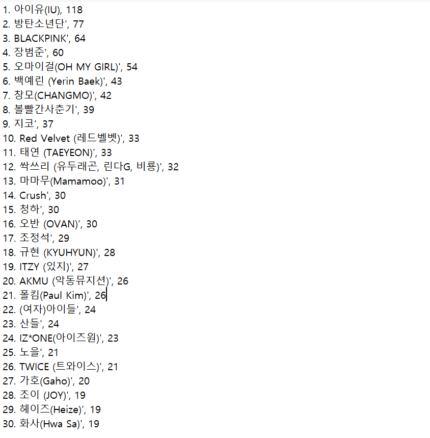"
   ]
  },
  {
   "cell_type": "markdown",
   "metadata": {},
   "source": [
    "**2) 네이버 블로그 포스팅 수 **\n",
    "\n",
    " 네이버 블로그에서의 아티스트에 관한 게시물의 개수는 아티스트의 현재 인기도 및 활동이력에 관한 지표가 될 수 있다.  \n",
    " 따라서 1번에서 뽑은 아티스트 30명에 관한 블로그 포스팅 수를 네이버의 Open API를 활용해 나타내 보았다. "
   ]
  },
  {
   "cell_type": "code",
   "execution_count": 4,
   "metadata": {},
   "outputs": [
    {
     "name": "stdout",
     "output_type": "stream",
     "text": [
      "아이유\n",
      "{\n",
      "\"lastBuildDate\": \"Sat, 05 Jun 2021 17:56:47 +0900\",\n",
      "\"total\": 722571,\n",
      "\"start\": 1,\n",
      "\"display\": 10,\n",
      "\"items\": [\n",
      "{\n",
      "\"title\": \"<b>아이유</b> 아파트 에테르노청담 나도간다\",\n",
      "\"link\": \"https:\\/\\/blog.naver.com\\/shit2342?Redirect=Log&logNo=222380579321\",\n",
      "\"description\": \"<b>아이유</b> 아파트 에테르노청담 나도간다 난 그냥 옆길로 지나가본다 지나가는건 자유잖아요 출처 인스타그램 2022년 12월 완공 예정인 <b>아이유</b> 아파트 청담 에테르노 토지거래허가구역 내 주택을 구입할 경우... \",\n",
      "\"bloggername\": \"킴씨\",\n",
      "\"bloggerlink\": \"https://blog.naver.com/shit2342\",\n",
      "\"postdate\": \"20210602\"\n",
      "\n",
      "},\n",
      "{\n",
      "\"title\": \"<b>아이유</b> 신용카드 :: 삼성카드 아멕스 골드\",\n",
      "\"link\": \"https:\\/\\/blog.naver.com\\/mydays81?Redirect=Log&logNo=222359344193\",\n",
      "\"description\": \"<b>아이유</b>가 삼성카드 모델을 시작한 것은 2018년이 처음이고, 이후 2020년 재계약을 하면서 현재에 이르고 있다. 사실 <b>아이유</b> 정도의 입지면 현대카드 the Black과 같은 레벨인 삼성카드의 RAUME O를 제공해줘도... \",\n",
      "\"bloggername\": \"Day\",\n",
      "\"bloggerlink\": \"https://blog.naver.com/mydays81\",\n",
      "\"postdate\": \"20210521\"\n",
      "\n",
      "},\n",
      "{\n",
      "\"title\": \"<b>아이유</b>, 한강뷰 에테르노청담 130억 원에 분양...코인\",\n",
      "\"link\": \"https:\\/\\/blog.naver.com\\/yunvestor1?Redirect=Log&logNo=222379685660\",\n",
      "\"description\": \"<b>아이유</b>, 한강뷰 에테르노청담 130억 원에 분양...코인 [MV] IU(<b>아이유</b>)_Coin 오늘 가수 <b>아이유</b>(IU)가 에테르노청담을 분양받았다는 소식이 화제다. 에테르노청담은 스페인 건축가 라파엘 메네오가 설계한... \",\n",
      "\"bloggername\": \"윤킴의 입장\",\n",
      "\"bloggerlink\": \"https://blog.naver.com/yunvestor1\",\n",
      "\"postdate\": \"20210601\"\n",
      "\n",
      "},\n",
      "{\n",
      "\"title\": \"<b>아이유</b> 밤편지 뮤비 촬영지 부산 정란각 문화공감수정\",\n",
      "\"link\": \"https:\\/\\/blog.naver.com\\/dlrhdmssla?Redirect=Log&logNo=222371647348\",\n",
      "\"description\": \"부산역에서 가까운 곳에 위치한 문화공감수정은 옛날 이름이 정란각이라는 곳으로 <b>아이유</b> '밤편지... 이렇게 보이는 모습이 <b>아이유</b> 밤편지 뮤비에 등장했다고 함! 옛날 느낌 가득한 공간. 물레...?!?! 낮은 천장을... \",\n",
      "\"bloggername\": \"파닥's 여행하는 일상\",\n",
      "\"bloggerlink\": \"https://blog.naver.com/dlrhdmssla\",\n",
      "\"postdate\": \"20210528\"\n",
      "\n",
      "},\n",
      "{\n",
      "\"title\": \"기미 여드름자국 글루타치온 화장품 / 백옥주사  <b>아이유</b>주사)\",\n",
      "\"link\": \"https:\\/\\/blog.naver.com\\/mylikebe?Redirect=Log&logNo=222379612412\",\n",
      "\"description\": \"핵심은 바로 글루타티온  <b>아이유</b>주사, 비욘세주사라고 하는 백옥주사에서도 가장 중요한 성분인 글루타티온이 들어간 화장품이에요 ! 글루타티온이 비타민의 한 종류로 비타민G 가 글루타티온이에요. 이... \",\n",
      "\"bloggername\": \"라이크베\",\n",
      "\"bloggerlink\": \"https://blog.naver.com/mylikebe\",\n",
      "\"postdate\": \"20210601\"\n",
      "\n",
      "},\n",
      "{\n",
      "\"title\": \"<b>아이유</b>, 에테르노청담 130억에 분양…전액 현금 동원\",\n",
      "\"link\": \"https:\\/\\/blog.naver.com\\/isop0315?Redirect=Log&logNo=222380276834\",\n",
      "\"description\": \"[사진 = 에테르노청담 홈페이지 / 스타투데이DB] 가수 겸 배우 <b>아이유</b>(본명 이지은·28)가 에테르노청담을 분양 받아 화제다. 1일 비즈한국과 부동산업계에 따르면, <b>아이유</b>는 지난 2월 강남에 들어서는 최고급... \",\n",
      "\"bloggername\": \"이솝의 신나는하루\",\n",
      "\"bloggerlink\": \"https://blog.naver.com/isop0315\",\n",
      "\"postdate\": \"20210602\"\n",
      "\n",
      "},\n",
      "{\n",
      "\"title\": \"<b>아이유</b> 물 다이어트  물 많이 마시면 좋은점\",\n",
      "\"link\": \"https:\\/\\/blog.naver.com\\/wisdom555555?Redirect=Log&logNo=222336072571\",\n",
      "\"description\": \"<b>아이유</b> 다이어트로도 알려져 있는 다이어트 방법 중 하나인데요 먼저 방송에 소개되어진 내용을 좀 보여드릴게요. <b>아이유</b>가 말하는 물 다이어트는 보통 5일정도 잡고 한다고 해요~ 소개팅등의 중요한 일이... \",\n",
      "\"bloggername\": \"강실장의 감성디자인공방\",\n",
      "\"bloggerlink\": \"https://blog.naver.com/wisdom555555\",\n",
      "\"postdate\": \"20210503\"\n",
      "\n",
      "},\n",
      "{\n",
      "\"title\": \"<b>아이유</b>도 감탄하게 만든 신박한 채널의 비밀\",\n",
      "\"link\": \"https:\\/\\/blog.naver.com\\/azaleass?Redirect=Log&logNo=222348026104\",\n",
      "\"description\": \"시작은 <b>아이유</b>였다. 유튜브 실시간 동영상에도 랭크되었던 ‘<b>아이유</b> 모른 척하기 챌린지’는 조회수 919만 회를 기록하며 ODG 콘텐츠 가운데서도 인기 동영상으로 꼽힌다. 영상에서는 ODG 인기 출연자이자... \",\n",
      "\"bloggername\": \"바다만큼 이야기\",\n",
      "\"bloggerlink\": \"https://blog.naver.com/azaleass\",\n",
      "\"postdate\": \"20210512\"\n",
      "\n",
      "},\n",
      "{\n",
      "\"title\": \"반올림피자샵 <b>아이유</b> 포토카드 겟~ 존예링\",\n",
      "\"link\": \"https:\\/\\/blog.naver.com\\/jollini152?Redirect=Log&logNo=222348714341\",\n",
      "\"description\": \"오늘은 바로 한 시간 전 낼롬- 시켜 먹은 먹방 후기 겸 반올림피자샵 <b>아이유</b> 포토카드 자랑하러... 이 비주얼을 보고는 못 참지 노랑노랑한 포장에 온통 #<b>아이유</b> 천지 생각해 보니 모델 바뀌고 첨 시켜 먹었나... \",\n",
      "\"bloggername\": \"매콤한 나의 도시\",\n",
      "\"bloggerlink\": \"https://blog.naver.com/jollini152\",\n",
      "\"postdate\": \"20210513\"\n",
      "\n",
      "},\n",
      "{\n",
      "\"title\": \"[<b>아이유</b>] 130억원, 이촌에서 청담: 현대건설\",\n",
      "\"link\": \"https:\\/\\/blog.naver.com\\/drleepr?Redirect=Log&logNo=222380088732\",\n",
      "\"description\": \"#<b>아이유</b> #IU #130억원 #이촌 #청담 1. <b>아이유</b> - 더 많이 치고 올라갈 위치는 이제는 없어 보인다. 후학 양성을 위해 힘쓰시면 될 듯. 출처: Google.com 2. 현대건설 - 건축계의 대가는 될 수 없다. 이... \",\n",
      "\"bloggername\": \"콕 COC\",\n",
      "\"bloggerlink\": \"https://blog.naver.com/drleepr\",\n",
      "\"postdate\": \"20210602\"\n",
      "\n",
      "}\n",
      "]\n",
      "}\n",
      "\n",
      "방탄소년단\n",
      "{\n",
      "\"lastBuildDate\": \"Sat, 05 Jun 2021 17:56:48 +0900\",\n",
      "\"total\": 11987787,\n",
      "\"start\": 1,\n",
      "\"display\": 10,\n",
      "\"items\": [\n",
      "{\n",
      "\"title\": \"<b>방탄소년단</b>(BTS) 버터, 다이너마이트 수상소감\",\n",
      "\"link\": \"https:\\/\\/blog.naver.com\\/holyspirit11?Redirect=Log&logNo=222365459733\",\n",
      "\"description\": \"그룹 <b>방탄소년단</b>(BTS)이 ‘2021 빌보드 뮤직 어워즈’에서 4관왕이라는 새 기록을 쓰며 주류 팝 시장에서 존재감을드러냈다. <b>방탄소년단</b>은 23일(현지시각) 빌보드 뮤직 어워즈 사전 시상식에서 ‘톱 듀오... \",\n",
      "\"bloggername\": \"순수한시선 블로그\",\n",
      "\"bloggerlink\": \"https://blog.naver.com/holyspirit11\",\n",
      "\"postdate\": \"20210525\"\n",
      "\n",
      "},\n",
      "{\n",
      "\"title\": \"<b>방탄소년단</b> 'Butter' 리믹스, 버터소년단\",\n",
      "\"link\": \"https:\\/\\/blog.naver.com\\/namnaraum?Redirect=Log&logNo=222384293927\",\n",
      "\"description\": \"<b>방탄소년단</b> 'Butter' 리믹스, 버터소년단 얼마 전 공개됐던 노랑 노랑 버터소년단의 안무 영상이 넘... <b>방탄소년단</b>은 원래 귀엽고 섹시하고 멋있고 청량하지 ㅋㅋㅋ *Sweeter/Cooler 리믹스 티저 포토 공개... \",\n",
      "\"bloggername\": \"남다른 남나르\",\n",
      "\"bloggerlink\": \"https://blog.naver.com/namnaraum\",\n",
      "\"postdate\": \"20210604\"\n",
      "\n",
      "},\n",
      "{\n",
      "\"title\": \"[BTS <b>방탄소년단</b>] 지민..한국관광산업 대표얼굴..'Korea... \",\n",
      "\"link\": \"https:\\/\\/blog.naver.com\\/holy1002?Redirect=Log&logNo=222383021537\",\n",
      "\"description\": \"#BTSjimin_Korea프론트맨_잇보이 #BTYS<b>방탄소년단</b>지민_한국관광산업대표얼굴 #BTS방탄지민_지역경제활성화이바지 #<b>방탄소년단</b>지민_지민단독사진대표_하이브인사이트소개 #방탄지민_하이브인사이트... \",\n",
      "\"bloggername\": \"나무처럼 걷다\",\n",
      "\"bloggerlink\": \"https://blog.naver.com/holy1002\",\n",
      "\"postdate\": \"20210603\"\n",
      "\n",
      "},\n",
      "{\n",
      "\"title\": \"[<b>방탄소년단</b> 지민] 세계를 사로잡은 힘, 지민이의 매력\",\n",
      "\"link\": \"https:\\/\\/blog.naver.com\\/tjhero?Redirect=Log&logNo=222382621860\",\n",
      "\"description\": \"사로잡은 <b>방탄소년단</b>을 예로 들어 이야기를 합니다. 공감이 많이 가는 내용인데다가 '매력'하면 또... 지 민 이 참 잘 컸 다 ! 우 리 방 탄 잘 컸 다 ! #<b>방탄소년단</b>지민 #매력있나 #지민매력고찰 #8주년페스타\",\n",
      "\"bloggername\": \"Li-Pro SerendiFilter\",\n",
      "\"bloggerlink\": \"https://blog.naver.com/tjhero\",\n",
      "\"postdate\": \"20210603\"\n",
      "\n",
      "},\n",
      "{\n",
      "\"title\": \"5일 빌보드차트 : &quot;Butter&quot;로 신기록을 세운 BTS(<b>방탄소년단</b>)\",\n",
      "\"link\": \"https:\\/\\/blog.naver.com\\/wltn3048?Redirect=Log&logNo=222380723824\",\n",
      "\"description\": \"Radio Songs 차트에선 <b>방탄소년단</b>의 노래 중에서 가장 높은 데뷔 순위인데요. 이전엔... <b>방탄소년단</b>의 4번째 Hot 100 1위: 나머지 3곡은 아래와 같습니다. &quot;Dynamite&quot;, 3주 1위, 2020년 9월... \",\n",
      "\"bloggername\": \"라빈이론\",\n",
      "\"bloggerlink\": \"https://blog.naver.com/wltn3048\",\n",
      "\"postdate\": \"20210602\"\n",
      "\n",
      "},\n",
      "{\n",
      "\"title\": \"[<b>방탄소년단</b> BTS] 기사 - BTS 'Butter', 편견에 맞선... \",\n",
      "\"link\": \"https:\\/\\/blog.naver.com\\/jjanga27?Redirect=Log&logNo=222384647718\",\n",
      "\"description\": \"공개된 <b>방탄소년단</b>의 신곡 ‘Butter’는 유튜브에서 최단 시간 1억 뷰 등 신기록을 세우며 전 세계에서 인기를 끌고 있고, 5월 23일 개최된 빌보드 뮤직 어워드에서 <b>방탄소년단</b>은 4관왕을 차지했다.... \",\n",
      "\"bloggername\": \"적과의동침\",\n",
      "\"bloggerlink\": \"https://blog.naver.com/jjanga27\",\n",
      "\"postdate\": \"20210604\"\n",
      "\n",
      "},\n",
      "{\n",
      "\"title\": \"<b>방탄소년단</b> 뷔 솔로곡 '스티그마'두버전 나란히 아마존1... \",\n",
      "\"link\": \"https:\\/\\/blog.naver.com\\/rkdl0830?Redirect=Log&logNo=222384220402\",\n",
      "\"description\": \"<b>방탄소년단</b> 뷔 김태형 <b>방탄소년단</b> 뷔의 솔로곡 '스티그마'(Stigma)가 아마존 '베스트 셀러 송'에서 나란히 1위와 2위에 올랐다. 또 49개국 아이튠즈 톱 송 차트에서 1위를 차지하며 꾸준한 인기를 이어가고... \",\n",
      "\"bloggername\": \"V positive\",\n",
      "\"bloggerlink\": \"https://blog.naver.com/rkdl0830\",\n",
      "\"postdate\": \"20210604\"\n",
      "\n",
      "},\n",
      "{\n",
      "\"title\": \"레고 <b>방탄소년단</b> BTS 다이너마이트 출시 되려나!\",\n",
      "\"link\": \"https:\\/\\/blog.naver.com\\/dongi0508?Redirect=Log&logNo=222372390831\",\n",
      "\"description\": \"레고 <b>방탄소년단</b> BTS 다이너마이트 출시 되려나 아미 분들에게는 어떻게보면 정말 좋은 소식이 될... 레고 <b>방탄소년단</b>이라고 JBBrickFanatic에서 제작한 컨셉이 있는데 이것도 1만 써포트를 이미 달성했기때문에... \",\n",
      "\"bloggername\": \"Der Sinn des Lebens\",\n",
      "\"bloggerlink\": \"https://blog.naver.com/dongi0508\",\n",
      "\"postdate\": \"20210529\"\n",
      "\n",
      "},\n",
      "{\n",
      "\"title\": \"<b>방탄소년단</b> BTS 덕질방법! 아미는 이렇게 팬질한다!버터... \",\n",
      "\"link\": \"https:\\/\\/blog.naver.com\\/simon9627?Redirect=Log&logNo=222371773564\",\n",
      "\"description\": \"<b>방탄소년단</b>이 또... '버터' 신드롬은 이제 시작! BTS가 신곡 Butter로 세계 신기록을 추가하며 강력한 글로벌 파워를 재확인 시켰습니다. 영국 기네스 월드 레코드는 25일 공식 홈페이지를 통해 &quot;<b>방탄소년단</b>이... \",\n",
      "\"bloggername\": \"스마트메이커\",\n",
      "\"bloggerlink\": \"https://blog.naver.com/simon9627\",\n",
      "\"postdate\": \"20210531\"\n",
      "\n",
      "},\n",
      "{\n",
      "\"title\": \"<b>방탄 소년단</b>-Butter 가사 &amp; 해석\",\n",
      "\"link\": \"https:\\/\\/blog.naver.com\\/cedubook?Redirect=Log&logNo=222366358947\",\n",
      "\"description\": \"프랑스 대통령이 <b>방탄소년단</b>의 팬이 올린 글을 리트윗까지 했다던데.. 세계로... 아직 들어보지 않았다면, 한번 들어보길 바라! Butter 아티스트 <b>방탄소년단</b> 발매일 2021.05.21.\",\n",
      "\"bloggername\": \"쎄듀와 함께 쎄쎄쎄\",\n",
      "\"bloggerlink\": \"https://blog.naver.com/cedubook\",\n",
      "\"postdate\": \"20210525\"\n",
      "\n",
      "}\n",
      "]\n",
      "}\n",
      "\n",
      "BLACKPINK\n",
      "{\n",
      "\"lastBuildDate\": \"Sat, 05 Jun 2021 17:56:48 +0900\",\n",
      "\"total\": 65110,\n",
      "\"start\": 1,\n",
      "\"display\": 10,\n",
      "\"items\": [\n",
      "{\n",
      "\"title\": \"<b>BLACKPINK</b> 지수 나이 몸무게 키 생일 본명 빠르게 알아볼까영?\",\n",
      "\"link\": \"https:\\/\\/blog.naver.com\\/ysclean00?Redirect=Log&logNo=222368297072\",\n",
      "\"description\": \"<b>BLACKPINK</b> 지수 나이 몸무게 키 생일 본명 빠르게 알아볼까영? 안녕하세영 YM크린입니당 오늘은 항상 인기 많은 <b>BLACKPINK</b> 지수 씨 에 대해서 알아보려구영 블랙 핑크 노래가 항상 들어보면 왜 인기가 있는줄... \",\n",
      "\"bloggername\": \"YM크린\",\n",
      "\"bloggerlink\": \"https://blog.naver.com/ysclean00\",\n",
      "\"postdate\": \"20210526\"\n",
      "\n",
      "},\n",
      "{\n",
      "\"title\": \"블랙핑크(<b>BLACKPINK</b>) - 블랙핑크 온라인 콘서트 THE SHOW... \",\n",
      "\"link\": \"https:\\/\\/blog.naver.com\\/dedoeoh?Redirect=Log&logNo=222226498640\",\n",
      "\"description\": \"<b>blackpink</b> #blackpinktheshow #blackpinktheshowsetlist #블핑 #블핑더쇼 #블핑지수 블랙핑크 라이브 스트림 콘서트 &lt;더쇼&gt; <b>BLACKPINK</b> LIVESTREAM CONCERT &lt;THE SHOW&gt; 2021년 1월 31일 (일)... \",\n",
      "\"bloggername\": \"Jazzjin's Paradiso\",\n",
      "\"bloggerlink\": \"https://blog.naver.com/dedoeoh\",\n",
      "\"postdate\": \"20210131\"\n",
      "\n",
      "},\n",
      "{\n",
      "\"title\": \"<b>BLACKPINK</b> 'How You Like That' 보란듯이\",\n",
      "\"link\": \"https:\\/\\/blog.naver.com\\/gxxd?Redirect=Log&logNo=222302616185\",\n",
      "\"description\": \"이 무대책, 무모함이 산업을 바꿔냈다. 그래서 세계시장에서 K-POP이라는 실체와 정서는 후불제와 가깝다. 일단 화려함에 끌려 들어오게 해놓고선 그 다음 로열티를 만든다. <b>BLACKPINK</b> 'How You Like That'\",\n",
      "\"bloggername\": \"good or fxxk\",\n",
      "\"bloggerlink\": \"https://blog.naver.com/gxxd\",\n",
      "\"postdate\": \"20210408\"\n",
      "\n",
      "},\n",
      "{\n",
      "\"title\": \"<b>BLACKPINK</b>(블랙핑크) - [THE ALBUM] Album Review\",\n",
      "\"link\": \"https:\\/\\/blog.naver.com\\/giuu05?Redirect=Log&logNo=222246133096\",\n",
      "\"description\": \"THE ALBUM 아티스트 <b>BLACKPINK</b> 발매일 2020.10.02. 1. How You Like That 2. Ice Cream (Feat. Selena Gomez) 3. Pretty Savage 4. Bet You Wanna (Feat. Cardi B) 5. Lovesick Girls 6. Crazy Over You 7. Love To Hate Me 8. You Never Know metacritic score : 71... \",\n",
      "\"bloggername\": \"EL NAMJU\",\n",
      "\"bloggerlink\": \"https://blog.naver.com/giuu05\",\n",
      "\"postdate\": \"20210216\"\n",
      "\n",
      "},\n",
      "{\n",
      "\"title\": \"블랙핑크[<b>BLACKPINK</b>] × 유엔 기후변화당사국총회[COP26]... \",\n",
      "\"link\": \"https:\\/\\/blog.naver.com\\/mycmy1004?Redirect=Log&logNo=222257845142\",\n",
      "\"description\": \"유엔 기후변화당사국총회[COP26] 홍보대사 위촉 그룹 '블랙핑크(<b>BLACKPINK</b>)'가 유엔 기후변화당사국총회(COP26) 홍보대사에 위촉됐다. 26일 YG엔터테인먼트에 따르면 블랙핑크는 지난 25일 서울 중구 주한... \",\n",
      "\"bloggername\": \"내가 빛날 시간 It is time for me to shine\",\n",
      "\"bloggerlink\": \"https://blog.naver.com/mycmy1004\",\n",
      "\"postdate\": \"20210226\"\n",
      "\n",
      "},\n",
      "{\n",
      "\"title\": \"<b>BLACKPINK</b> 2021 [THE SHOW] DVD &amp; KiT VIDEO // 블랙핑크 더 쇼... \",\n",
      "\"link\": \"https:\\/\\/blog.naver.com\\/lhs10728?Redirect=Log&logNo=222379168731\",\n",
      "\"description\": \"[TRACK LIST] - <b>BLACKPINK</b> 2021 [THE SHOW] DVD - 1. OPENING VCR 2. KILL THIS LOVE 3. CRAZY OVER YOU... ENDING VCR - <b>BLACKPINK</b> 2021 [THE SHOW] DVD (SPECIAL FEATURES) - 1. <b>BLACKPINK</b> 2021 [THE SHOW]... \",\n",
      "\"bloggername\": \"Own Personal Bubble\",\n",
      "\"bloggerlink\": \"https://blog.naver.com/lhs10728\",\n",
      "\"postdate\": \"20210601\"\n",
      "\n",
      "},\n",
      "{\n",
      "\"title\": \"블랙핑크 굿즈 [THESHOW] <b>BLACKPINK</b> PHOTO FRAME\",\n",
      "\"link\": \"https:\\/\\/blog.naver.com\\/eniletik?Redirect=Log&logNo=222381552569\",\n",
      "\"description\": \"[THESHOW] <b>BLACKPINK</b> PHOTO FRAME 다시 돌아온 블랙핑크 첫 온라인 콘서트 '더 쇼' 굿즈를 구경하는 시간! 이번에 볼 굿즈는 '[THESHOW] <b>BLACKPINK</b> PHOTO FRAME' (블랙핑크 포토 프레임) 이다. Previous image Next image 블랙핑크... \",\n",
      "\"bloggername\": \"eniletik님의 블로그\",\n",
      "\"bloggerlink\": \"https://blog.naver.com/eniletik\",\n",
      "\"postdate\": \"20210602\"\n",
      "\n",
      "},\n",
      "{\n",
      "\"title\": \"『블랙핑크(<b>Blackpink</b>)』 로제(Rosé) 첫 솔로곡 「GONE/Gone... \",\n",
      "\"link\": \"https:\\/\\/blog.naver.com\\/amoayhwh?Redirect=Log&logNo=222227059831\",\n",
      "\"description\": \"『블랙핑크(<b>Blackpink</b>)』 멤버 중 하나인 로제(Rosé)의 첫 솔로곡 「GONE/Gone[곤]」에 대한 이야기를 간단히 해볼까 합니다. 2021년 1월 31일 오후 2시부터 시작된 「YG PALM STAGE - 2021 <b>BLACKPINK</b>: THE SHOW... \",\n",
      "\"bloggername\": \"토플ㅇ제2외국어\",\n",
      "\"bloggerlink\": \"https://blog.naver.com/amoayhwh\",\n",
      "\"postdate\": \"20210201\"\n",
      "\n",
      "},\n",
      "{\n",
      "\"title\": \"Lady Gaga 레이디 가가, <b>BLACKPINK</b> 블랙핑크 - Sour Candy... \",\n",
      "\"link\": \"https:\\/\\/blog.naver.com\\/gkstjd1020?Redirect=Log&logNo=222363917173\",\n",
      "\"description\": \"Lady Gaga, <b>BLACKPINK</b> - Sour Candy 아이셔 [제니] Sou-sour candy (Sou-sour candy) [제니 &amp; 리사] I'm sour candy 난 새콤한 사탕 So sweet, then I get a little angry, yeah 달콤하다가도, 조금... \",\n",
      "\"bloggername\": \"SINGRY PLACE\",\n",
      "\"bloggerlink\": \"https://blog.naver.com/gkstjd1020\",\n",
      "\"postdate\": \"20210524\"\n",
      "\n",
      "},\n",
      "{\n",
      "\"title\": \"<b>Blackpink</b> in my area!\",\n",
      "\"link\": \"https:\\/\\/blog.naver.com\\/fi1ament?Redirect=Log&logNo=222110533895\",\n",
      "\"description\": \"이 정도의 음악을 그것도 세계적 아티스트들과 함께 만들 수 있다는 것이 놀랍다 그리고 세계의 수많은 사람들이 아름다운 그들의 멋진 노래와 춤을 즐기고 있다 <b>Blackpink</b>의 음악은 힙합의 톡특하고... \",\n",
      "\"bloggername\": \"fi1ament님의 블로그\",\n",
      "\"bloggerlink\": \"https://blog.naver.com/fi1ament\",\n",
      "\"postdate\": \"20201008\"\n",
      "\n",
      "}\n",
      "]\n",
      "}\n",
      "\n"
     ]
    },
    {
     "name": "stdout",
     "output_type": "stream",
     "text": [
      "장범준\n",
      "{\n",
      "\"lastBuildDate\": \"Sat, 05 Jun 2021 17:56:48 +0900\",\n",
      "\"total\": 59684,\n",
      "\"start\": 1,\n",
      "\"display\": 10,\n",
      "\"items\": [\n",
      "{\n",
      "\"title\": \"버스커버스커 한정판 LP : 나의 연예인 <b>장범준</b>\",\n",
      "\"link\": \"https:\\/\\/blog.naver.com\\/llstepaniall?Redirect=Log&logNo=222332876885\",\n",
      "\"description\": \"[ <b>장범준</b> ] 어느 순간부터였는지 , 언제 입덕했는지는 잘 모르겠는데 최소 9년은 넘었음 ㅋㅋㅋㅋㅋ 버스커버스커의 한정판 LP가 얼마전에 풀리면서 <b>장범준</b>의 성덕이였던 순간순간을 기록하기 위함.... \",\n",
      "\"bloggername\": \"나눔공예학원\",\n",
      "\"bloggerlink\": \"https://blog.naver.com/llstepaniall\",\n",
      "\"postdate\": \"20210502\"\n",
      "\n",
      "},\n",
      "{\n",
      "\"title\": \"히든싱어6 <b>장범준</b> 탈락 은퇴송 발표 2라운드 탈락 모창능력자... \",\n",
      "\"link\": \"https:\\/\\/blog.naver.com\\/free7love?Redirect=Log&logNo=222124751099\",\n",
      "\"description\": \"가수 <b>장범준</b>이 가수 생명을 걸었다. 23일 방송된 JTBC '히든싱어6'에서는 '믿고 듣는 싱어송라이터' <b>장범준</b>이 12번째 원조가수로 출격했다. <b>장범준</b>은 '히든싱어6'을 출연한 이유에 대해 &quot;올해 공연을 크게 잡았다.... \",\n",
      "\"bloggername\": \"나의보물 패밀리정\",\n",
      "\"bloggerlink\": \"https://blog.naver.com/free7love\",\n",
      "\"postdate\": \"20201024\"\n",
      "\n",
      "},\n",
      "{\n",
      "\"title\": \"버스커버스커 <b>장범준</b>의 히트곡, 대표곡\",\n",
      "\"link\": \"https:\\/\\/blog.naver.com\\/jpk0107?Redirect=Log&logNo=221832761139\",\n",
      "\"description\": \"그래도 항상 봄하면 벚꽃이, 벚꽃하면 버스커버스커 출신의 가수 <b>장범준</b>을 떠올리곤 합니다. 바로... <b>장범준</b>씨답게 원곡과는 많이 다른 스타일로 재해석했습니다. 오디션 경연곡임에도 불구하고 당시에... \",\n",
      "\"bloggername\": \"고모군의 정치이야기\",\n",
      "\"bloggerlink\": \"https://blog.naver.com/jpk0107\",\n",
      "\"postdate\": \"20200302\"\n",
      "\n",
      "},\n",
      "{\n",
      "\"title\": \"형돈이와 대준이 &quot;<b>장범준</b>에게 우리 보컬 안 밀린다...&quot;  포크... \",\n",
      "\"link\": \"https:\\/\\/blog.naver.com\\/jazzkid?Redirect=Log&logNo=222369283425\",\n",
      "\"description\": \"&quot;우리 보컬 <b>장범준</b>에게 밀리지 않는다!&quot;, &quot;가창력으로 승부한다&quot;라는 자신만만한 자세로 가요계에... <b>장범준</b>, 10cm 등 소위 '봄 캐럴' 강자들을 의식한 듯한 음악적 구성이지만 기대 이상의 탄탄한 멜로디를... \",\n",
      "\"bloggername\": \"enter note\",\n",
      "\"bloggerlink\": \"https://blog.naver.com/jazzkid\",\n",
      "\"postdate\": \"20210527\"\n",
      "\n",
      "},\n",
      "{\n",
      "\"title\": \"히든싱어 <b>장범준</b> 최종우승자는?\",\n",
      "\"link\": \"https:\\/\\/blog.naver.com\\/okbest123?Redirect=Log&logNo=222125101348\",\n",
      "\"description\": \"어제 방송된 히든싱어 6 <b>장범준</b> 편을 보셨나요 ? 저도 오전에 재방송을 봤는데요 많은 기대를 하고 봐서그런지 아쉬움이 컸습니다 우선 <b>장범준</b>은 ' 버스커 버스커' 로 슈퍼스타k 를 통해 이름을 알리기... \",\n",
      "\"bloggername\": \"쏭앤푸드\",\n",
      "\"bloggerlink\": \"https://blog.naver.com/okbest123\",\n",
      "\"postdate\": \"20201024\"\n",
      "\n",
      "},\n",
      "{\n",
      "\"title\": \"2019 KT 보야지투자라섬 1일차 후기 (<b>장범준</b>, 다이나믹듀오... \",\n",
      "\"link\": \"https:\\/\\/blog.naver.com\\/bennywhang?Redirect=Log&logNo=221662490409\",\n",
      "\"description\": \"서사무엘, 옥상달빛, <b>장범준</b>, 다이나믹듀오 등 1일차에도 좋아하는 뮤지션들이 정말 대거 무대에 올라 귀가 행복하 하루였다. 2019 KT 보야지투자라섬 인기남 <b>장범준</b>. 역주행 장인, 연금장인으로 알려진 그는... \",\n",
      "\"bloggername\": \"벤 문의 세상살이\",\n",
      "\"bloggerlink\": \"https://blog.naver.com/bennywhang\",\n",
      "\"postdate\": \"20190929\"\n",
      "\n",
      "},\n",
      "{\n",
      "\"title\": \"히든싱어 6 / <b>장범준</b> 편 요약\",\n",
      "\"link\": \"https:\\/\\/blog.naver.com\\/mauida?Redirect=Log&logNo=222124956480\",\n",
      "\"description\": \"히든싱어 시즌 6 10월 넷째 주 원조가수는 전 국민이 얼굴은 몰라도 노래는 다 아는 대한민국 대표 싱어송라이터 '<b>장범준</b>'입니다. <b>장범준</b>은 '버스커 버스커'라는 그룹 멤버로 '슈퍼스타 K 시즌3'에 출연하여... \",\n",
      "\"bloggername\": \"그림과 생활\",\n",
      "\"bloggerlink\": \"https://blog.naver.com/mauida\",\n",
      "\"postdate\": \"20201024\"\n",
      "\n",
      "},\n",
      "{\n",
      "\"title\": \"히든싱어6 <b>장범준</b> 충격의 2라운드 탈락 후 제일 급하게 만든... \",\n",
      "\"link\": \"https:\\/\\/blog.naver.com\\/kidjina1998?Redirect=Log&logNo=222125481468\",\n",
      "\"description\": \"23일 오후 방송된 '히든싱어6'에서는 <b>장범준</b>이 등장해 이목을 집중시켰습니다. MC전현무가 출연 계기를 묻자 <b>장범준</b>은 &quot;원래는 이게 중요한 카드다. 제가 공연을 크게 잡아놨었다. 그걸 홍보하려고 연초에... \",\n",
      "\"bloggername\": \"이슈모아\",\n",
      "\"bloggerlink\": \"https://blog.naver.com/kidjina1998\",\n",
      "\"postdate\": \"20201024\"\n",
      "\n",
      "},\n",
      "{\n",
      "\"title\": \"<b>장범준</b> 히든싱어6 왕중왕전 이소라\",\n",
      "\"link\": \"https:\\/\\/blog.naver.com\\/werjazz?Redirect=Log&logNo=222138015085\",\n",
      "\"description\": \"12회 <b>장범준</b> 탈락 전현무 탈락의 물꼬를 가수 김원준 터주셨죠 .이번시즌 리매치 백지영, 불안한... [ <b>장범준</b> ] 12번 김은주 [ 이소라 ] 이번시즌 모창으로 완곡을 불러요 이번 시즌 1~10점수제 도입 히든판정... \",\n",
      "\"bloggername\": \"세상사&바닐라B\",\n",
      "\"bloggerlink\": \"https://blog.naver.com/werjazz\",\n",
      "\"postdate\": \"20201107\"\n",
      "\n",
      "},\n",
      "{\n",
      "\"title\": \"[방송] 히든싱어6 <b>장범준</b>편 감상\",\n",
      "\"link\": \"https:\\/\\/blog.naver.com\\/jarlanlhd?Redirect=Log&logNo=222124834535\",\n",
      "\"description\": \"군림하시는 <b>장범준</b> 분. 어쩌면 이번 시즌6에서 가장 기대를 모았던 원조 가수중 한명이라고 여길정도로 기대가 많이 되던 회차였습니다. 참여 투표율도 역대 최고라고 하네요. <b>장범준</b> 분은 89년생 31세로... \",\n",
      "\"bloggername\": \"달콤한 인생\",\n",
      "\"bloggerlink\": \"https://blog.naver.com/jarlanlhd\",\n",
      "\"postdate\": \"20201024\"\n",
      "\n",
      "}\n",
      "]\n",
      "}\n",
      "\n",
      "오마이걸\n",
      "{\n",
      "\"lastBuildDate\": \"Sat, 05 Jun 2021 17:56:49 +0900\",\n",
      "\"total\": 102537,\n",
      "\"start\": 1,\n",
      "\"display\": 10,\n",
      "\"items\": [\n",
      "{\n",
      "\"title\": \"<b>오마이걸</b> 마루시리즈 슈퍼콘 비니,아린\",\n",
      "\"link\": \"https:\\/\\/blog.naver.com\\/kml0516?Redirect=Log&logNo=222326820656\",\n",
      "\"description\": \"오마이마루 오마이콘 탐방일주 체험기 여러분 저 미라클(=<b>오마이걸</b> 팬덤이름)인데 아시는 이웃분들도... 트에도 파나 싶었는데 양은 적지만 있긴 있더라고요 오 !! 드디어 아리니 발견 왜 이렇게 찾기 힘든건지... \",\n",
      "\"bloggername\": \"래미의 공간\",\n",
      "\"bloggerlink\": \"https://blog.naver.com/kml0516\",\n",
      "\"postdate\": \"20210428\"\n",
      "\n",
      "},\n",
      "{\n",
      "\"title\": \"의류 및 소품 등장의 건: 조이와 <b>오마이걸</b> 던던댄스를 중심으로\",\n",
      "\"link\": \"https:\\/\\/blog.naver.com\\/jesperation1?Redirect=Log&logNo=222378355115\",\n",
      "\"description\": \"이미 같은 디자인 다른 컬러로 <b>오마이걸</b> 유아도 던던댄스 무대에서 몇 번 썼다. 어라..? 저 모자.. 뜰 수... BTS 뷔가 다이너마이트 무대(2020년 9월 3일)에서 입은 코바늘 베스트. 이것도 그래니스퀘어를 이렇게... \",\n",
      "\"bloggername\": \"이상한 일기장\",\n",
      "\"bloggerlink\": \"https://blog.naver.com/jesperation1\",\n",
      "\"postdate\": \"20210601\"\n",
      "\n",
      "},\n",
      "{\n",
      "\"title\": \"[덕질] <b>오마이걸</b> 던던댄스 미니 8집 언박싱 같이 해요 XD\",\n",
      "\"link\": \"https:\\/\\/blog.naver.com\\/dbfldjs2?Redirect=Log&logNo=222384761100\",\n",
      "\"description\": \"찾았다 <b>오마이걸</b>! <b>오마이걸</b>이 1년 1개월 만에 컴백을 했었죠! 활동 시작한 지 얼마나 됐다고 벌써 3주가 지났는데요ㅠ_ㅠ 타이틀곡 '던던댄스'로 <b>오마이걸</b>표 댄스팝을 제대로 보여주었습니다 ㅎㅎ... \",\n",
      "\"bloggername\": \"지금 여기, 이곳에서\",\n",
      "\"bloggerlink\": \"https://blog.naver.com/dbfldjs2\",\n",
      "\"postdate\": \"20210604\"\n",
      "\n",
      "},\n",
      "{\n",
      "\"title\": \"OH MY GIRL <b>오마이걸</b> 던던댄스 (DunDun-Dance) 앨범 언박싱... \",\n",
      "\"link\": \"https:\\/\\/blog.naver.com\\/kmj6142?Redirect=Log&logNo=222374120205\",\n",
      "\"description\": \"내 덕에 남편이 퇴근 후 강제로 <b>오마이걸</b>영상을 같이 시청하고있는건 미안시렵지만 남편입장에서는... 팬 한명 추가 유입이요 ❤ 미라클 이제 슬슬 가입해야겠어요^^ #<b>오마이걸</b>던던댄스앨범구성 - CD - : 2종... \",\n",
      "\"bloggername\": \"안녕, Kong\",\n",
      "\"bloggerlink\": \"https://blog.naver.com/kmj6142\",\n",
      "\"postdate\": \"20210529\"\n",
      "\n",
      "},\n",
      "{\n",
      "\"title\": \"[리뷰] 'Dun Dun Dance'로 컴백한 컨셉장인 <b>오마이걸</b>의... \",\n",
      "\"link\": \"https:\\/\\/blog.naver.com\\/gangyoo87?Redirect=Log&logNo=222346086212\",\n",
      "\"description\": \"1번 트랙 타이틀곡 Dun Du Dance는 마냥 신난 것처럼 들리면서도 메이저 마이너 코드를 적절히 옮겨가다보니 은근히 애절한 느낌도 나며 기존 <b>오마이걸</b>의 청순몽환 컨셉을 잘 구사한다. 오히려 작년 살짝... \",\n",
      "\"bloggername\": \"네잎클로버를 찾아 나선 여행자\",\n",
      "\"bloggerlink\": \"https://blog.naver.com/gangyoo87\",\n",
      "\"postdate\": \"20210511\"\n",
      "\n",
      "},\n",
      "{\n",
      "\"title\": \"<b>오마이걸</b> 신곡!! 던던댄스(dun dun dance) 리뷰하기!!\",\n",
      "\"link\": \"https:\\/\\/blog.naver.com\\/mecante?Redirect=Log&logNo=222347932340\",\n",
      "\"description\": \"<b>오마이걸</b> 공식 홈페이지 http://ohmy-girl.com/omg_official/ <b>오마이걸</b>이 5월 10일 6시에 신곡 던던댄스(dun dun... 이틀이 되기전에 천만회를 찍었네요 오~ 잇지나 블랙핑크.. 그리고 어나더 레벨인 BTS와 같은 큰기획사가... \",\n",
      "\"bloggername\": \"나무에스며들다 hoaken\",\n",
      "\"bloggerlink\": \"https://blog.naver.com/mecante\",\n",
      "\"postdate\": \"20210512\"\n",
      "\n",
      "},\n",
      "{\n",
      "\"title\": \"<b>오마이걸</b> 아린 사주 (신축일주 연예인)\",\n",
      "\"link\": \"https:\\/\\/blog.naver.com\\/hwajinsaju?Redirect=Log&logNo=222383893694\",\n",
      "\"description\": \"이번에는 걸그룹 '<b>오마이걸</b>'의 멤버 아린님의 사주를 풀이해보겠습니다. <b>오마이걸</b> 아린 사주 생각이... 기본적으로 '신금'일간이라 본인 계획이 흐트러지는 걸 극도로 싫어하고 '편인'이 강해 본인만의 세계가... \",\n",
      "\"bloggername\": \"화진사주 블로그\",\n",
      "\"bloggerlink\": \"https://blog.naver.com/hwajinsaju\",\n",
      "\"postdate\": \"20210604\"\n",
      "\n",
      "},\n",
      "{\n",
      "\"title\": \"<b>오마이걸</b> 미니 8집 앨범 (Dear OHMYGIRL) Dun Dun Dance... \",\n",
      "\"link\": \"https:\\/\\/blog.naver.com\\/728hdh728?Redirect=Log&logNo=222378224352\",\n",
      "\"description\": \"심지어 <b>오마이걸</b>은 지어진 이름처럼 대중의 마이걸이라는 뜻이 있기도 하다. 그래서 이제부터라도 대중의 마이걸이 되겠다는건가... (!) 다만 섣불리 스타일의 변화를 시도하면 팬덤 이탈의 위험이 있을... \",\n",
      "\"bloggername\": \"파란이온의 it's Click\",\n",
      "\"bloggerlink\": \"https://blog.naver.com/728hdh728\",\n",
      "\"postdate\": \"20210601\"\n",
      "\n",
      "},\n",
      "{\n",
      "\"title\": \"<b>오마이걸</b> 던던댄스 앨범 곰돌이 두가지버전 포카 다 사야지... \",\n",
      "\"link\": \"https:\\/\\/blog.naver.com\\/cnnjang?Redirect=Log&logNo=222368854694\",\n",
      "\"description\": \"사달라는 걸 달래고 달래서 한가지 버전씩 구입하기로 했어요 <b>오마이걸</b> 8집 미니앨범 두 가지 버전으로 돌아와서 너무 귀엽죠 이 박스안에 많은게 들었는데 포스터와 지관통포장까지 해서 18.800원에... \",\n",
      "\"bloggername\": \"현이쩡이의 즐거운 일상속으로~~\",\n",
      "\"bloggerlink\": \"https://blog.naver.com/cnnjang\",\n",
      "\"postdate\": \"20210526\"\n",
      "\n",
      "},\n",
      "{\n",
      "\"title\": \"<b>오마이걸</b> 미니 8집 [Dear OHMYGIRL] 발매 기념 온라인... \",\n",
      "\"link\": \"https:\\/\\/blog.naver.com\\/gurygury2001?Redirect=Log&logNo=222345480278\",\n",
      "\"description\": \"그룹 <b>오마이걸</b>이 건강한 에너지를 예고했다. 가장 <b>오마이걸</b>스러운 음악을 유지하면서도 수록곡을 통해 따스한 감성을 추가해 완성도를 꾀했다. 그룹은 “터닝포인트가 될 것”이라고 자신했다. 10일... \",\n",
      "\"bloggername\": \"구리구리-한성별곡\",\n",
      "\"bloggerlink\": \"https://blog.naver.com/gurygury2001\",\n",
      "\"postdate\": \"20210510\"\n",
      "\n",
      "}\n",
      "]\n",
      "}\n",
      "\n",
      "백예린\n",
      "{\n",
      "\"lastBuildDate\": \"Sat, 05 Jun 2021 17:56:49 +0900\",\n",
      "\"total\": 52497,\n",
      "\"start\": 1,\n",
      "\"display\": 10,\n",
      "\"items\": [\n",
      "{\n",
      "\"title\": \"<b>백예린</b>크림! 마몽드 프로바이오틱스 세라마이드 크림으로... \",\n",
      "\"link\": \"https:\\/\\/blog.naver.com\\/siehl?Redirect=Log&logNo=222267840139\",\n",
      "\"description\": \"바로 <b>백예린</b>과 콜라보한 제품이거든요! 일명 <b>백예린</b>크림이라는데 이 화보 보자마자 대박 대박 미쳤다 하면서 저장했어요  그래서 꼭 써보고 싶었다구요!! <b>백예린</b>X마몽드 첫번째 콜라보로 출시된 프로바이오틱스... \",\n",
      "\"bloggername\": \"다랑의 뷰티양x플레이군\",\n",
      "\"bloggerlink\": \"https://blog.naver.com/siehl\",\n",
      "\"postdate\": \"20210311\"\n",
      "\n",
      "},\n",
      "{\n",
      "\"title\": \"<b>백예린</b>크림 마몽드 프로바이오틱스 세라마이드 크림으로 피부... \",\n",
      "\"link\": \"https:\\/\\/blog.naver.com\\/hanstar_94?Redirect=Log&logNo=222285405238\",\n",
      "\"description\": \"마몽드x<b>백예린</b> 제 맘에 쏙 드는 이 크림이 알고보니 마몽드와 백에린의 첫번째 콜라보 제품이었다는거..!! 핑크 핑크 한 크림 패키지와 <b>백예린</b> 화보는 보고 감탄했쨚아여ㅠㅠㅠ 너무 이뻐서.. 이 제품은... \",\n",
      "\"bloggername\": \"별밤의 뷰티&패션\",\n",
      "\"bloggerlink\": \"https://blog.naver.com/hanstar_94\",\n",
      "\"postdate\": \"20210324\"\n",
      "\n",
      "},\n",
      "{\n",
      "\"title\": \"<b>백예린</b> 새 앨범의 차트 성적이 저조한 이유에 대해\",\n",
      "\"link\": \"https:\\/\\/blog.naver.com\\/imaginesmile?Redirect=Log&logNo=222173955943\",\n",
      "\"description\": \"최근 들어 아이돌을 제외하고 가장 많은 관심을 받은 신보는 <b>백예린</b>의 &lt;tellusboutyourself&gt;였다. &lt;Our love is... <b>백예린</b> 입장에선 팬들을 위해 가사를 해석해 올려주는 수고까지 감수했지만 읽어서 이해하는 것과... \",\n",
      "\"bloggername\": \"Going Deep\",\n",
      "\"bloggerlink\": \"https://blog.naver.com/imaginesmile\",\n",
      "\"postdate\": \"20201215\"\n",
      "\n",
      "},\n",
      "{\n",
      "\"title\": \"마몽드 프로바이오틱스 세라마이드 크림 내돈내산-<b>백예린</b>... \",\n",
      "\"link\": \"https:\\/\\/blog.naver.com\\/diane504?Redirect=Log&logNo=222270763321\",\n",
      "\"description\": \"<b>백예린</b>이잖아요..... 그냥 니가 덕후인게 아닐까 그리고 도착한 물건(들)!!!!! 일단 단상자는 이렇게... 솔직히 저 마몽드에 관심 1도 없었는데 예린이 때문에 처돌이 될듯..ㅋㅋㅋㅋㅋㅋㅋㅋ 그거슨 <b>백예린</b> 근데... \",\n",
      "\"bloggername\": \"Sterninsel\",\n",
      "\"bloggerlink\": \"https://blog.naver.com/diane504\",\n",
      "\"postdate\": \"20210310\"\n",
      "\n",
      "},\n",
      "{\n",
      "\"title\": \"나의 1월부터 3월 ( <b>백예린</b> 앨범, LP리뷰, 증명사진, 탈색과... \",\n",
      "\"link\": \"https:\\/\\/blog.naver.com\\/icatlove?Redirect=Log&logNo=222334097394\",\n",
      "\"description\": \"<b>백예린</b>님이 참여한 We are all muse가 수록되어 있기 때문 디자인도 정말 예쁘고 일러스트도 함께... 바로 이어지는 정규 2집 tellusboutyourself 기존의 <b>백예린</b>과는 전혀 다른 느낌의 컨셉, 음악이라 저는 너무 좋았어요!... \",\n",
      "\"bloggername\": \"나의 일상, 전시장\",\n",
      "\"bloggerlink\": \"https://blog.naver.com/icatlove\",\n",
      "\"postdate\": \"20210502\"\n",
      "\n",
      "},\n",
      "{\n",
      "\"title\": \"마몽드 프로바이오틱스 세라마이드 크림 / <b>백예린</b> 보습크림\",\n",
      "\"link\": \"https:\\/\\/blog.naver.com\\/yukihana96?Redirect=Log&logNo=222272726831\",\n",
      "\"description\": \"그리고 마몽드 세라마이드 크림이 네이버스토어에서 3월 14일까지 브랜드위크를 하는데요. 기획전 구성이 좋더라구요. 혜자스러운 기획세트에 <b>백예린</b> 핸드크림도 증정중이니깐 참고하세요!\",\n",
      "\"bloggername\": \"블링유에 텔레파시푸시\",\n",
      "\"bloggerlink\": \"https://blog.naver.com/yukihana96\",\n",
      "\"postdate\": \"20210312\"\n",
      "\n",
      "},\n",
      "{\n",
      "\"title\": \"마몽드 X <b>백예린</b> 콜라보 프로바이오틱스 세라마이드 크림 론칭!\",\n",
      "\"link\": \"https:\\/\\/blog.naver.com\\/sugarcat_soo?Redirect=Log&logNo=222284039570\",\n",
      "\"description\": \"마몽드에서 이번에 <b>백예린</b>과 역대급 콜라보 (꽃라보! 라고 부르기도 +_+) 한 소식 아시나요? 핑크빛 화보 정말 넘넘 예뻐요! 꽃 그자체인 <b>백예린</b> 저도 <b>백예린</b> 앨범을 소장하고 있을 정도로 그녀의 노래와 목소리... \",\n",
      "\"bloggername\": \"설탕냥이의 소소일기\",\n",
      "\"bloggerlink\": \"https://blog.naver.com/sugarcat_soo\",\n",
      "\"postdate\": \"20210322\"\n",
      "\n",
      "},\n",
      "{\n",
      "\"title\": \"프로바이오틱스 세라마이드 크림 보습장벽 지켜주는 <b>백예린</b>크림\",\n",
      "\"link\": \"https:\\/\\/blog.naver.com\\/jej7634?Redirect=Log&logNo=222272323651\",\n",
      "\"description\": \"바로 <b>백예린</b>과 마몽드가 만나게 되었다고 하는데요 ! 광고 영상 보는 내내 넘 기분이 좋은 것 .. 봄이 가득 - 담겨있는 느낌이랄까요 ? 헤헤 화보 속 <b>백예린</b>크림의 정체도 정말 궁금했는데 이번에 좋은 기회로... \",\n",
      "\"bloggername\": \"연우로그 뷰티톡\",\n",
      "\"bloggerlink\": \"https://blog.naver.com/jej7634\",\n",
      "\"postdate\": \"20210311\"\n",
      "\n",
      "},\n",
      "{\n",
      "\"title\": \"<b>백예린</b> 투명 LP 'Every letter I sent you' 매일 들어도 좋아~\",\n",
      "\"link\": \"https:\\/\\/blog.naver.com\\/myapangt?Redirect=Log&logNo=222251688390\",\n",
      "\"description\": \"<b>백예린</b> LP 'every letter i sent you' 매일 들어도 좋아~!! 시작해 보겠습니당! 정가는 약 5만원 정도... 진짜 <b>백예린</b> 감성....ㅠㅠ 사랑함... * 인스타 갬성 인스타 갬성샷 하나 찍어주고용... 구성 한번... \",\n",
      "\"bloggername\": \"삐까뻔쩍☆\",\n",
      "\"bloggerlink\": \"https://blog.naver.com/myapangt\",\n",
      "\"postdate\": \"20210221\"\n",
      "\n",
      "},\n",
      "{\n",
      "\"title\": \"<b>백예린</b> 콜라보 마몽드 프로바이오틱스 세라마이드크림... \",\n",
      "\"link\": \"https:\\/\\/blog.naver.com\\/k_159500?Redirect=Log&logNo=222272406477\",\n",
      "\"description\": \"<b>백예린</b>과의 콜라보레이션으로 마몽드의 프로바이오틱스 세라마이드 크림이 출시되었어요. 여리여리~ 화사한 그녀의 모습을 보면 인간 꽃이랄까요! ㅎㅎ 너무 예쁘다고 생각했는데요. 이번에 출시된 #<b>백예린</b>크림... \",\n",
      "\"bloggername\": \"치즈초콜릿의 깨알블로그:-]\",\n",
      "\"bloggerlink\": \"https://blog.naver.com/k_159500\",\n",
      "\"postdate\": \"20210311\"\n",
      "\n",
      "}\n",
      "]\n",
      "}\n",
      "\n"
     ]
    },
    {
     "name": "stdout",
     "output_type": "stream",
     "text": [
      "창모\n",
      "{\n",
      "\"lastBuildDate\": \"Sat, 05 Jun 2021 17:56:49 +0900\",\n",
      "\"total\": 28514,\n",
      "\"start\": 1,\n",
      "\"display\": 10,\n",
      "\"items\": [\n",
      "{\n",
      "\"title\": \"[성지순례] <b>창모</b>(CHANGMO)의 동네 ‘덕소 방문기’ 2020.... \",\n",
      "\"link\": \"https:\\/\\/blog.naver.com\\/kirito?Redirect=Log&logNo=222221133270\",\n",
      "\"description\": \"작년 5월 31일 <b>창모</b> 생일을 기념하여 무언가를 하고 싶었다. <b>창모</b>에게 뭔가를 해주는 게 아니라 그냥 내가 하고싶은 걸 말이다. 그것은 바로 성지순례~ <b>창모</b>의 고향 ‘덕소’에 가보기로 하였다. 마침 친한 동생이... \",\n",
      "\"bloggername\": \"今を生きる\",\n",
      "\"bloggerlink\": \"https://blog.naver.com/kirito\",\n",
      "\"postdate\": \"20210126\"\n",
      "\n",
      "},\n",
      "{\n",
      "\"title\": \"GENIUS (Feat. <b>창모</b>)-D.Ark(디아크)천재강사 오전B반\",\n",
      "\"link\": \"https:\\/\\/blog.naver.com\\/marymi1004?Redirect=Log&logNo=222379673652\",\n",
      "\"description\": \"<b>창모</b>)-D.Ark(디아크) 천재강사 오전B반 [ZN댄스 목동점] 5월 넷째주안무 디아크-지니어스 어린... <b>창모</b>)-D.Ark(디아크) 찾아오시는길 오전A반 9:30~11:10 오전B반 11:30~1:00 6월 첫째주 안무 방탄소년단 BUTTER\",\n",
      "\"bloggername\": \"신의손\",\n",
      "\"bloggerlink\": \"https://blog.naver.com/marymi1004\",\n",
      "\"postdate\": \"20210601\"\n",
      "\n",
      "},\n",
      "{\n",
      "\"title\": \"요즘은 <b>창모</b>\",\n",
      "\"link\": \"https:\\/\\/blog.naver.com\\/ara7679?Redirect=Log&logNo=222354059507\",\n",
      "\"description\": \"요즘 제일 많이 듣는건 역시 <b>창모</b>. 비트를 너무 잘 뽑는다. 요즘 너무 말을 많이해야해서 쉴때는 이렇게 한국어 노래나 영상을 틀어놓고 마음의 평온을 찾으려고 노력중. 근데 메테오 가사 내용보면... \",\n",
      "\"bloggername\": \"새벽의 약속\",\n",
      "\"bloggerlink\": \"https://blog.naver.com/ara7679\",\n",
      "\"postdate\": \"20210517\"\n",
      "\n",
      "},\n",
      "{\n",
      "\"title\": \"NC구<b>창모</b>(엔씨 구<b>창모</b>) 랩퍼 <b>창모</b>(CHANGMO) 송골매 구<b>창모</b>\",\n",
      "\"link\": \"https:\\/\\/blog.naver.com\\/koreadoc?Redirect=Log&logNo=222132612642\",\n",
      "\"description\": \"NC 구<b>창모</b>(엔씨 구<b>창모</b>) 랩퍼 <b>창모</b>(CHANGMO) 송골매 구<b>창모</b> 안녕하세요 오늘 2020년 11월 1일은 한국프로야구 와일드카드 1차전이 펼쳐지는 날인데요. 오전부터 내리던 비가 지금 3시가 넘었는데 계속 내리고... \",\n",
      "\"bloggername\": \"지사미 한의원\",\n",
      "\"bloggerlink\": \"https://blog.naver.com/koreadoc\",\n",
      "\"postdate\": \"20201101\"\n",
      "\n",
      "},\n",
      "{\n",
      "\"title\": \"고등래퍼4 파이널 진출 웨이체드 <b>창모</b> 노윤하 패션\",\n",
      "\"link\": \"https:\\/\\/blog.naver.com\\/spdlqj9577?Redirect=Log&logNo=222310888924\",\n",
      "\"description\": \"박재범이나 <b>창모</b> 같은 기존 인기 래퍼들이 피처링을 하면서 더욱 완성도 높은 무대를 선보이는 모습을... 앞으로 더욱 흥미진진해질 오늘 소개해드린 고등래퍼4 파이널 진출 웨이체드, <b>창모</b> , 노윤하 소식... \",\n",
      "\"bloggername\": \"아붐의 패션뷰티로그\",\n",
      "\"bloggerlink\": \"https://blog.naver.com/spdlqj9577\",\n",
      "\"postdate\": \"20210416\"\n",
      "\n",
      "},\n",
      "{\n",
      "\"title\": \"박봄 - 도레미파솔 (feat. <b>창모</b>) [가사/듣기/동영상]\",\n",
      "\"link\": \"https:\\/\\/blog.naver.com\\/hywntrpjii?Redirect=Log&logNo=222294990967\",\n",
      "\"description\": \"<b>창모</b>) [가사/듣기/동영상] 우리 사랑은 이제 뒤죽박죽 so dizzy you give me a chronic headache baby 가끔 넌... <b>창모</b>) [가사/듣기/동영상] https://youtu.be/S_SssgjLBrQ 이번 박봄의 신곡 '도레미파솔'어떻게 들으셨나요?... \",\n",
      "\"bloggername\": \"by초코언니\",\n",
      "\"bloggerlink\": \"https://blog.naver.com/hywntrpjii\",\n",
      "\"postdate\": \"20210401\"\n",
      "\n",
      "},\n",
      "{\n",
      "\"title\": \"고등래퍼4 출연진 넉살 <b>창모</b> PH-1 사이먼도미닉 패션 파헤치기\",\n",
      "\"link\": \"https:\\/\\/blog.naver.com\\/daechankim91?Redirect=Log&logNo=222320251431\",\n",
      "\"description\": \"사이먼도미닉과 <b>창모</b>의 표정은, 거의 아들을 보고 있는 것 같은 느낌이랄까 ㅋㅋㅋ 고등래퍼4 속 래퍼들의 패션 아무래도 아이들과 같은 경우에는, 이런 TV프로그램이나 SNS, 인터넷을 통해서, 상당히 유행에... \",\n",
      "\"bloggername\": \"차니차니여행★☆\",\n",
      "\"bloggerlink\": \"https://blog.naver.com/daechankim91\",\n",
      "\"postdate\": \"20210423\"\n",
      "\n",
      "},\n",
      "{\n",
      "\"title\": \"기록 (브람스를 좋아하세요.../2020 현대문학상 수상작품집-<b>창모</b>)\",\n",
      "\"link\": \"https:\\/\\/blog.naver.com\\/toathal?Redirect=Log&logNo=222083943071\",\n",
      "\"description\": \"2020 현대문학상 수상작품집 - <b>창모</b>/우다영 우다영 작가님의 글은 처음 읽어본다. '<b>창모</b>'라는 작품이다. <b>창모</b>라는 이름을 보고는 노래 마에스트로가 너무 많이 생각나서, 첫 장을 넘기며 다섯살때부터 난 피아노를... \",\n",
      "\"bloggername\": \"flor que flamea\",\n",
      "\"bloggerlink\": \"https://blog.naver.com/toathal\",\n",
      "\"postdate\": \"20200908\"\n",
      "\n",
      "},\n",
      "{\n",
      "\"title\": \"청하 PLAY(Feat. <b>창모</b>) MV 분석\",\n",
      "\"link\": \"https:\\/\\/blog.naver.com\\/ekvlsu369?Redirect=Log&logNo=222381965296\",\n",
      "\"description\": \"오늘은 2020년 7월 6일에 발매된 곡으로 청하의 첫 정규 앨범의 두 번째 선공개 곡이었던 PLAY(Feat.<b>창모</b>) MV를 분석해 보려고 합니다! 1. PLAY(Feat. <b>창모</b>) 곡 정보 사진은 올라인 자료를... \",\n",
      "\"bloggername\": \"소이보다\",\n",
      "\"bloggerlink\": \"https://blog.naver.com/ekvlsu369\",\n",
      "\"postdate\": \"20210603\"\n",
      "\n",
      "},\n",
      "{\n",
      "\"title\": \"고등래퍼4 심사위원 라인업 (염따&amp;더콰이엇, <b>창모</b>&amp;웨이체드... \",\n",
      "\"link\": \"https:\\/\\/blog.naver.com\\/sanguckdu?Redirect=Log&logNo=222291143077\",\n",
      "\"description\": \"더콰이엇&amp;염따 사이먼도미닉&amp;로꼬 <b>창모</b>&amp;웨이체드 하이어뮤직 (우기&amp;박재범&amp;ph-1) 출처... 번째로 <b>창모</b> &amp; 웨이체드 !!! 출처: 웨이체드 개인 인스타 출처: <b>창모</b> 개인 인스타 예명: <b>창모</b>... \",\n",
      "\"bloggername\": \"세상을 잇는 세블리\",\n",
      "\"bloggerlink\": \"https://blog.naver.com/sanguckdu\",\n",
      "\"postdate\": \"20210329\"\n",
      "\n",
      "}\n",
      "]\n",
      "}\n",
      "\n",
      "볼빨간사춘기\n",
      "{\n",
      "\"lastBuildDate\": \"Sat, 05 Jun 2021 17:56:50 +0900\",\n",
      "\"total\": 65042,\n",
      "\"start\": 1,\n",
      "\"display\": 10,\n",
      "\"items\": [\n",
      "{\n",
      "\"title\": \"안지영 우지윤 <b>볼빨간사춘기</b> 탈퇴 이유 인스타 증거\",\n",
      "\"link\": \"https:\\/\\/blog.naver.com\\/force_7?Redirect=Log&logNo=222005867867\",\n",
      "\"description\": \"지난 봄, <b>볼빨간사춘기</b> 우지윤 탈퇴 이유가 공식적으로는 서로의 갈길이 달라서 헤어진 것이라고 했고... 궤변도 볼 수 있습니다. 어쨌든 조금 전 확인한 안지영 인스타에서는 그런 징조는 없었지만 확실히... \",\n",
      "\"bloggername\": \"Table Review\",\n",
      "\"bloggerlink\": \"https://blog.naver.com/force_7\",\n",
      "\"postdate\": \"20200619\"\n",
      "\n",
      "},\n",
      "{\n",
      "\"title\": \"190608 <b>볼빨간사춘기</b> 일본 데뷔 쇼케이스 콘서트 보러가다\",\n",
      "\"link\": \"https:\\/\\/blog.naver.com\\/choongchoongchoong?Redirect=Log&logNo=221599986822\",\n",
      "\"description\": \"<b>볼빨간사춘기</b>가 일본 데뷔를 했다. 케이팝에 관심이 많은 케이가 이 데뷔 소식을 먼저 접하고... <b>볼빨간사춘기</b>의 글로벌네임인 BOL4. 일본에서는 <b>볼빨간사춘기</b>를 직역한 아카호오시슌키(赤頬思春期)라고... \",\n",
      "\"bloggername\": \"Life Never Felt So Good\",\n",
      "\"bloggerlink\": \"https://blog.naver.com/choongchoongchoong\",\n",
      "\"postdate\": \"20190730\"\n",
      "\n",
      "},\n",
      "{\n",
      "\"title\": \"2020 아트트럭 어텀스피릿 공연관람 (<b>볼빨간사춘기</b>, 페퍼톤스... \",\n",
      "\"link\": \"https:\\/\\/blog.naver.com\\/dragonswing?Redirect=Log&logNo=222138509875\",\n",
      "\"description\": \"가장 처음에 나온가수는 <b>볼빨간사춘기</b>에요 라이브콘서트가 2번째라고 하신것같은데 초반엔 약간 목이... 이번에 <b>볼빨간사춘기</b> 신곡이 나왔다고 하는데 여기서 처음으로 선보여주셨어요 이땐 어느정도 목도... \",\n",
      "\"bloggername\": \"신사의 일상생활 블로그\",\n",
      "\"bloggerlink\": \"https://blog.naver.com/dragonswing\",\n",
      "\"postdate\": \"20201108\"\n",
      "\n",
      "},\n",
      "{\n",
      "\"title\": \"남양주 평내동 돈까스 맛집 <b>볼빨간사춘기</b>\",\n",
      "\"link\": \"https:\\/\\/blog.naver.com\\/zumdree?Redirect=Log&logNo=222060468183\",\n",
      "\"description\": \"평내동에 거주하신다면 누구나 한 번쯤 먹어봤을 평내동 수제돈까스 맛집 <b>볼빨간사춘기</b>! 카페겸... 동네 커피숍&amp;돈까스 맛집 볼빨산 사춘기 후.기.였어요. 야매주부는 다음 주에도 돈까스 타임 예약입니다. 흐흐흐~\",\n",
      "\"bloggername\": \"바이줌의 주부탐구생활 ♪\",\n",
      "\"bloggerlink\": \"https://blog.naver.com/zumdree\",\n",
      "\"postdate\": \"20200814\"\n",
      "\n",
      "},\n",
      "{\n",
      "\"title\": \"<b>볼빨간사춘기</b> - 나비와 고양이(feat.백현)ㅣ플룻(플루트)... \",\n",
      "\"link\": \"https:\\/\\/blog.naver.com\\/silverstarca?Redirect=Log&logNo=221988089940\",\n",
      "\"description\": \"나비와 고양이 <b>볼빨간사춘기</b>with백현 얼마전 치기 쉬운 피아노 악보 곡으로도 다룬 적 있는 곡이죠?... 그리고 1절은 여성(<b>볼빨간사춘기</b>) 파트, 2절은 남성(백현) 파트로 나위어져있죠. 특이한 것이 1,2절... \",\n",
      "\"bloggername\": \"MOSICA MUSIC\",\n",
      "\"bloggerlink\": \"https://blog.naver.com/silverstarca\",\n",
      "\"postdate\": \"20200605\"\n",
      "\n",
      "},\n",
      "{\n",
      "\"title\": \"인간관계란? <b>볼빨간사춘기</b> 그리고 AOA 신지민 권민아\",\n",
      "\"link\": \"https:\\/\\/blog.naver.com\\/ameliepink?Redirect=Log&logNo=222021164964\",\n",
      "\"description\": \"꼭 이렇게 인스타그램에 올려서 대중에서 화제가 되고 또 다시 <b>볼빨간사춘기</b>가 화제가 되어야 하는지.. 두 사람이 그냥 해결 볼 문제는 아니었나 안타까워요. 문제는 서로 다른 기억을 가지고 있는거니깐 두... \",\n",
      "\"bloggername\": \"핑크빛 가득한 아멜리에\",\n",
      "\"bloggerlink\": \"https://blog.naver.com/ameliepink\",\n",
      "\"postdate\": \"20200704\"\n",
      "\n",
      "},\n",
      "{\n",
      "\"title\": \"20191229 <b>볼빨간사춘기</b> twofive 콘서트 후기\",\n",
      "\"link\": \"https:\\/\\/blog.naver.com\\/core_cream?Redirect=Log&logNo=221753982727\",\n",
      "\"description\": \"작년 자우림 연말콘에 이어서 올해는 <b>볼빨간 사춘기</b> 콘서트를 예매했당 사실 좀더 연차?있는 가수를 하고 싶었는데 어쩐지 연말콘이 별로 없었음... 그래도 <b>볼빨간 사춘기</b>는 대중적이니까 괜찮지 않을까하면서... \",\n",
      "\"bloggername\": \"머그컵\",\n",
      "\"bloggerlink\": \"https://blog.naver.com/core_cream\",\n",
      "\"postdate\": \"20191230\"\n",
      "\n",
      "},\n",
      "{\n",
      "\"title\": \"<b>볼빨간 사춘기</b> - 나비와 고양이 Leo 기타 코드 / 타브악보... \",\n",
      "\"link\": \"https:\\/\\/blog.naver.com\\/yogoho210?Redirect=Log&logNo=221978125995\",\n",
      "\"description\": \"<b>볼빨간사춘기</b> 나비와 고양이를 연주해봤습니다. 노래제목에 나비와 고양이가 있으므로 오늘의... <b>볼빨간 사춘기</b> 이분이 키우는 고양이 이름이 레오라고합니다. 그래서 가사에서 &quot;~할래오&quot; 이런 식으로... \",\n",
      "\"bloggername\": \"통단기 : 통기타 단기완성 기타레슨\",\n",
      "\"bloggerlink\": \"https://blog.naver.com/yogoho210\",\n",
      "\"postdate\": \"20200525\"\n",
      "\n",
      "},\n",
      "{\n",
      "\"title\": \"<b>볼빨간사춘기</b> 안지영,1억원대 외제차 셀프세차...궁둥이도 예쁨!~\",\n",
      "\"link\": \"https:\\/\\/blog.naver.com\\/kidjina1998?Redirect=Log&logNo=222029958558\",\n",
      "\"description\": \"★<b>볼빨간사춘기</b> 안지영, 1억원대 외제차 셀프 세차 &quot;로고가 중요, 궁둥이도 예뻐&quot;★ 안지영 유튜브 '<b>볼빨간 사춘기</b>' 안지영이 10일 자신의 유튜브에 1억 원대 차량을 셀프 세차하는 모습의 영상을 올려 주목을... \",\n",
      "\"bloggername\": \"이슈모아\",\n",
      "\"bloggerlink\": \"https://blog.naver.com/kidjina1998\",\n",
      "\"postdate\": \"20200713\"\n",
      "\n",
      "},\n",
      "{\n",
      "\"title\": \"<b>볼빨간사춘기</b>·국카스텐 공연 용인서 즐긴다…100% 자동차... \",\n",
      "\"link\": \"https:\\/\\/blog.naver.com\\/mediamh?Redirect=Log&logNo=222120678826\",\n",
      "\"description\": \"<b>볼빨간사춘기</b>와 국카스텐 그리고 페퍼톤스가 용인에서 공연을 펼친다는 소식입니다.... 대중적 인지도와 최상급 라이브 실력을 갖춘 국카스텐, <b>볼빨간사춘기</b>, 페퍼톤스의 공연이 준비돼 있습니다.... \",\n",
      "\"bloggername\": \"미디어모현 블로그\",\n",
      "\"bloggerlink\": \"https://blog.naver.com/mediamh\",\n",
      "\"postdate\": \"20201020\"\n",
      "\n",
      "}\n",
      "]\n",
      "}\n",
      "\n",
      "지코\n",
      "{\n",
      "\"lastBuildDate\": \"Sat, 05 Jun 2021 17:56:50 +0900\",\n",
      "\"total\": 155260,\n",
      "\"start\": 1,\n",
      "\"display\": 10,\n",
      "\"items\": [\n",
      "{\n",
      "\"title\": \"독서 :: 사는 게 정답이 있으려나_아이유, 조수미, <b>지코</b> 외 KBS... \",\n",
      "\"link\": \"https:\\/\\/blog.naver.com\\/dbflclsrn7?Redirect=Log&logNo=222356343321\",\n",
      "\"description\": \"저자 아이유|조수미|<b>지코</b>|KBS|백종원|이정은 출판 포르체 발매 2021.05.21. 《사는 게 정답이 있으려나?》는 KBS &lt;대화의 희열&gt; 프로그램 시즌1과 시즌2에서 출연한 명사들 중 엄선하여 아이유, <b>지코</b>, 조수미, 유시민... \",\n",
      "\"bloggername\": \"HaPpyDay_ღ\",\n",
      "\"bloggerlink\": \"https://blog.naver.com/dbflclsrn7\",\n",
      "\"postdate\": \"20210518\"\n",
      "\n",
      "},\n",
      "{\n",
      "\"title\": \"- 아이유, 조수미, <b>지코</b>, 이정은, 백종원 외 7명 ★★★☆\",\n",
      "\"link\": \"https:\\/\\/blog.naver.com\\/lotusksm?Redirect=Log&logNo=222355875515\",\n",
      "\"description\": \"아이유, 조수미, <b>지코</b>, 이정은, 백종원, 김숙, 배철수, 이수정, 박항서, 리아킴, 유시민등 11명이 나오는데... 저자 아이유, 조수미, <b>지코</b>, KBS, 백종원, 이정은 출판 포르체 발매 2021.05.21. #사는게정답이있으려나... \",\n",
      "\"bloggername\": \"날마다 좋은날\",\n",
      "\"bloggerlink\": \"https://blog.naver.com/lotusksm\",\n",
      "\"postdate\": \"20210518\"\n",
      "\n",
      "},\n",
      "{\n",
      "\"title\": \"노력하면 이루어져, 못말하겠어요. &lt;<b>지코</b>, 대화의 희열3&gt;\",\n",
      "\"link\": \"https:\\/\\/blog.naver.com\\/cksalsdbs?Redirect=Log&logNo=222384600687\",\n",
      "\"description\": \"하지만 작사: <b>지코</b>, 작곡: <b>지코</b>가 맘에 들지 않았던 청중도 존재했었다. &quot;저 ** 대필했네&quot;라고 표현한 청중도 어쩌면 있었는지도 모른다. 가수의 노래는 평가 받아져야 하는, 어쩌면 노래가 아닌 가수가 평가 받을... \",\n",
      "\"bloggername\": \"직접 읽은 책 리뷰. 도움이 되셨으면 좋겠습니다.\",\n",
      "\"bloggerlink\": \"https://blog.naver.com/cksalsdbs\",\n",
      "\"postdate\": \"20210604\"\n",
      "\n",
      "},\n",
      "{\n",
      "\"title\": \"에스<b>지코</b> 클렌징마일드폼 온가족이 사용하는 저자극 약산성폼\",\n",
      "\"link\": \"https:\\/\\/blog.naver.com\\/sunnyya314?Redirect=Log&logNo=222122159898\",\n",
      "\"description\": \"에스<b>지코</b> 클렌징마일드폼을 써봤는데 민감피부인 저도, 아직 여린 피부를 가진 우리 딸도 편안한 사용감에 정착템을 찾게 된 것 같아 만족스럽게 사용중이라서 소개해드리려고 해요 에스<b>지코</b> 클렌징마일드폼... \",\n",
      "\"bloggername\": \"쎄이지’s Beauty review\",\n",
      "\"bloggerlink\": \"https://blog.naver.com/sunnyya314\",\n",
      "\"postdate\": \"20201021\"\n",
      "\n",
      "},\n",
      "{\n",
      "\"title\": \"다용도 <b>지코</b>(G-KO) 살균기 사용 후기\",\n",
      "\"link\": \"https:\\/\\/blog.naver.com\\/fksel33?Redirect=Log&logNo=221924019096\",\n",
      "\"description\": \"지난 3월 초 한차례 마스크 파동과 함께 살균기에 대한 관심이 높아져 여러 차례 다용도 살균기 <b>지코</b>(G... 그래도 거의 한 달여 만에 오게 된 <b>지코</b>(G-KO) 살균기를 반품시키는 것도 귀찮아 사용해보기로 했다.... \",\n",
      "\"bloggername\": \"란디의 하늘색 꿈\",\n",
      "\"bloggerlink\": \"https://blog.naver.com/fksel33\",\n",
      "\"postdate\": \"20200423\"\n",
      "\n",
      "},\n",
      "{\n",
      "\"title\": \"사는 게 정답이 있으려나? by 아이유,<b>지코</b> 외\",\n",
      "\"link\": \"https:\\/\\/blog.naver.com\\/wonmipoto?Redirect=Log&logNo=222357991212\",\n",
      "\"description\": \"저자 아이유, 조수미, <b>지코</b>, KBS, 백종원, 이정은 출판 포르체 발매 2021.05.21. 읽은날짜 : 2021. 5. 17 ~ 5. 18... <b>지코</b>의 이야기 중 가장 기억에 남는 것은, 영감을 얻고 창작하기 위해서 책을 본다는 문장이였다. 영감을... \",\n",
      "\"bloggername\": \"달빛서가 - 달빛이 머무르는 서가\",\n",
      "\"bloggerlink\": \"https://blog.naver.com/wonmipoto\",\n",
      "\"postdate\": \"20210520\"\n",
      "\n",
      "},\n",
      "{\n",
      "\"title\": \"[Digging] <b>지코</b> - 1집 Thinking, 미니앨범 2집 Television\",\n",
      "\"link\": \"https:\\/\\/blog.naver.com\\/taeng2papa?Redirect=Log&logNo=222375962029\",\n",
      "\"description\": \"아무노래로 포텐 폭발한 <b>지코</b>를 접한 뒤 다른 앨범도 들어보고 싶어서 발매일 역순에 따라 자취를... 워낙 쩌는 곡부터 들어서 기대가 충족되지는 않았지만 <b>지코</b>는 이제 서른이다. 항상 부지런히 창작을... \",\n",
      "\"bloggername\": \"탱이의 블로그\",\n",
      "\"bloggerlink\": \"https://blog.naver.com/taeng2papa\",\n",
      "\"postdate\": \"20210530\"\n",
      "\n",
      "},\n",
      "{\n",
      "\"title\": \"Rx신발 <b>지코</b>일, 기능성 발 편한 신발.운동화.실내화\",\n",
      "\"link\": \"https:\\/\\/blog.naver.com\\/rx_footwear?Redirect=Log&logNo=222377282367\",\n",
      "\"description\": \"미국 전문 Rx신발 <b>지코</b>일을 만나기 전에는 알수 없었던 부분입니다. 아마도 <b>지코</b>일이란 기능성 편한 신발을 지나가다 저게 뭐야, 모양이 왜 저렇게 패션 리스트해? 특이해? 어글리 슈즈? 인상을 받았다가 관심을... \",\n",
      "\"bloggername\": \"지코일 RX 신발 Z-CoiL\",\n",
      "\"bloggerlink\": \"https://blog.naver.com/rx_footwear\",\n",
      "\"postdate\": \"20210531\"\n",
      "\n",
      "},\n",
      "{\n",
      "\"title\": \"미국 프로보트 브러쉬리스모터 적용 전동 보트 미스<b>지코</b>17 2.4... \",\n",
      "\"link\": \"https:\\/\\/blog.naver.com\\/zmemory?Redirect=Log&logNo=222321256676\",\n",
      "\"description\": \"미국 프로보트 브러쉬리스모터 적용 전동 보트 미스<b>지코</b>17 2.4 조종기 폴리머 배터리 포함 273,000원(기본가) 리코일17 보트는 기본 방수 2950KV 브러시리스 모터 및 다이나메이트(Dynamite) 30A... \",\n",
      "\"bloggername\": \"RC카 자동차 권총 쇼핑몰 유레카샵 WWW.11U.CO.KR\",\n",
      "\"bloggerlink\": \"https://blog.naver.com/zmemory\",\n",
      "\"postdate\": \"20210424\"\n",
      "\n",
      "},\n",
      "{\n",
      "\"title\": \"강다니엘X<b>지코</b> 펩시 콜라보 Refresh ♪\",\n",
      "\"link\": \"https:\\/\\/blog.naver.com\\/snsskfkrjdwn?Redirect=Log&logNo=221926686315\",\n",
      "\"description\": \"[MV] <b>지코</b> (ZICO) X 강다니엘 (KANG DANIEL) - Refresh refresh가 너무 고퀄이라서 ㅋㅋㅋㅋ 나중에 펩시가... ㅇ&lt;-&lt; #강다니엘 #KangDaniel #<b>지코</b> #ZICO #펩시 #PEPSI #리프레쉬 #REFRESH #MV #강다니엘X<b>지코</b> #빨간색하늘과... \",\n",
      "\"bloggername\": \"天衣無縫\",\n",
      "\"bloggerlink\": \"https://blog.naver.com/snsskfkrjdwn\",\n",
      "\"postdate\": \"20200424\"\n",
      "\n",
      "}\n",
      "]\n",
      "}\n",
      "\n"
     ]
    },
    {
     "name": "stdout",
     "output_type": "stream",
     "text": [
      "레드벨벳\n",
      "{\n",
      "\"lastBuildDate\": \"Sat, 05 Jun 2021 17:56:50 +0900\",\n",
      "\"total\": 443399,\n",
      "\"start\": 1,\n",
      "\"display\": 10,\n",
      "\"items\": [\n",
      "{\n",
      "\"title\": \"<b>레드벨벳</b> 웬디의 진심이 가득 담긴 앨범, Like Water를... \",\n",
      "\"link\": \"https:\\/\\/blog.naver.com\\/rensea2309?Redirect=Log&logNo=222300129481\",\n",
      "\"description\": \"<b>레드벨벳</b> 웬디의 진심이 가득 담긴 앨범, Like Water를 들으며... &quot;지금 이걸 쓰는 시각은 오전 7시 10분... ‘<b>레드벨벳</b>의 퍼포먼스와 보컬.’ 그냥 내가 너무너무 사랑하는 모습들.. 몬스터와 놀이로 역대급을... \",\n",
      "\"bloggername\": \"ʀᴇᴅ ᴠᴇʟᴠᴇᴛ ғᴏʀᴇᴠᴇʀ°\",\n",
      "\"bloggerlink\": \"https://blog.naver.com/rensea2309\",\n",
      "\"postdate\": \"20210406\"\n",
      "\n",
      "},\n",
      "{\n",
      "\"title\": \"라비 <b>레드벨벳</b> 성희롱 논란이 된 가사 및 사과문\",\n",
      "\"link\": \"https:\\/\\/blog.naver.com\\/0m0m0m0m0?Redirect=Log&logNo=222384606320\",\n",
      "\"description\": \"라비 <b>레드벨벳</b> 성희롱 논란이 된 노래가 새롭게 낸 라비 로지스 앨범에 수록된 곡 때문에 일어나게 된 거라고 하는데요 라비 성희롱 가사라고 알려지게 된건 제목부터 <b>레드벨벳</b>이라고 턱 써있는데다가... \",\n",
      "\"bloggername\": \"하루하루 긍정적으로\",\n",
      "\"bloggerlink\": \"https://blog.naver.com/0m0m0m0m0\",\n",
      "\"postdate\": \"20210604\"\n",
      "\n",
      "},\n",
      "{\n",
      "\"title\": \"<b>레드벨벳</b> 조이 안녕 뮤비 니트 가디건 정보 : 스컬프터 크로쉐... \",\n",
      "\"link\": \"https:\\/\\/blog.naver.com\\/jej7634?Redirect=Log&logNo=222384519782\",\n",
      "\"description\": \"특히나 이번 <b>레드벨벳</b> 조이 안녕 뮤비 속 여름 숏 가디건이 넘 예쁘고 귀여워서 참 잘 어울린다는... ㅋㅋㅋ 출처 : 조이 인스타그램 <b>레드벨벳</b> 조이 안녕 뮤비 속 스컬프터 크로쉐 볼레로는 5월 31일 직접... \",\n",
      "\"bloggername\": \"연우로그 뷰티톡\",\n",
      "\"bloggerlink\": \"https://blog.naver.com/jej7634\",\n",
      "\"postdate\": \"20210604\"\n",
      "\n",
      "},\n",
      "{\n",
      "\"title\": \"라비→<b>레드벨벳</b> '충격 성희롱... 삭제+ <b>레드벨벳</b> 예리... \",\n",
      "\"link\": \"https:\\/\\/blog.naver.com\\/rlqhstyle?Redirect=Log&logNo=222384531909\",\n",
      "\"description\": \"덤덤, 아크케, 러시안 룰렛, 수영, 예리 등등 누가봐도 <b>레드벨벳</b>을 연상시키는 노래 '198곡 저작권' 그룹 빅스 라비가 신보 수록곡 '<b>레드벨벳</b>' 가사 관련 성희롱 논란에 대해 머리를 숙였다. 라비는 4일... \",\n",
      "\"bloggername\": \"크리드포스트\",\n",
      "\"bloggerlink\": \"https://blog.naver.com/rlqhstyle\",\n",
      "\"postdate\": \"20210604\"\n",
      "\n",
      "},\n",
      "{\n",
      "\"title\": \"&quot;<b>레드벨벳</b>→SM 이수만 칭찬&quot;…조이, 7년만의 솔로 자신감\",\n",
      "\"link\": \"https:\\/\\/blog.naver.com\\/azaleass?Redirect=Log&logNo=222377099906\",\n",
      "\"description\": \"조이는 2014년 <b>레드벨벳</b> 데뷔 이후 처음 솔로로 출격한다. 웬디에 이어 <b>레드벨벳</b>에서 두 번?로 솔로 데뷔를 하게된 그는 리메이크 앨범을 선택해 관심을 모았다. 조이는 &quot;저의 첫 솔로앨범이자 리메이크... \",\n",
      "\"bloggername\": \"바다만큼 이야기\",\n",
      "\"bloggerlink\": \"https://blog.naver.com/azaleass\",\n",
      "\"postdate\": \"20210531\"\n",
      "\n",
      "},\n",
      "{\n",
      "\"title\": \"⭐️ 라비 <b>레드벨벳</b> 성희롱 가사 논란 이유 로지스(ROSES)... \",\n",
      "\"link\": \"https:\\/\\/blog.naver.com\\/gomsune1?Redirect=Log&logNo=222384492906\",\n",
      "\"description\": \"신곡 '<b>레드벨벳</b>'의 성희롱 논란에 대해 사과하며 해당 음원을 내리기로 결정했다. 라비는 4일 소속사를 통해 &quot;가사에 언급된 <b>레드벨벳</b> 그룹 멤버들과 소속사 관계자분들께 진심으로... \",\n",
      "\"bloggername\": \"모모와이_MOMOY\",\n",
      "\"bloggerlink\": \"https://blog.naver.com/gomsune1\",\n",
      "\"postdate\": \"20210604\"\n",
      "\n",
      "},\n",
      "{\n",
      "\"title\": \"폰즈의 NEW 모델 <b>레드벨벳</b> 웬디와 모공케어 클렌징\",\n",
      "\"link\": \"https:\\/\\/blog.naver.com\\/3010462?Redirect=Log&logNo=222349164679\",\n",
      "\"description\": \"그리하여 이번에는 폰즈의 NEW 모델 <b>레드벨벳</b> 웬디가 소개하는 제품들을 만나게 되었어요... 마스크가... 제품을 선택해보셨으면 합니다!! 현재 <b>레드벨벳</b> 웬디와 함께 프로모션이 진행중이니 참여도 해보시고요!!\",\n",
      "\"bloggername\": \"귤사온희의 스타일룸\",\n",
      "\"bloggerlink\": \"https://blog.naver.com/3010462\",\n",
      "\"postdate\": \"20210513\"\n",
      "\n",
      "},\n",
      "{\n",
      "\"title\": \"라비, 가사 성희롱 논란 “<b>레드벨벳</b>에 사과…음원 내릴 것”\",\n",
      "\"link\": \"https:\\/\\/blog.naver.com\\/bubsa0701?Redirect=Log&logNo=222384419221\",\n",
      "\"description\": \"그룹 ‘빅스’ 멤버 겸 메인 래퍼 라비가 새 앨범 수록곡 가사가 그룹 ‘<b>레드벨벳</b>’을 연상시킨다는... 언급된 <b>레드벨벳</b> 그룹 멤버들과 소속사 관계자분들께 진심으로 사과드린다. 또한 지켜봐 주시는 많은 팬... \",\n",
      "\"bloggername\": \"정현법사\",\n",
      "\"bloggerlink\": \"https://blog.naver.com/bubsa0701\",\n",
      "\"postdate\": \"20210604\"\n",
      "\n",
      "},\n",
      "{\n",
      "\"title\": \"[문정 카페] 빌리엔젤 <b>레드벨벳</b> 케이크\",\n",
      "\"link\": \"https:\\/\\/blog.naver.com\\/torymimi?Redirect=Log&logNo=222377840802\",\n",
      "\"description\": \"내가 <b>레드벨벳</b>을 좋아해서 연애초반에 자주 먹으러 다닌 덕분에 뽀동이도 <b>레드벨벳</b>을 좋아하게 되었다. 이래서 부부는 닮나 보다. 레드카카오 시트 사이사이를 꾸덕하게 채우고 있는 크림치즈의 향연!... \",\n",
      "\"bloggername\": \"갯토리, 순간을 소중히\",\n",
      "\"bloggerlink\": \"https://blog.naver.com/torymimi\",\n",
      "\"postdate\": \"20210531\"\n",
      "\n",
      "},\n",
      "{\n",
      "\"title\": \"라비 <b>레드벨벳</b> 성희롱 가사 논란 멤버들에게 사과 음원 삭제\",\n",
      "\"link\": \"https:\\/\\/blog.naver.com\\/ijoao?Redirect=Log&logNo=222384465233\",\n",
      "\"description\": \"가수 라비가 새 앨범 수록곡 ‘<b>레드벨벳</b>’(RED VELVET)을 두고 논란이 일자 사과 입장문을 내고 음원을 내리겠다고 밝혔습니다 앞서 발표된 라비의 새 앨범 ‘로지스’ 수록곡 ‘<b>레드벨벳</b>’을 두고 온라인상에서... \",\n",
      "\"bloggername\": \"웃는햇님\",\n",
      "\"bloggerlink\": \"https://blog.naver.com/ijoao\",\n",
      "\"postdate\": \"20210604\"\n",
      "\n",
      "}\n",
      "]\n",
      "}\n",
      "\n",
      "태연\n",
      "{\n",
      "\"lastBuildDate\": \"Sat, 05 Jun 2021 17:56:51 +0900\",\n",
      "\"total\": 659649,\n",
      "\"start\": 1,\n",
      "\"display\": 10,\n",
      "\"items\": [\n",
      "{\n",
      "\"title\": \"소녀시대 <b>태연</b>이 가수지망생에 개빡쳐 공개저격한 이유\",\n",
      "\"link\": \"https:\\/\\/blog.naver.com\\/azaleass?Redirect=Log&logNo=222342380902\",\n",
      "\"description\": \"그런데 소녀시대의 멤버 <b>태연</b> 씨가 과거 같은 회사의 동료였고 자신처럼 되길 원하는 가수 지망생에게... 하지만 방송이 종료된 후 소녀시대 <b>태연</b> 씨의 저격으로 다시 한 번 화제가 되고 말았습니다. ● <b>태연</b>의... \",\n",
      "\"bloggername\": \"바다만큼 이야기\",\n",
      "\"bloggerlink\": \"https://blog.naver.com/azaleass\",\n",
      "\"postdate\": \"20210508\"\n",
      "\n",
      "},\n",
      "{\n",
      "\"title\": \"송내역미용실 엔캐슬헤어 <b>태연</b>투톤 염색 완성\",\n",
      "\"link\": \"https:\\/\\/blog.naver.com\\/pinkyboo69?Redirect=Log&logNo=222195928124\",\n",
      "\"description\": \"지난주에 드디어 그동안 하고 싶었던 <b>태연</b>투톤염색을 하고 왔어요! 친구가 추천해준 송내역미용실에... 저는 애당초 상담할 때 당시에도 <b>태연</b> 뮤직비디오에 나오는 투톤 스타일을 하고 싶다고 말씀 드리고... \",\n",
      "\"bloggername\": \"////메디포맨울산점\",\n",
      "\"bloggerlink\": \"https://blog.naver.com/pinkyboo69\",\n",
      "\"postdate\": \"20210104\"\n",
      "\n",
      "},\n",
      "{\n",
      "\"title\": \"<b>태연</b> 콜라겐 까다롭게 고른 올앳미 콜라겐3270\",\n",
      "\"link\": \"https:\\/\\/blog.naver.com\\/yeseung3007?Redirect=Log&logNo=222316865175\",\n",
      "\"description\": \"그래서 저는 #<b>태연</b>콜라겐 하고 있답니다. 시중에 많은 제품들이 있고 어떤 걸 선택해야 할까 싶죠.... 종근당건강 올앳미 콜라겐3270 일명 <b>태연</b>콜라겐이라 불리는 프리미엄 이너뷰티 제품으로, 식약처에서... \",\n",
      "\"bloggername\": \"콩자언니의 Life Style\",\n",
      "\"bloggerlink\": \"https://blog.naver.com/yeseung3007\",\n",
      "\"postdate\": \"20210420\"\n",
      "\n",
      "},\n",
      "{\n",
      "\"title\": \"<b>태연</b> 콜라겐! 올앳미 콜라겐3270\",\n",
      "\"link\": \"https:\\/\\/blog.naver.com\\/0813dcba?Redirect=Log&logNo=222317381411\",\n",
      "\"description\": \"있으니 <b>태연</b>도 같이 챙겨 먹을까 싶네요. 섭취방법도 간편한데요. 1일 2회 / 1회 1포 섭취이니... <b>태연</b>이 선택한 콜라겐 올앳미 콜라겐 3270을 앞으로 쭉쭉 챙겨 봐야겠다 싶네요. 마지막으로 저처럼 이번 제품에... \",\n",
      "\"bloggername\": \"곰세마리의 앤돌핀 만땅 충천소 날아라 슝슝슝\",\n",
      "\"bloggerlink\": \"https://blog.naver.com/0813dcba\",\n",
      "\"postdate\": \"20210421\"\n",
      "\n",
      "},\n",
      "{\n",
      "\"title\": \"<b>태연</b> 강아지 견종 제로, 진저 평균 분양가\",\n",
      "\"link\": \"https:\\/\\/blog.naver.com\\/skyzzang011?Redirect=Log&logNo=222381602229\",\n",
      "\"description\": \"<b>태연</b> 인스타 안녕하세요. 개家천선 가족 여러분 이번 포스팅은 소녀시대 <b>태연</b> 님의 반려견 제로와 진저의 견종에 대해서 그리고 분양가는 어떻게 되는지 궁금하신 분들을 위해 포스팅을 준비했습니다. <b>태연</b>... \",\n",
      "\"bloggername\": \"개가천선\",\n",
      "\"bloggerlink\": \"https://blog.naver.com/skyzzang011\",\n",
      "\"postdate\": \"20210602\"\n",
      "\n",
      "},\n",
      "{\n",
      "\"title\": \"나혼자산다 샤이니 키 나이 종현 사망 언급 소녀시대 <b>태연</b>... \",\n",
      "\"link\": \"https:\\/\\/blog.naver.com\\/kidjina1998?Redirect=Log&logNo=222281948468\",\n",
      "\"description\": \"'나혼자산다'에 샤이니 멤버 키가 첫 등장한 가운데 소녀시대 <b>태연</b>이 얼굴을 비추며 샤이니 전 멤버 故 종현에 대해 언급했네요. 이날 샤이니 키는 SM공식 남매로 통하는 소녀시대 멤버 <b>태연</b>을 집으로 초대해... \",\n",
      "\"bloggername\": \"이슈모아\",\n",
      "\"bloggerlink\": \"https://blog.naver.com/kidjina1998\",\n",
      "\"postdate\": \"20210320\"\n",
      "\n",
      "},\n",
      "{\n",
      "\"title\": \"놀라운 토요일 도레미마켓 <b>태연</b> 패션 다나버튼 스와로브스키... \",\n",
      "\"link\": \"https:\\/\\/blog.naver.com\\/oddangzzigae?Redirect=Log&logNo=222353084571\",\n",
      "\"description\": \"놀라운 토요일 도레미마켓 <b>태연</b> 목걸이, 반지 주얼리 브랜드 추천 &lt;출처: tvN 놀라운 토요일... 바로 <b>태연</b>입니다용~ <b>태연</b>은 넉살과 함께 이효리 이상순 부부 컨셉으로 등장, 예쁜 <b>태연</b> 신부를 볼 수 있었네요... \",\n",
      "\"bloggername\": \"우주인과 짱가네 지구별 이야기\",\n",
      "\"bloggerlink\": \"https://blog.naver.com/oddangzzigae\",\n",
      "\"postdate\": \"20210516\"\n",
      "\n",
      "},\n",
      "{\n",
      "\"title\": \"<b>태연</b>과 열애설 라비(빅스), 레드벨벳에 대한 선정적 가사 논란... \",\n",
      "\"link\": \"https:\\/\\/blog.naver.com\\/nadiatear0?Redirect=Log&logNo=222384711840\",\n",
      "\"description\": \"지난해 12월 <b>태연</b>(소녀시대)과 열애설에 휩싸였던 빅스 라비가 이번엔 신곡에 SM 걸그룹 레드벨벳을... 라비와 <b>태연</b>의 열애설이 터졌고 두 사람이 친한 선후배 관계일뿐 이라고 부인했지만 언론에 의해... \",\n",
      "\"bloggername\": \"☆*:.My Sweet Haven.:*☆\",\n",
      "\"bloggerlink\": \"https://blog.naver.com/nadiatear0\",\n",
      "\"postdate\": \"20210604\"\n",
      "\n",
      "},\n",
      "{\n",
      "\"title\": \"이너뷰티 <b>태연</b>이 선택한 올앳미 콜라겐3270 최대함량으로... \",\n",
      "\"link\": \"https:\\/\\/blog.naver.com\\/loveholic_?Redirect=Log&logNo=222316930952\",\n",
      "\"description\": \"먼저 가수 <b>태연</b>이 선택한 콜라겐이라 관심이 갖는데요. <b>태연</b> 피부 뽀얗고 진짜 좋잖아요~ 그녀가 선택한 거라니 왠지 더 믿음도 가더라고요. 올앳미 콜라겐3270은 이름에 숫자가 있잖아요. 숫자가 붙어 있는 게... \",\n",
      "\"bloggername\": \"엔제린지나's Life story ★\",\n",
      "\"bloggerlink\": \"https://blog.naver.com/loveholic_\",\n",
      "\"postdate\": \"20210420\"\n",
      "\n",
      "},\n",
      "{\n",
      "\"title\": \"화명동원룸청소업체 <b>태연</b>원룸청소편입니다.\",\n",
      "\"link\": \"https:\\/\\/blog.naver.com\\/lajiafen?Redirect=Log&logNo=222379251506\",\n",
      "\"description\": \"화명동 <b>태연</b>원룸청소편입니다. ▶화명동 원룸&amp;오피스텔청소는 깐깐한 퍼팩트크리닝입니다. 퍼팩트크리닝 퍼팩트크리닝 청소후 현관입구청소입니다. 입구문 내부.외부의청소 신발장 내부.외부의청소... \",\n",
      "\"bloggername\": \"퍼팩트 크리닝\",\n",
      "\"bloggerlink\": \"https://blog.naver.com/lajiafen\",\n",
      "\"postdate\": \"20210601\"\n",
      "\n",
      "}\n",
      "]\n",
      "}\n",
      "\n",
      "싹쓰리\n",
      "{\n",
      "\"lastBuildDate\": \"Sat, 05 Jun 2021 17:56:51 +0900\",\n",
      "\"total\": 86576,\n",
      "\"start\": 1,\n",
      "\"display\": 10,\n",
      "\"items\": [\n",
      "{\n",
      "\"title\": \"임신선물 바디닥터스에서 엽산 <b>싹쓰리</b>했어요!\",\n",
      "\"link\": \"https:\\/\\/blog.naver.com\\/geniussehee?Redirect=Log&logNo=222327740287\",\n",
      "\"description\": \"그래서 저도 이번에 바디닥터스 제품을 <b>싹쓰리</b> 해왔답니다 ㅎㅎ 온라인으로도 주문이 가능해... 한 통이 약 2달치였고 임신 전부터 출산 후 수유기에도 도움이 된다고 해서 넉넉하게 3통을 <b>싹쓰리</b>했어요. 엽산을... \",\n",
      "\"bloggername\": \"kbar(케이바)\",\n",
      "\"bloggerlink\": \"https://blog.naver.com/geniussehee\",\n",
      "\"postdate\": \"20210430\"\n",
      "\n",
      "},\n",
      "{\n",
      "\"title\": \"[배달/치킨] 착한 치킨브랜드 치킨매니아 <b>싹쓰리</b>치킨세트\",\n",
      "\"link\": \"https:\\/\\/blog.naver.com\\/hoisulhi?Redirect=Log&logNo=222323465537\",\n",
      "\"description\": \"오늘은 먼저 주말에 신나게 먹은 착한 치킨브랜드 치킨매니아의 <b>싹쓰리</b>치킨세트 비쥬얼부터 공개하고... 출시된 #<b>싹쓰리</b>치킨세트 가 나왔다고 해서 주말 저녁은 항상 고심해서 메뉴를 선택하는데, 바로 이번주의... \",\n",
      "\"bloggername\": \"맛선생 이설렘의 맛탐험\",\n",
      "\"bloggerlink\": \"https://blog.naver.com/hoisulhi\",\n",
      "\"postdate\": \"20210426\"\n",
      "\n",
      "},\n",
      "{\n",
      "\"title\": \"맛있는 녀석들 솥뚜껑 삼겹살 - <b>싹쓰리</b> 솥뚜껑김치삼겹살... \",\n",
      "\"link\": \"https:\\/\\/blog.naver.com\\/gypsyone?Redirect=Log&logNo=222380798756\",\n",
      "\"description\": \"#<b>싹쓰리</b>솥뚜겅삼겹살 #맛있는녀석들솥뚜껑삼겹살 #솥뚜껑김치삼겹살 #맛있는녀석들 맛있는 녀석들 솥뚜껑삼겹살 <b>싹쓰리</b> 구의점 21년 6월 4일 금요일 맛있는 녀석들 328회 먹어서 혼쭐내는 먹쭐 특집! 맛있는... \",\n",
      "\"bloggername\": \"세콰노의 머거머거\",\n",
      "\"bloggerlink\": \"https://blog.naver.com/gypsyone\",\n",
      "\"postdate\": \"20210602\"\n",
      "\n",
      "},\n",
      "{\n",
      "\"title\": \"온 가족이 즐기는 야식메뉴추천 <b>싹쓰리</b>치킨세트\",\n",
      "\"link\": \"https:\\/\\/blog.naver.com\\/2artshow?Redirect=Log&logNo=222315760264\",\n",
      "\"description\": \"바로 치킨매니아의 '<b>싹쓰리</b>치킨세트'인데요, 레게노치킨시리즈 1탄에 연이은 2탄으로 출시된 건데... #야식메뉴추천 #<b>싹쓰리</b>치킨세트 는 다른 곳과 다르게 아주 큼직큼직하게 잘라져있었어요. 윤기 좌르르르... \",\n",
      "\"bloggername\": \"U-vely의 연필통\",\n",
      "\"bloggerlink\": \"https://blog.naver.com/2artshow\",\n",
      "\"postdate\": \"20210419\"\n",
      "\n",
      "},\n",
      "{\n",
      "\"title\": \"놀면뭐하니 이효리 비 <b>싹쓰리</b> 뜻 혼성그룹 이름 싹3 지린다... \",\n",
      "\"link\": \"https:\\/\\/blog.naver.com\\/chesungmin?Redirect=Log&logNo=221992064723\",\n",
      "\"description\": \"놀면뭐하니 이효리 비 <b>싹쓰리</b> 뜻 혼성그룹 이름 결정 지린다!! 새우깡모델 비 발탁 45회 6월 4일... 사람이 <b>싹쓰리</b>라는 이름을 치면서 순식간에 3명의 멤버가 와닿았죠 <b>싹쓰리</b>의 뜻은 이 더운 여름 음원차트를... \",\n",
      "\"bloggername\": \"오늘의 추천아이템\",\n",
      "\"bloggerlink\": \"https://blog.naver.com/chesungmin\",\n",
      "\"postdate\": \"20200606\"\n",
      "\n",
      "},\n",
      "{\n",
      "\"title\": \"즐거웠던 캠핑여행 여름 바닷가 갯벌조개 <b>싹쓰리</b>\",\n",
      "\"link\": \"https:\\/\\/blog.naver.com\\/kenykim70?Redirect=Log&logNo=222035080934\",\n",
      "\"description\": \"즐거웠던 캠핑여행 여름 바닷가 갯벌조개 <b>싹쓰리</b> 장마가 온다는 소식에 서둘러 여름휴가를 다녀왔어요.... 아내는 <b>싹쓰리</b> 가능하다고 호언장담 하네요. 매년 행사처럼 떠나는 여름안에서 가족여행 캠핑 장소는... \",\n",
      "\"bloggername\": \"케니의 일상다반사\",\n",
      "\"bloggerlink\": \"https://blog.naver.com/kenykim70\",\n",
      "\"postdate\": \"20200719\"\n",
      "\n",
      "},\n",
      "{\n",
      "\"title\": \"야식메뉴 추천 치맥♥ 치킨매니아 <b>싹쓰리</b>치킨세트\",\n",
      "\"link\": \"https:\\/\\/blog.naver.com\\/sodam3826?Redirect=Log&logNo=222325388070\",\n",
      "\"description\": \"야식메뉴 추천 치맥 치킨매니아 <b>싹쓰리</b>치킨세트 후라이드, 양념 반반 국물떡볶이 이 조합 말해뭐해... 제가 바로 먹어봤습니다~~~ 레게노치킨시리즈 3종 1탄은 허니치킨편 2탄은 <b>싹쓰리</b>치킨편 3탄은 트윙클치킨편... \",\n",
      "\"bloggername\": \"기억, 추억, 생각\",\n",
      "\"bloggerlink\": \"https://blog.naver.com/sodam3826\",\n",
      "\"postdate\": \"20210427\"\n",
      "\n",
      "},\n",
      "{\n",
      "\"title\": \"배달음식 추천 치킨매니아 <b>싹쓰리</b> 세트 제 점수는요!\",\n",
      "\"link\": \"https:\\/\\/blog.naver.com\\/geniusm?Redirect=Log&logNo=222311523936\",\n",
      "\"description\": \"ㅋㅋㅋㅋㅋㅋㅋㅋㅋ 오늘 포스팅 할 치킨매니아 <b>싹쓰리</b> 세트가 바로 그 주인공인데요. 이름부터가... 2탄 <b>싹쓰리</b>, 3탄 트윙클로 나뉘는데요. 하나 같이 한 번쯤은 먹어봤음직한 그런 맛들을 조화롭게 섞어 어쩜... \",\n",
      "\"bloggername\": \"궤변술사의 쓸모있는 잡담 블로그..\",\n",
      "\"bloggerlink\": \"https://blog.naver.com/geniusm\",\n",
      "\"postdate\": \"20210415\"\n",
      "\n",
      "},\n",
      "{\n",
      "\"title\": \"[배달음식추천] 치킨매니아 <b>싹쓰리</b>치킨\",\n",
      "\"link\": \"https:\\/\\/blog.naver.com\\/darkyoon85?Redirect=Log&logNo=222319839162\",\n",
      "\"description\": \"치킨매니아 <b>싹쓰리</b>치킨 배달음식추천 저는 치킨매니아를 좋아해요. 벌써 레게노시리즈만 몇 번째 주문인지 모르겠어요. 그런데도 아직 안 먹어 본 치킨이 있더라구요. 그건 바로 레게노치킨 시리즈 2탄 <b>싹쓰리</b>... \",\n",
      "\"bloggername\": \"다크윤의 맛집이야기♥\",\n",
      "\"bloggerlink\": \"https://blog.naver.com/darkyoon85\",\n",
      "\"postdate\": \"20210423\"\n",
      "\n",
      "},\n",
      "{\n",
      "\"title\": \"놀면뭐하니 환불원정대 네이밍센스로 <b>싹쓰리</b>\",\n",
      "\"link\": \"https:\\/\\/blog.naver.com\\/wh77bear?Redirect=Log&logNo=222075993837\",\n",
      "\"description\": \"ㅋㅋㅋㅋㅋ 무튼 재방보다 그래서 시작한줄 알았음 놀면뭐하니는 챙겨보던 프로는 아닌데 <b>싹쓰리</b>는... 내가 <b>싹쓰리</b> 한번 폿팅한적있는데 그때도 이런말을 했더라 ▼▼▼▼▼ 하아 ,,저때 이미 환불원정대... \",\n",
      "\"bloggername\": \"초록민_다이어리\",\n",
      "\"bloggerlink\": \"https://blog.naver.com/wh77bear\",\n",
      "\"postdate\": \"20200831\"\n",
      "\n",
      "}\n",
      "]\n",
      "}\n",
      "\n"
     ]
    },
    {
     "name": "stdout",
     "output_type": "stream",
     "text": [
      "마마무\n",
      "{\n",
      "\"lastBuildDate\": \"Sat, 05 Jun 2021 17:56:52 +0900\",\n",
      "\"total\": 153477,\n",
      "\"start\": 1,\n",
      "\"display\": 10,\n",
      "\"items\": [\n",
      "{\n",
      "\"title\": \"케이시X조영수, <b>마마무</b> 문별•솔라•휘인•화사 WAW 544회\",\n",
      "\"link\": \"https:\\/\\/blog.naver.com\\/gomsune1?Redirect=Log&logNo=222385237643\",\n",
      "\"description\": \"544회 2021.06.04 (금) 유희열의 스케치북 '초대 손님' 출연 이상순, 조이, 케이시, 조영수, <b>마마무</b>... 99) ♬ 듣고있나요 <b>마마무</b> ♬ 2000년대 댄스곡 메들리 ♬ Where Are We Now 믿고 듣는 걸그룹 <b>마마무</b>가 완전체로... \",\n",
      "\"bloggername\": \"모모와이_MOMOY\",\n",
      "\"bloggerlink\": \"https://blog.naver.com/gomsune1\",\n",
      "\"postdate\": \"20210604\"\n",
      "\n",
      "},\n",
      "{\n",
      "\"title\": \"<b>마마무</b> 'Where Are We Now'] 휘인 사주\",\n",
      "\"link\": \"https:\\/\\/blog.naver.com\\/juhom03?Redirect=Log&logNo=222384113574\",\n",
      "\"description\": \"대한민국의 4인조 걸그룹 <b>마마무</b>의 멤버. 보컬과 퍼포먼스을 맡고 있다. 이름이 '정휘인'으로 상당히... <b>마마무</b>의 대부분 곡의 후렴구를 꿰차는 멤버로서, 휘인의 코러스에 맞추어 솔라와 화사가 고음... \",\n",
      "\"bloggername\": \"홍대 혜안 사주타로\",\n",
      "\"bloggerlink\": \"https://blog.naver.com/juhom03\",\n",
      "\"postdate\": \"20210604\"\n",
      "\n",
      "},\n",
      "{\n",
      "\"title\": \"휘인(<b>마마무</b>), 이승철, 써니, 우기, 케이(러블리즈)의 아이유... \",\n",
      "\"link\": \"https:\\/\\/blog.naver.com\\/smotherguy?Redirect=Log&logNo=222340459225\",\n",
      "\"description\": \"5월 첫 주, 아이유 언급 및 커버 동영상 모음 원진(크래비티), 선우(엔하이픈), 츄(이달소), 휘인(<b>마마무</b>)... 준비한 언급 및 커버 동영 상은 <b>마마무</b>의 휘인 씨, 소녀시대 써니 씨, 이승철 씨 등 예닐곱 개. 현재... \",\n",
      "\"bloggername\": \"I U H O L I C\",\n",
      "\"bloggerlink\": \"https://blog.naver.com/smotherguy\",\n",
      "\"postdate\": \"20210506\"\n",
      "\n",
      "},\n",
      "{\n",
      "\"title\": \"<b>마마무</b>와 짱절미, 어바웃펫 절미네민박에서 볼수 있어요!\",\n",
      "\"link\": \"https:\\/\\/blog.naver.com\\/forceofwill?Redirect=Log&logNo=222372089376\",\n",
      "\"description\": \"국민 콩고물 짱절미가 민박집 사장으로 맞이하는 첫번째 손님은 <b>마마무</b>와 시크릿 게스트들!?! (시크릿이 아니잖아.. <b>마마무</b> 솔라네 용키와 <b>마마무</b> 문별과 장구가 게스트로 나오네요! 아니까 더 보고 싶잖아;;;)... \",\n",
      "\"bloggername\": \"세지쓰 라이프스타일을 담다. 사진찍는개엄마™\",\n",
      "\"bloggerlink\": \"https://blog.naver.com/forceofwill\",\n",
      "\"postdate\": \"20210528\"\n",
      "\n",
      "},\n",
      "{\n",
      "\"title\": \"사장님 귀는 당나귀 귀 108회 양치승, <b>마마무</b> 솔라 체지방 얼마... \",\n",
      "\"link\": \"https:\\/\\/blog.naver.com\\/mamy0227?Redirect=Log&logNo=222353209210\",\n",
      "\"description\": \"<b>마마무</b> 솔라와 양치승의 지옥훈련이 시작된다. 돼지 체지방률 얼마? 돼지는 뚱뚱하다고 다들... 그룹 <b>마마무</b> 포지션 리더, 보컬 MBTI INFJ 16일 방송되는 KBS2 ‘사장님 귀는 당나귀 귀’(이하 ‘당나귀 귀’... \",\n",
      "\"bloggername\": \"Today & Tomorrow\",\n",
      "\"bloggerlink\": \"https://blog.naver.com/mamy0227\",\n",
      "\"postdate\": \"20210516\"\n",
      "\n",
      "},\n",
      "{\n",
      "\"title\": \"<b>마마무</b> 솔라 나이 키 노출증 체지방 양치승 체육관 위치... \",\n",
      "\"link\": \"https:\\/\\/blog.naver.com\\/kyongil1228?Redirect=Log&logNo=222353181963\",\n",
      "\"description\": \"당나귀귀에서는 양치승의 체육관에 <b>마마무</b> 솔라가 등장했는데요. 본격적인 훈련에 앞서서 운동 능력을... <b>마마무</b> 솔라 나이 91년생 31세 키 160cm 학력 한양여자대 노출증 루머는 사실이 아닙니다. 양치승 체육관... \",\n",
      "\"bloggername\": \"Bon Appetit & Posting\",\n",
      "\"bloggerlink\": \"https://blog.naver.com/kyongil1228\",\n",
      "\"postdate\": \"20210516\"\n",
      "\n",
      "},\n",
      "{\n",
      "\"title\": \"사장님 귀는 당나귀 귀 <b>마마무</b> 솔라 나이 인바디 검사 돼지... \",\n",
      "\"link\": \"https:\\/\\/blog.naver.com\\/cwmylee?Redirect=Log&logNo=222353128433\",\n",
      "\"description\": \"⭕️ <b>마마무</b> 솔라 나이 본명 김용선 (金容仙, Kim Yongsun) 본관 광산 김씨 출생 1991년 2월 21일[입학유예]... 그룹 <b>마마무</b> BLUE;S 로고 평소와 다르게 들뜬 마음으로 꽃단장 중인 근조직! 근조직을 설레게 만든... \",\n",
      "\"bloggername\": \"RIA's 링링's\",\n",
      "\"bloggerlink\": \"https://blog.naver.com/cwmylee\",\n",
      "\"postdate\": \"20210516\"\n",
      "\n",
      "},\n",
      "{\n",
      "\"title\": \"2021년 6월 컴백 아이돌 가수 라인업 - <b>마마무</b>, 엑소, 트와이스... \",\n",
      "\"link\": \"https:\\/\\/blog.naver.com\\/nadiatear0?Redirect=Log&logNo=222379203533\",\n",
      "\"description\": \"몬스타엑스, <b>마마무</b> 2주차 - 엑소, 트와이스 3주차 - 브레이브걸스, 세븐틴 4주차 - ? 현재 넷째주만... 2일 <b>마마무</b>, 유니버스티(뮤지X스페이스카우보이) 김뮤지엄 3일 고스트나인, 라비(빅스) 신용재, 주니... \",\n",
      "\"bloggername\": \"☆*:.My Sweet Haven.:*☆\",\n",
      "\"bloggerlink\": \"https://blog.naver.com/nadiatear0\",\n",
      "\"postdate\": \"20210601\"\n",
      "\n",
      "},\n",
      "{\n",
      "\"title\": \"내돈내산 제주 말고기 맛집 <b>마마무</b>말가든 B코스\",\n",
      "\"link\": \"https:\\/\\/blog.naver.com\\/skdaks5042?Redirect=Log&logNo=222272598423\",\n",
      "\"description\": \"제주 말고기 맛집 <b>마마무</b>말가든 #제주말고기맛집 #내돈내산후기 제주도 말고기 유명하다는 얘기는 익히... 여기서도 원래 <b>마마무</b> A코스로 먹으려고 했는데 이날 호텔 조식을 너무 거하게 먹는 바람에ㅋㅋㅋ... \",\n",
      "\"bloggername\": \"JUYALAND (ღ'ᴗ'ღ)\",\n",
      "\"bloggerlink\": \"https://blog.naver.com/skdaks5042\",\n",
      "\"postdate\": \"20210312\"\n",
      "\n",
      "},\n",
      "{\n",
      "\"title\": \"어바웃펫 짱절미 절미네민박 <b>마마무</b>가 놀러온대요\",\n",
      "\"link\": \"https:\\/\\/blog.naver.com\\/myday2227?Redirect=Log&logNo=222370913661\",\n",
      "\"description\": \"바로 <b>마마무</b> 솔라와 문별이었어요!! 딩가딩가할래 친구들 모아 ~ 장구 용키 그리고 짱절미가 하는... 그래도 여전히 귀엽고 사랑스럽더라구요 절미가 운영하는 절미네민박 첫번째 손님으로 온 <b>마마무</b> 문별과... \",\n",
      "\"bloggername\": \"빛나는 인생\",\n",
      "\"bloggerlink\": \"https://blog.naver.com/myday2227\",\n",
      "\"postdate\": \"20210528\"\n",
      "\n",
      "}\n",
      "]\n",
      "}\n",
      "\n",
      "크러쉬\n",
      "{\n",
      "\"lastBuildDate\": \"Sat, 05 Jun 2021 17:56:52 +0900\",\n",
      "\"total\": 200900,\n",
      "\"start\": 1,\n",
      "\"display\": 10,\n",
      "\"items\": [\n",
      "{\n",
      "\"title\": \"요즘 듣는 대중음악과 오늘일기 3 #<b>크러쉬</b>\",\n",
      "\"link\": \"https:\\/\\/blog.naver.com\\/zaqw1221?Redirect=Log&logNo=222336488323\",\n",
      "\"description\": \"시작된 <b>크러쉬</b> 여행기의 출발점. 이상과 자아를 찾아 떠나는 <b>크러쉬</b>의 이야기가 담긴 이번 앨범은 25살의 인간 신효섭에 대해 탐색하는 시간이다. 지금 자신의 현실에서 그리는 이상, 그리고 과거에... \",\n",
      "\"bloggername\": \"창 달린 방\",\n",
      "\"bloggerlink\": \"https://blog.naver.com/zaqw1221\",\n",
      "\"postdate\": \"20210503\"\n",
      "\n",
      "},\n",
      "{\n",
      "\"title\": \"오빠 <b>크러쉬</b> 5\",\n",
      "\"link\": \"https:\\/\\/blog.naver.com\\/writerjin01?Redirect=Log&logNo=222377291013\",\n",
      "\"description\": \"오빠 <b>크러쉬</b> 05 나 오늘 세상에서 제일 무서운 경험함. 아직도 다리 후들거리네. 내가 원래 갇혀있는 공간 이런 거 진짜 싫어해. 좀 오바인 것 같지만 드라이기 내 코앞에 오는 것도 무서워하고 이불도 못... \",\n",
      "\"bloggername\": \"Dear. mine\",\n",
      "\"bloggerlink\": \"https://blog.naver.com/writerjin01\",\n",
      "\"postdate\": \"20210531\"\n",
      "\n",
      "},\n",
      "{\n",
      "\"title\": \"홈술 혼술 하기 좋은 피치<b>크러쉬</b> 쉐이킷 수제 칵테일키트\",\n",
      "\"link\": \"https:\\/\\/blog.naver.com\\/dlditgh999?Redirect=Log&logNo=222352611274\",\n",
      "\"description\": \"피치<b>크러쉬</b> 칵테일 코로나로인해 강제 알쓰가 되었지만 그럼에도 좋은건 소주와 거리두기를 하면서 와인,전통주,칵테일등 다른 주종들과 친해지게됐다는 점이다. 그리고 오늘은 칵테일키트로 직접 피치<b>크러쉬</b>... \",\n",
      "\"bloggername\": \"럭키뚜래블\",\n",
      "\"bloggerlink\": \"https://blog.naver.com/dlditgh999\",\n",
      "\"postdate\": \"20210516\"\n",
      "\n",
      "},\n",
      "{\n",
      "\"title\": \"웨딩밴드 대장정~ 최종 pick은 샤넬 코코<b>크러쉬</b> 플래티넘\",\n",
      "\"link\": \"https:\\/\\/blog.naver.com\\/daru_pin?Redirect=Log&logNo=222267201731\",\n",
      "\"description\": \"#웨딩밴드 #샤넬웨딩밴드 #코코<b>크러쉬</b> #코코<b>크러쉬</b>플래티넘 #코코크래쉬플래티늄 #코코<b>크러쉬</b>다이아 #코코<b>크러쉬</b>5다이아 #갤러리아웨딩마일리지 #갤러리아샤넬웨딩마일리지 #플래티넘웨딩반지 우리는... \",\n",
      "\"bloggername\": \"일상 기록 모음집,\",\n",
      "\"bloggerlink\": \"https://blog.naver.com/daru_pin\",\n",
      "\"postdate\": \"20210307\"\n",
      "\n",
      "},\n",
      "{\n",
      "\"title\": \"홈파티 칵테일키트 [쉐이킷 피치<b>크러쉬</b>]\",\n",
      "\"link\": \"https:\\/\\/blog.naver.com\\/wolfin?Redirect=Log&logNo=222355183399\",\n",
      "\"description\": \"쉐이킷 브랜드 로고가 있는 피치 <b>크러쉬</b>를 위한 크렌베리 주스, 쉐이킷 믹스, 복숭아 시럽, 오렌지 주스... 복숭아시럽이 달큰하네요 쉐이킷 믹스는 상큼 오렌지 주스와 크렌베리 주스를 넣어주면 피치 <b>크러쉬</b>... \",\n",
      "\"bloggername\": \"술마시는 일상\",\n",
      "\"bloggerlink\": \"https://blog.naver.com/wolfin\",\n",
      "\"postdate\": \"20210517\"\n",
      "\n",
      "},\n",
      "{\n",
      "\"title\": \"안양예술공원 파스쿠찌 베리 트로피칼 <b>크러쉬</b>\",\n",
      "\"link\": \"https:\\/\\/blog.naver.com\\/yeunhap_steel?Redirect=Log&logNo=222295967236\",\n",
      "\"description\": \"자세한 리뷰를 해보고자 합니다 오늘 포스팅은 안양예술공원 파스쿠찌 베리 트로피칼 <b>크러쉬</b> 마셔본... 않답니다 #베리트로피칼<b>크러쉬</b> 계단을 통해 2층으로 올라가면 2층 홀 널찍한 공간과 많은 수의 테이블... \",\n",
      "\"bloggername\": \"홍련화\",\n",
      "\"bloggerlink\": \"https://blog.naver.com/yeunhap_steel\",\n",
      "\"postdate\": \"20210402\"\n",
      "\n",
      "},\n",
      "{\n",
      "\"title\": \"팁토 Tip toe - <b>크러쉬</b>(Crush) ft.이하이(Lee hi) [가사/댄스]\",\n",
      "\"link\": \"https:\\/\\/blog.naver.com\\/kektmf?Redirect=Log&logNo=222382583903\",\n",
      "\"description\": \"#오늘일기 #블챌 팁토 Tip toe - <b>크러쉬</b>(Crush) ft.이하이(Lee hi) [가사/댄스] 안녕하세요 :) 오늘은... 바로바로바로〰️〰️〰️〰️ 팁토 Tip toe - <b>크러쉬</b>(Crush) ft.이하이(Lee hi) 팁토 (Tip toe) 라는... \",\n",
      "\"bloggername\": \":: Dancing Yogini ::\",\n",
      "\"bloggerlink\": \"https://blog.naver.com/kektmf\",\n",
      "\"postdate\": \"20210603\"\n",
      "\n",
      "},\n",
      "{\n",
      "\"title\": \"공차 신메뉴 복숭아 쥬얼리 요구르트 <b>크러쉬</b> 솔직 리뷰\",\n",
      "\"link\": \"https:\\/\\/blog.naver.com\\/onew54?Redirect=Log&logNo=222348018571\",\n",
      "\"description\": \"그렇게 발걸음이 복숭아 쥬얼리 요구르트 <b>크러쉬</b>를 먹으러 향해 갔어요 :) 지난번에 먹은 피스타치오도... 이번 행사음료는 공차 복숭아 쥬얼리 요구르트 <b>크러쉬</b>와 밀크티 이렇게 두가지 종류입니다. 공차... \",\n",
      "\"bloggername\": \"재희의 즐거움나누기♪\",\n",
      "\"bloggerlink\": \"https://blog.naver.com/onew54\",\n",
      "\"postdate\": \"20210512\"\n",
      "\n",
      "},\n",
      "{\n",
      "\"title\": \"루나 톤<b>크러쉬</b> 아이섀도우 팔레트, 쿨톤 꿀조합까지?\",\n",
      "\"link\": \"https:\\/\\/blog.naver.com\\/gorm12?Redirect=Log&logNo=222299565741\",\n",
      "\"description\": \"루나 톤<b>크러쉬</b> 아이섀도우 팔레트, 쿨톤 꿀조합까지? 안녕하세요 ㄷㅕ미에요 -* 그 어느 때보다 예쁜... 톤<b>크러쉬</b> 아이섀도우 팔레트 3종을 출시했습니다 :) 루나 톤<b>크러쉬</b> 아이섀도우 팔레트 01 썬버스트 샌드... \",\n",
      "\"bloggername\": \"ㄷㅕ미월드\",\n",
      "\"bloggerlink\": \"https://blog.naver.com/gorm12\",\n",
      "\"postdate\": \"20210405\"\n",
      "\n",
      "},\n",
      "{\n",
      "\"title\": \"루나 톤<b>크러쉬</b> 섀도우 팔레트, 래쉬 익스트림 픽싱카라\",\n",
      "\"link\": \"https:\\/\\/blog.naver.com\\/rinto0916?Redirect=Log&logNo=222297722753\",\n",
      "\"description\": \"루나 톤<b>크러쉬</b> 섀도우 팔레트, 래쉬 익스트림 픽싱카라 #봄메이크업 #신상팔레트 #마스카라추천... 바로 루나 톤 <b>크러쉬</b> 섀도우 팔레트를 사용해봤어요. 그리고 은은한 분위기를 위해서 마스카라는 래쉬 익스트림... \",\n",
      "\"bloggername\": \"♥아이린토 다락방♥\",\n",
      "\"bloggerlink\": \"https://blog.naver.com/rinto0916\",\n",
      "\"postdate\": \"20210404\"\n",
      "\n",
      "}\n",
      "]\n",
      "}\n",
      "\n",
      "청하\n",
      "{\n",
      "\"lastBuildDate\": \"Sat, 05 Jun 2021 17:56:52 +0900\",\n",
      "\"total\": 353516,\n",
      "\"start\": 1,\n",
      "\"display\": 10,\n",
      "\"items\": [\n",
      "{\n",
      "\"title\": \"파주 횟집 불금엔 제철회 포장 - 랍다횟집 모듬회 with <b>청하</b>\",\n",
      "\"link\": \"https:\\/\\/blog.naver.com\\/gkfn012?Redirect=Log&logNo=222297363168\",\n",
      "\"description\": \"밥은 매운탕이랑 먹으려고 참고 야채쌈으로 먹었다 - 냉장고 <b>청하</b>님 나오시고요 한상 차림 - 도톰한... 회 좋아하는 사람이랑 살면서 매주 회먹다 보니 이제 이 맛을 알게 되는것 같아 아 맑고 깨끗한 <b>청하</b>의... \",\n",
      "\"bloggername\": \"아돈띵소, i dont think so\",\n",
      "\"bloggerlink\": \"https://blog.naver.com/gkfn012\",\n",
      "\"postdate\": \"20210403\"\n",
      "\n",
      "},\n",
      "{\n",
      "\"title\": \"수준 높은 여의도 횟집 <b>청하</b>♡\",\n",
      "\"link\": \"https:\\/\\/blog.naver.com\\/cateye99?Redirect=Log&logNo=222347864236\",\n",
      "\"description\": \"횟집 <b>청하</b>라는 일식집에 다녀왔어요. 기본찬도 푸짐하게 나오는데다 모든 음식의 퀄리티가 높았던 곳이라 소개해드릴게요. 저희가 다녀왔던 <b>청하</b>는 샛강역 2번출구로 나와 걸어서 약 5분정도 거리에 있었어요.... \",\n",
      "\"bloggername\": \"케이부부의 달콤한 이야기_♡\",\n",
      "\"bloggerlink\": \"https://blog.naver.com/cateye99\",\n",
      "\"postdate\": \"20210513\"\n",
      "\n",
      "},\n",
      "{\n",
      "\"title\": \"<b>청하</b>님을 겨냥한 디자인컬러 <b>청하</b>팬까페분들 보고 있나요?\",\n",
      "\"link\": \"https:\\/\\/blog.naver.com\\/shindong9996?Redirect=Log&logNo=222374171953\",\n",
      "\"description\": \"요 유니콘컬러를 <b>청하</b>님을 위해 선택한 이유는!!! 바로~ 엘브라운 대표 원장 신요한 Hair by Yohan 일단 머 겁나 화려 합니다 ㅋㅋㅋ 왜냐하면!! <b>청하</b>님은 이정도는 화려해 줘야~ ㅋ ㅑ~ 우리 <b>청하</b>님은 얼굴이면... \",\n",
      "\"bloggername\": \"머릿결 살리는 l 컬러리스트 엘브라운 신요한\",\n",
      "\"bloggerlink\": \"https://blog.naver.com/shindong9996\",\n",
      "\"postdate\": \"20210529\"\n",
      "\n",
      "},\n",
      "{\n",
      "\"title\": \"광주미용실 <b>청하</b>쌤께 관리받고 왔어요\",\n",
      "\"link\": \"https:\\/\\/blog.naver.com\\/iamkdj?Redirect=Log&logNo=222206042029\",\n",
      "\"description\": \"추천을 해주길래 바로 인스타그램을 찾아보게 됐는데, 2호점에 있는 <b>청하</b>쌤의 개인 인스타를 보면 딱... <b>청하</b>쌤께 인스타 DM을 보내서 상담을 받고 예약을 하게 됐는데, 위치 설명도 세세하게 잘해주셨고, 제가... \",\n",
      "\"bloggername\": \"#맨즈업남성의원\",\n",
      "\"bloggerlink\": \"https://blog.naver.com/iamkdj\",\n",
      "\"postdate\": \"20210113\"\n",
      "\n",
      "},\n",
      "{\n",
      "\"title\": \"'21 상반기 아이돌 앨범 결산 [단평] - 2월 / 샤이니, <b>청하</b> 외\",\n",
      "\"link\": \"https:\\/\\/blog.naver.com\\/rlawnsgur118?Redirect=Log&logNo=222329683209\",\n",
      "\"description\": \"15일 <b>청하</b> - [QUERENCIA] 정규 'BICYCLE' 정규 앨범의 규모와 완결성에 대한 욕심으로 앨범의 집중력이 다소 흐트러진 점에 아쉬움을 표할 수는 있겠으나, 그럼에도 <b>청하</b>의 정규 앨범은 아티스트의 과거부터... \",\n",
      "\"bloggername\": \"Rainy Tears\",\n",
      "\"bloggerlink\": \"https://blog.naver.com/rlawnsgur118\",\n",
      "\"postdate\": \"20210501\"\n",
      "\n",
      "},\n",
      "{\n",
      "\"title\": \"소찌개와 두루치기 <b>청하</b> 시장식육식당  [경북 포항 맛집]\",\n",
      "\"link\": \"https:\\/\\/blog.naver.com\\/bluedaisy706?Redirect=Log&logNo=222347842531\",\n",
      "\"description\": \"2021년 5월 11일(화) 내연산 12폭포 탐방을 마친 후… 찾아간 맛집은 <b>청하</b>면 <b>청하</b> 시장에 있는 시장식육식당. 코시국에 접어들면서 휴업 내지는 폐업하는 가게가 많아 출발 전에 꼭 확인을 하는 버릇이 있는데... \",\n",
      "\"bloggername\": \"구르메 달 가드시\",\n",
      "\"bloggerlink\": \"https://blog.naver.com/bluedaisy706\",\n",
      "\"postdate\": \"20210525\"\n",
      "\n",
      "},\n",
      "{\n",
      "\"title\": \"가수 <b>청하</b>가 선택한 뻐꾸기 인테리어♡/<b>청하</b> 집 인테리어♡\",\n",
      "\"link\": \"https:\\/\\/blog.naver.com\\/lali8122?Redirect=Log&logNo=222316925579\",\n",
      "\"description\": \"2월 말에 <b>청하</b> 집 비포 사진 &amp; 공사 중 사진을 보여드렸는데요. 거의 한달반만에 준공 사진 대방출을 하려고 합니다. <b>청하</b>씨도 바쁘고 저희도 바빠서 준공촬영이 늦어졌고 그러면서 블로그 업로드가... \",\n",
      "\"bloggername\": \"뻐꾸기 인테리어\",\n",
      "\"bloggerlink\": \"https://blog.naver.com/lali8122\",\n",
      "\"postdate\": \"20210420\"\n",
      "\n",
      "},\n",
      "{\n",
      "\"title\": \"에버조이 건식 반신욕기 <b>청하</b>도 쓰더라! 내돈내산 후기\",\n",
      "\"link\": \"https:\\/\\/blog.naver.com\\/xogml1814?Redirect=Log&logNo=222302432395\",\n",
      "\"description\": \"출연자 <b>청하</b> 님도 사용하시더라구요 약 세 달 전에 롯데마트에 직접 방문하여 앉아보고 주문했다고... 집에 <b>청하</b> 반신욕기를 들였을 때의 장점과 에버조이 건식 제품을 선택하기 잘 한 것 같다 하는 느낀점들을... \",\n",
      "\"bloggername\": \"사슴이언니 태희의 블로그\",\n",
      "\"bloggerlink\": \"https://blog.naver.com/xogml1814\",\n",
      "\"postdate\": \"20210408\"\n",
      "\n",
      "},\n",
      "{\n",
      "\"title\": \"영암 맛집 <b>청하</b>식당, 나주 맛집 청해연, 그리고 벚꽃구경\",\n",
      "\"link\": \"https:\\/\\/blog.naver.com\\/teacherr10?Redirect=Log&logNo=222295245060\",\n",
      "\"description\": \"사진을 못 찍은 식당들은 아쉽게도 다음 기회에 포스팅을 올리도록 할 거구요~ 사진을 찍어 온 맛집 1번은 영암 독천에 있는 <b>청하</b>식당입니다. 저희는 주차장에 차를 대고 들어가서, 후문 샷을 찍었답니다. 정문은... \",\n",
      "\"bloggername\": \"류일영 영어 스튜디오\",\n",
      "\"bloggerlink\": \"https://blog.naver.com/teacherr10\",\n",
      "\"postdate\": \"20210401\"\n",
      "\n",
      "},\n",
      "{\n",
      "\"title\": \"<b>청하</b>쥐손이 대신 쥐손이키우기\",\n",
      "\"link\": \"https:\\/\\/blog.naver.com\\/sj990101?Redirect=Log&logNo=222337937742\",\n",
      "\"description\": \"#<b>청하</b>쥐손이 #쥐손이 #쥐손이키우기 #<b>청하</b>쥐손이키우기 #매력있는야생화 #야생화 #청화쥐손이 4월이 되면서 나가면 꽃들이 얼마나 예쁜지~ 걸어다닐때 향기로운 꽃내음과 꽃들이 마음을 즐겁고 설례게 하더군여... \",\n",
      "\"bloggername\": \"창조를 꿈꾸는 나\",\n",
      "\"bloggerlink\": \"https://blog.naver.com/sj990101\",\n",
      "\"postdate\": \"20210504\"\n",
      "\n",
      "}\n",
      "]\n",
      "}\n",
      "\n"
     ]
    },
    {
     "name": "stdout",
     "output_type": "stream",
     "text": [
      "오반\n",
      "{\n",
      "\"lastBuildDate\": \"Sat, 05 Jun 2021 17:56:52 +0900\",\n",
      "\"total\": 23604,\n",
      "\"start\": 1,\n",
      "\"display\": 10,\n",
      "\"items\": [\n",
      "{\n",
      "\"title\": \"<b>오반</b>이 탄생♡ (유성미즈제일 / 자연분만)\",\n",
      "\"link\": \"https:\\/\\/blog.naver.com\\/kokoma0131?Redirect=Log&logNo=222202078875\",\n",
      "\"description\": \"그렇게 <b>오반</b>이의 심박소리를 배경음악 삼아... 나홀로 기나긴 기다림이 시작되었다. 12시쯤 지나니 슬슬... 뱃속에서 톡 하는 느낌이 들었고 <b>오반</b>이의 태동인가?? 싶던 찰나에 양수가 쏟아짐. 아 이게 바로 양수... \",\n",
      "\"bloggername\": \"시즈마켓 * 시즈의 취미생활 노트\",\n",
      "\"bloggerlink\": \"https://blog.naver.com/kokoma0131\",\n",
      "\"postdate\": \"20210109\"\n",
      "\n",
      "},\n",
      "{\n",
      "\"title\": \"드래곤볼 제노버스2 , 손오공 미래 <b>오반</b> 부자 에네르기파 공개!\",\n",
      "\"link\": \"https:\\/\\/blog.naver.com\\/ptj0969?Redirect=Log&logNo=222280098129\",\n",
      "\"description\": \"손<b>오반</b>과 슈퍼사이어인 블루 손오공이 함께 에네르기파를 쏘는 연출로서 드래곤볼 팬들에게는 최고의 명장면으로 남아있는 셀전의 피니시인 부자 에네르기파 포즈까지 그대로 보여주는데 이걸 미래 손<b>오반</b>... \",\n",
      "\"bloggername\": \"에레키맨의 무겐 블로그\",\n",
      "\"bloggerlink\": \"https://blog.naver.com/ptj0969\",\n",
      "\"postdate\": \"20210319\"\n",
      "\n",
      "},\n",
      "{\n",
      "\"title\": \"<b>오반</b>, 깜찍이가 되다!!! - 드래곤볼 월콜 피규어 : 어린 <b>오반</b>... \",\n",
      "\"link\": \"https:\\/\\/blog.naver.com\\/hunoo_83?Redirect=Log&logNo=222240688231\",\n",
      "\"description\": \"손<b>오반</b>입니다. 진짜 귀엽고 앙증맞게 잘 나와준 피규어가 아닌가 싶어요^^ . 포장지를 제거하고 보니 더 귀엽다는 생각이 듭니다ㅎ 어?? 근데.. 저게 뭐지?? . 어린 <b>오반</b>이의 얼굴에 약간의 도색미스가 보입니다.... \",\n",
      "\"bloggername\": \"H u N o o\",\n",
      "\"bloggerlink\": \"https://blog.naver.com/hunoo_83\",\n",
      "\"postdate\": \"20210211\"\n",
      "\n",
      "},\n",
      "{\n",
      "\"title\": \"롯데마트에서 탈리스커, <b>오반</b>14, 싱글톤, 조니워커 더블블랙 등... \",\n",
      "\"link\": \"https:\\/\\/blog.naver.com\\/zaaboo?Redirect=Log&logNo=222352004602\",\n",
      "\"description\": \"(라프로익은 못 본 것 같네요.) 항상 눈이 가는 <b>오반</b>14년 숙성입니다. <b>오반</b>싱글뫁르 14년 숙성이 104,000원으로 남대문보다 아주 조금 비싸지만, 카드결제되고 주차가 편하니 손이 갈만 합니다. 라가블린... \",\n",
      "\"bloggername\": \"금주의 체험\",\n",
      "\"bloggerlink\": \"https://blog.naver.com/zaaboo\",\n",
      "\"postdate\": \"20210515\"\n",
      "\n",
      "},\n",
      "{\n",
      "\"title\": \"OVAN(<b>오반</b>) _ I Need You(어떻게 지내)\",\n",
      "\"link\": \"https:\\/\\/blog.naver.com\\/chzhskfro?Redirect=Log&logNo=222147976206\",\n",
      "\"description\": \"MV 출처: https://youtu.be/rVXeArOQIs4 어떻게 지내 아티스트 <b>오반</b> 발매일 2020.03.05. 2. 가사 어떻게 지내 식상한 말이 내 가사가 될 줄 몰랐어 얼마 안됐네 지나온 날이 다 알아도 그립더라고 I still need you I need... \",\n",
      "\"bloggername\": \"냥이가 좋아요\",\n",
      "\"bloggerlink\": \"https://blog.naver.com/chzhskfro\",\n",
      "\"postdate\": \"20201118\"\n",
      "\n",
      "},\n",
      "{\n",
      "\"title\": \"세종시 보람동 맛집 배달킹안춘배 볶음의정석 똥반 <b>오반</b>의 정석... \",\n",
      "\"link\": \"https:\\/\\/blog.naver.com\\/tpqms54?Redirect=Log&logNo=222302564835\",\n",
      "\"description\": \"세종시보람동맛집 배달킹 안춘배 똥반<b>오반</b> 포장해서 먹은 후기 해볼까 해요~ 예전 용감한 형제에서... 저는 배민에서 주문하고 포장해왔어요 똥반 <b>오반</b>의 정석 20,000원 국물 떡볶이 7,000원 주문했어요!!~~ 카드... \",\n",
      "\"bloggername\": \"세종시 조치원 동양킥복싱 무에타이\",\n",
      "\"bloggerlink\": \"https://blog.naver.com/tpqms54\",\n",
      "\"postdate\": \"20210408\"\n",
      "\n",
      "},\n",
      "{\n",
      "\"title\": \"드래곤볼 제일복권 &lt;지구를 지키는 전사들&gt; A상 오공 &amp; <b>오반</b>... \",\n",
      "\"link\": \"https:\\/\\/blog.naver.com\\/u1000wp?Redirect=Log&logNo=222296702045\",\n",
      "\"description\": \"A상 오공&amp;<b>오반</b> 부자 제일복권 &lt;지구를 지키는 전사들&gt; 박스샷입니다. 이미지 공개 시점부터 저의 목표는... 만년 유망주 <b>오반</b>의 머리엔 4성구가 있습니다. 어린 <b>오반</b>은 특히 인기가 많은데 많이 좀 뽑아주었으면... \",\n",
      "\"bloggername\": \"격투기와 피규어의 안어울리는 조합, 그리고 일상쪼금\",\n",
      "\"bloggerlink\": \"https://blog.naver.com/u1000wp\",\n",
      "\"postdate\": \"20210403\"\n",
      "\n",
      "},\n",
      "{\n",
      "\"title\": \"제일복권 드래곤볼 EX 지구를 지키는 전사들 A상 손오공 <b>오반</b>... \",\n",
      "\"link\": \"https:\\/\\/blog.naver.com\\/kyty77?Redirect=Log&logNo=222301913503\",\n",
      "\"description\": \"제일복권 드래곤볼 EX 지구를 지키는 전사들 A상 손오공 <b>오반</b>과 D상 야무치를 드디어 뜯어봤습니다.... 그럼 박스부터 살펴보겠습니다 일단 A상 손오공, <b>오반</b>입니다 바로 개봉.. 파손되지 말라고 뽁뽁이 포장이... \",\n",
      "\"bloggername\": \"Paper film의 잡블로그\",\n",
      "\"bloggerlink\": \"https://blog.naver.com/kyty77\",\n",
      "\"postdate\": \"20210407\"\n",
      "\n",
      "},\n",
      "{\n",
      "\"title\": \"music#9 <b>오반</b>(OVAN) &lt;안아줘&gt; :: 함께 있어도 혼자 있는 것... \",\n",
      "\"link\": \"https:\\/\\/blog.naver.com\\/donumm?Redirect=Log&logNo=222368900926\",\n",
      "\"description\": \"인디 음악 좀 듣는다는 사람들은 다 아는 가수 <b>오반</b>(OVAN)이 부른 '안아줘'라는 곡이다. 나는 사실 이... <b>오반</b>(OVAN) &lt;안아줘&gt; 이 곡은 지난 3월달에 나온 <b>오반</b>(OVAN)의 디지털 싱글인데 <b>오반</b>이라는 아티스트는... \",\n",
      "\"bloggername\": \"다시, 봄\",\n",
      "\"bloggerlink\": \"https://blog.naver.com/donumm\",\n",
      "\"postdate\": \"20210526\"\n",
      "\n",
      "},\n",
      "{\n",
      "\"title\": \"글랜드로낙12년 / 글렌피딕15년 / <b>오반</b>14년 비교 시음기\",\n",
      "\"link\": \"https:\\/\\/blog.naver.com\\/caelian?Redirect=Log&logNo=222164805566\",\n",
      "\"description\": \"글랜드로낙과 글렌피딕은 셰리캐스크에 숙성시킨 위스키라 셰리향이 특징이고 <b>오반</b>14년은 디아지오... 마지막 세번째 <b>오반</b>14년 : 셋중에 스모키와 피트함과 오크향이 강한편이지만 강한 피트와 스모키는... \",\n",
      "\"bloggername\": \"카일리안의 블로그 - Aemaeth\",\n",
      "\"bloggerlink\": \"https://blog.naver.com/caelian\",\n",
      "\"postdate\": \"20201206\"\n",
      "\n",
      "}\n",
      "]\n",
      "}\n",
      "\n",
      "조정석\n",
      "{\n",
      "\"lastBuildDate\": \"Sat, 05 Jun 2021 17:56:53 +0900\",\n",
      "\"total\": 137157,\n",
      "\"start\": 1,\n",
      "\"display\": 10,\n",
      "\"items\": [\n",
      "{\n",
      "\"title\": \"<b>조정석</b> 에어데이즈 귀 안아픈 새부리형 마스크! 예뻐 보인데\",\n",
      "\"link\": \"https:\\/\\/blog.naver.com\\/bora871217?Redirect=Log&logNo=222263950658\",\n",
      "\"description\": \"그래서 이번에 고성능 필터와 귀 안아픈 <b>조정석</b> 마스크를 초이스 하게 됐는데 이거! 선택 무척 잘 한 것... 좋아하는 <b>조정석</b> 씨가 모델이라 &quot;엇? 써볼까?&quot;라는 호기심이 생겼는데 요즘 계속 써 보니 착용감이 좋고... \",\n",
      "\"bloggername\": \"보라의 리뷰박스\",\n",
      "\"bloggerlink\": \"https://blog.naver.com/bora871217\",\n",
      "\"postdate\": \"20210304\"\n",
      "\n",
      "},\n",
      "{\n",
      "\"title\": \"<b>조정석</b> 자담치킨 맵슐랭 생그라나 두가지 먹어본 후기\",\n",
      "\"link\": \"https:\\/\\/blog.naver.com\\/00sweetlove?Redirect=Log&logNo=222191678049\",\n",
      "\"description\": \"특히 <b>조정석</b>이 광고 모델이여서 더 호감이 극대화 되기도 했네요. 내가 좋아하는 배우님 <b>조정석</b> 광고 보고 예전에 야나두 하고 한달도 못하고 기간끝난 건 안비밀!! ㅋㅋ 자담 맵슐랭 치킨 이름 한번 잘... \",\n",
      "\"bloggername\": \"If you♡\",\n",
      "\"bloggerlink\": \"https://blog.naver.com/00sweetlove\",\n",
      "\"postdate\": \"20201231\"\n",
      "\n",
      "},\n",
      "{\n",
      "\"title\": \"<b>조정석</b> 자담치킨 맵슐랭 후기 (+우유튀김)\",\n",
      "\"link\": \"https:\\/\\/blog.naver.com\\/rrsnow?Redirect=Log&logNo=222007167774\",\n",
      "\"description\": \"요즘 배우 <b>조정석</b>이 모델로 활동하고 있는 자담치킨에서 #맵슐랭 이라는 매운 치킨이 핫하다고 해서... 블로그에 후기 남길 거라니까 예쁘게 셋팅해주는 센스쟁이 내 친구들 ㅋㅋ <b>조정석</b>이 모델로 활동하는... \",\n",
      "\"bloggername\": \"ᴍɪɴɢ ʙᴇᴀᴜᴛʏ ʙʟᴏɢ\",\n",
      "\"bloggerlink\": \"https://blog.naver.com/rrsnow\",\n",
      "\"postdate\": \"20200620\"\n",
      "\n",
      "},\n",
      "{\n",
      "\"title\": \"에어데이즈블랙 <b>조정석</b>마스크 새부리형 사이즈\",\n",
      "\"link\": \"https:\\/\\/blog.naver.com\\/wh77bear?Redirect=Log&logNo=222368636234\",\n",
      "\"description\": \"처음봄 <b>조정석</b>마스크로 유명한 에어데이즈 광고하는 마스크라서다들 알텐데 혐터 칭구도 어디가서 에어데이즈 편하고 잘맞더라면서 사오더라고 !! 그래서 급 관심갖게된 <b>조정석</b>마스크 ~~ 대 중 소 일단 사이즈... \",\n",
      "\"bloggername\": \"초록민_다이어리\",\n",
      "\"bloggerlink\": \"https://blog.naver.com/wh77bear\",\n",
      "\"postdate\": \"20210526\"\n",
      "\n",
      "},\n",
      "{\n",
      "\"title\": \"<b>조정석</b>마스크 에어데이즈 KF94 마스크 귀편한착용감 내 스타일~\",\n",
      "\"link\": \"https:\\/\\/blog.naver.com\\/eunryori_?Redirect=Log&logNo=222207589027\",\n",
      "\"description\": \"<b>조정석</b>마스크 에어데이즈 KF94마스크 귀편한착용감 내 스타일~ 안녕하세요! 눈 엄청 펑펑 내렸죵~ 제가... 요즘은 <b>조정석</b>마스크로도 이름이 났더라구요~ 브랜드는 에어데이즈구요. 새부리형으로 디자인되어서... \",\n",
      "\"bloggername\": \"은료리 블로그\",\n",
      "\"bloggerlink\": \"https://blog.naver.com/eunryori_\",\n",
      "\"postdate\": \"20210114\"\n",
      "\n",
      "},\n",
      "{\n",
      "\"title\": \"<b>조정석</b>마스크 새부리형이라 숨쉬기 편한 에어데이즈\",\n",
      "\"link\": \"https:\\/\\/blog.naver.com\\/meesoda?Redirect=Log&logNo=222184586693\",\n",
      "\"description\": \"이번에 <b>조정석</b>마스크 제품을 알게 되면서 아! 이거다 싶을 정도로 꽂히게 되었어요! 가장 첫번째로... 있겠죠 <b>조정석</b>마스크 재질은 겉감, 중간재, 프리미엄 안간, 필터, 귀끈으로 설계되어 있는데요. 높은 등급... \",\n",
      "\"bloggername\": \"게으름뱅이그녀의 패션,뷰티\",\n",
      "\"bloggerlink\": \"https://blog.naver.com/meesoda\",\n",
      "\"postdate\": \"20201224\"\n",
      "\n",
      "},\n",
      "{\n",
      "\"title\": \"<b>조정석</b> 영어 얼마나 발전한 걸까?\",\n",
      "\"link\": \"https:\\/\\/blog.naver.com\\/yanadooblog?Redirect=Log&logNo=221781354393\",\n",
      "\"description\": \"오늘은 우리의 마델이신 <b>조정석</b> 배우의 영어 실력이 예전에 비해서 얼마나 발전했는지 한 번 낱낱이 알아보려고 합니다. 먼저, <b>조정석</b> 배우가 아직 영어를 시작하지 않았을 시점의 실력부터... \",\n",
      "\"bloggername\": \"야나두 영어회화 공식블로그\",\n",
      "\"bloggerlink\": \"https://blog.naver.com/yanadooblog\",\n",
      "\"postdate\": \"20200122\"\n",
      "\n",
      "},\n",
      "{\n",
      "\"title\": \"오디오북 멜론과 <b>조정석</b>이 함께하는 밀리의서재\",\n",
      "\"link\": \"https:\\/\\/blog.naver.com\\/wltjs0252?Redirect=Log&logNo=222300493824\",\n",
      "\"description\": \"오디오북 멜론과 <b>조정석</b>이 함께하는 밀리의서재 여러분들은 새해에 목표하신 계획들을 차근차근... 중에 <b>조정석</b> 배우가 광고를 하고 있는 밀리의서재를 알게 되었어요 멜론 이벤트로 진행하고있는... \",\n",
      "\"bloggername\": \"부지런한 이간세\",\n",
      "\"bloggerlink\": \"https://blog.naver.com/wltjs0252\",\n",
      "\"postdate\": \"20210406\"\n",
      "\n",
      "},\n",
      "{\n",
      "\"title\": \"<b>조정석</b>마스크 에어데이즈 새부리형이라 숨쉬기도 편해.\",\n",
      "\"link\": \"https:\\/\\/blog.naver.com\\/serena914?Redirect=Log&logNo=222206999161\",\n",
      "\"description\": \"저희 집에서는 <b>조정석</b>마스크라고 편하게 부르고 있는데, 그 이유는, <b>조정석</b> 씨가 모델로 활동 중이시거든요! ㅎㅎ 대형과 소형 모두 출시돼 있어 이제 곧 초등학생이 될 쭈니 아들이 있는 저희 집의 경우 찾아... \",\n",
      "\"bloggername\": \"쿠굥이 뷰티&패션 라이프로그\",\n",
      "\"bloggerlink\": \"https://blog.naver.com/serena914\",\n",
      "\"postdate\": \"20210114\"\n",
      "\n",
      "},\n",
      "{\n",
      "\"title\": \"<b>조정석</b>처럼 써봐! 에어데이즈 KF94 새부리형마스크\",\n",
      "\"link\": \"https:\\/\\/blog.naver.com\\/sungdevilsh?Redirect=Log&logNo=222183898766\",\n",
      "\"description\": \"그래서 소개해드리는 #<b>조정석</b>마스크 ! 크~ 잘생김에 유머러스한데다가 #<b>조정석</b> 오라버니가 사용한다면 무조건입니다 ㅋㅋ 이번에 신규 론칭된 브랜드로 #에어데이즈 제품인데요 :) iaan 아파트로 유명한... \",\n",
      "\"bloggername\": \"쭈's Diary\",\n",
      "\"bloggerlink\": \"https://blog.naver.com/sungdevilsh\",\n",
      "\"postdate\": \"20201224\"\n",
      "\n",
      "}\n",
      "]\n",
      "}\n",
      "\n",
      "규현\n",
      "{\n",
      "\"lastBuildDate\": \"Sat, 05 Jun 2021 17:56:53 +0900\",\n",
      "\"total\": 120127,\n",
      "\"start\": 1,\n",
      "\"display\": 10,\n",
      "\"items\": [\n",
      "{\n",
      "\"title\": \"뮤지컬 팬텀 PHANTOM : <b>규현</b> 규릭 규팬텀 210403\",\n",
      "\"link\": \"https:\\/\\/blog.naver.com\\/happy13boy?Redirect=Log&logNo=222352106979\",\n",
      "\"description\": \"울 <b>규현</b>이 크게 볼 거야!!! 베르테르 때의 절망을 다시 맛볼 수 없지 샤롯데 오페라글라스는 온라인... <b>규현</b>이랑도 한 컷~.~ 한동안 내 프사였다... 나는 일코 따위 안 하는 사람이라...ㅎㅎㅎㅎㅎㅎ 사진 찍고... \",\n",
      "\"bloggername\": \"나의 생각, 너의 기억\",\n",
      "\"bloggerlink\": \"https://blog.naver.com/happy13boy\",\n",
      "\"postdate\": \"20210515\"\n",
      "\n",
      "},\n",
      "{\n",
      "\"title\": \"[日常] 삼선동 카페 더홈서울, <b>규현</b> 커피 뮤비 촬영장소 덕질... \",\n",
      "\"link\": \"https:\\/\\/blog.naver.com\\/jazzmate?Redirect=Log&logNo=222321148346\",\n",
      "\"description\": \"뀨 (= <b>규현</b>님) 팬인 구압현풍이가 얼마전 발표한 커피 뮤비 촬영지 이야길 하길래 아 어딘데 그러는... (라고 쓰고 <b>규현</b> 커피 뮤비 촬영지 라고 읽어요) 내돈내산 방문 후기였습니다~ ▶ 공감과 댓글 부탁 드려요~◀\",\n",
      "\"bloggername\": \"14P 와가마마 레코멘\",\n",
      "\"bloggerlink\": \"https://blog.naver.com/jazzmate\",\n",
      "\"postdate\": \"20210424\"\n",
      "\n",
      "},\n",
      "{\n",
      "\"title\": \"<b>규현</b>아 15주년 축하행 (더벤티 이벤트를 가보았어여~^^)\",\n",
      "\"link\": \"https:\\/\\/blog.naver.com\\/barunhjcom?Redirect=Log&logNo=222370011621\",\n",
      "\"description\": \"ㅋㅋㅋ 더벤티는 <b>규현</b>특전으로 주문하면 음료에 <b>규현</b>이 컵홀더랑 펭귄볼펜과 부채를 줌 음료 아무거나 다됨 그래서 아멜로 시킴 (바로 신전떡볶이로 2차갈거라 ㅎㅎㅎ) #온통_<b>규현</b>으로_물든_15주년 #데뷔_15주년... \",\n",
      "\"bloggername\": \"마요펭기니의 뽀로그~♡\",\n",
      "\"bloggerlink\": \"https://blog.naver.com/barunhjcom\",\n",
      "\"postdate\": \"20210527\"\n",
      "\n",
      "},\n",
      "{\n",
      "\"title\": \"유스케와 <b>규현</b>\",\n",
      "\"link\": \"https:\\/\\/blog.naver.com\\/tcbm2014?Redirect=Log&logNo=222351399373\",\n",
      "\"description\": \"랩을하는 <b>규현</b>도 재밌지만 희열옹의 시시각각 달라지는 표정을 보는 재미가 더 큰 영상이다 이게... 성시경.<b>규현</b> 듀엣으로 한 곡 나올수 있다면 얼마나 좋을까 뮤직비디오에 SM이 뻘짓만 안한다면 평생... \",\n",
      "\"bloggername\": \"tcbm2014님의블로그\",\n",
      "\"bloggerlink\": \"https://blog.naver.com/tcbm2014\",\n",
      "\"postdate\": \"20210514\"\n",
      "\n",
      "},\n",
      "{\n",
      "\"title\": \"시즌2 서울대 김헌 교수 네로 황제 (MC 이혜성 은지원 <b>규현</b>)\",\n",
      "\"link\": \"https:\\/\\/blog.naver.com\\/ijoao?Redirect=Log&logNo=222378525906\",\n",
      "\"description\": \"은지원, <b>규현</b>, 이혜성이 출연. 이번 시즌 첫 회에서 로마제국의 네로 황제에 대해 알아보는데요~ 서울대학교 김헌 교수가 강연자로 나서 로마제국의 네로 황제에 대한 세계사 강의를 펼칩니다 김헌 교수는 지난... \",\n",
      "\"bloggername\": \"웃는햇님\",\n",
      "\"bloggerlink\": \"https://blog.naver.com/ijoao\",\n",
      "\"postdate\": \"20210601\"\n",
      "\n",
      "},\n",
      "{\n",
      "\"title\": \"벌거벗은 세계사2 네로 황제 로마제국 김헌 교수 <b>규현</b> 나이... \",\n",
      "\"link\": \"https:\\/\\/blog.naver.com\\/kyongil1228?Redirect=Log&logNo=222378863676\",\n",
      "\"description\": \"김헌 교수 나이 62세 학력 서울대, 스트라스부르대학교 대학원 서양고전학 박사, <b>규현</b> 나이 34세 학력... 벌거벗은 세계사2 mc 군단으로는 은지원, <b>규현</b>, 이혜성의 활약 또한 궁금증을 자극했는데요. 특히나 연예계... \",\n",
      "\"bloggername\": \"Bon Appetit & Posting\",\n",
      "\"bloggerlink\": \"https://blog.naver.com/kyongil1228\",\n",
      "\"postdate\": \"20210601\"\n",
      "\n",
      "},\n",
      "{\n",
      "\"title\": \"팬텀 대기실 인터뷰 - <b>규현</b> 편, + 신영숙 칼롯 인터뷰\",\n",
      "\"link\": \"https:\\/\\/blog.naver.com\\/lemonfair_3?Redirect=Log&logNo=222371052904\",\n",
      "\"description\": \"어제 야근했다고 너무 피곤해서 선크리 나오는 영상 보다가 기절....ㅋㅋㅋㅋㅋㅋㅋ 뒷부분에 <b>규현</b>이 인터뷰 파트가 나왔더라. 찾아서 올려봄 #SuperJunior #슈주 #<b>규현</b> #팬텀 #인터뷰 #팬텀2021 #뮤지컬팬텀 #뮤지컬... \",\n",
      "\"bloggername\": \"SUPER JUNIOR\",\n",
      "\"bloggerlink\": \"https://blog.naver.com/lemonfair_3\",\n",
      "\"postdate\": \"20210528\"\n",
      "\n",
      "},\n",
      "{\n",
      "\"title\": \"뮤:시즌 8회 팬텀 mc <b>규현</b>\",\n",
      "\"link\": \"https:\\/\\/blog.naver.com\\/ejrgn2?Redirect=Log&logNo=222354815602\",\n",
      "\"description\": \"# 팬텀편 다시보기 https://view.myseezn.com/record_gw/webview/vod/detail?content_id=20696292 # <b>규현</b> - 이렇게 그대 그의 품에 2주 전 뮤시즌 8회 &lt;팬텀&gt; 편!! 근데 mc가 규릭과 문감님이네? ㅋㅋㅋㅋ 현재진행형 공연팀이 한 자리에... \",\n",
      "\"bloggername\": \"오늘도 달려본다\",\n",
      "\"bloggerlink\": \"https://blog.naver.com/ejrgn2\",\n",
      "\"postdate\": \"20210517\"\n",
      "\n",
      "},\n",
      "{\n",
      "\"title\": \"<b>규현</b> 깐풍두부  에어프라이어 두부요리 만들기\",\n",
      "\"link\": \"https:\\/\\/blog.naver.com\\/mildek?Redirect=Log&logNo=222262651973\",\n",
      "\"description\": \"미우새에서 <b>규현</b>이가 만든 깐풍두부 그리고 달달한 고구마빠스 두 가지나 ㅎ 어제는 잠들기 전에... #깐풍두부 #<b>규현</b>깐풍두부 #두부요리 #에어프라이어요리 #에어프라이어두부 <b>규현</b>깐풍두부 재 료 ------------ 두부... \",\n",
      "\"bloggername\": \"초코's happy table\",\n",
      "\"bloggerlink\": \"https://blog.naver.com/mildek\",\n",
      "\"postdate\": \"20210303\"\n",
      "\n",
      "},\n",
      "{\n",
      "\"title\": \"<b>규현</b>, 임선혜의 뮤지컬 팬텀(21.04.24.)\",\n",
      "\"link\": \"https:\\/\\/blog.naver.com\\/rainbow_psh?Redirect=Log&logNo=222322313180\",\n",
      "\"description\": \"뮤지컬 볼 생각에 들떠있었던 4월 김소현, <b>규현</b> 조합으로 팬텀 예매 성공!! 그런데....뮤지컬 보기 하루... 팬텀 <b>규현</b>, 크리스틴 임선혜, 카리에르 홍경수, 카를로타 신영숙 배우님! 샤롯데씨어터 좌석표! 팬텀 1층... \",\n",
      "\"bloggername\": \"샹's blog\",\n",
      "\"bloggerlink\": \"https://blog.naver.com/rainbow_psh\",\n",
      "\"postdate\": \"20210425\"\n",
      "\n",
      "}\n",
      "]\n",
      "}\n",
      "\n"
     ]
    },
    {
     "name": "stdout",
     "output_type": "stream",
     "text": [
      "ITZY\n",
      "{\n",
      "\"lastBuildDate\": \"Sat, 05 Jun 2021 17:56:53 +0900\",\n",
      "\"total\": 34253,\n",
      "\"start\": 1,\n",
      "\"display\": 10,\n",
      "\"items\": [\n",
      "{\n",
      "\"title\": \"<b>ITZY</b> &quot;JYP, 보너스 두당 천 주셨으면… &quot; 돌직구\",\n",
      "\"link\": \"https:\\/\\/blog.naver.com\\/azaleass?Redirect=Log&logNo=222335048135\",\n",
      "\"description\": \"왼쪽부터 예지, 리아 , 류진 , 채령 , 유나 [SBS연예뉴스 | 김효정 에디터] <b>ITZY</b>가 솔직한 입담과 완벽한 라이브 실력을 뽐냈다. 2일에 방송된 SBS '티키타카'에서는 걸그룹 <b>ITZY</b>가 두 번째 손님으로 탑승했다.... \",\n",
      "\"bloggername\": \"바다만큼 이야기\",\n",
      "\"bloggerlink\": \"https://blog.naver.com/azaleass\",\n",
      "\"postdate\": \"20210503\"\n",
      "\n",
      "},\n",
      "{\n",
      "\"title\": \"신수동 필라테스와 코어 강화 후 걸그룹 있지(<b>ITZY</b>) 안무... \",\n",
      "\"link\": \"https:\\/\\/blog.naver.com\\/tldk342436?Redirect=Log&logNo=222345536997\",\n",
      "\"description\": \"요즘 신곡이 나온 핫한 걸그룹 있지(<b>ITZY</b>) 있지 안무는 코어힘이 굉장히 많이 필요한 동작들이 많이 들어가 있는걸로 유명합니다! 출처- https://m.blog.naver.com/pinkgirlgr/222335468162 출처- https://m.blog.naver.com/pinkgirlgr... \",\n",
      "\"bloggername\": \"리본필라테스 공덕\",\n",
      "\"bloggerlink\": \"https://blog.naver.com/tldk342436\",\n",
      "\"postdate\": \"20210510\"\n",
      "\n",
      "},\n",
      "{\n",
      "\"title\": \"골목식당 <b>ITZY</b> 있지 예지 리아 류진 채령 유나 나이 프로필... \",\n",
      "\"link\": \"https:\\/\\/blog.naver.com\\/seokks0919?Redirect=Log&logNo=222339213985\",\n",
      "\"description\": \"5월 5일 방송 SBS '백종원의 골목식당'에서는 32번째 골목 '구로구 오류동 골목' 네 번째 편이 공개된 한편 반가운 게스트 <b>ITZY</b>(있지) 멤버 예지 리아 류진 채령 유나가 찾아왔네요. <b>ITZY</b> 있지 리아 나이 프로필... \",\n",
      "\"bloggername\": \"모아봐요! 리뷰의숲\",\n",
      "\"bloggerlink\": \"https://blog.naver.com/seokks0919\",\n",
      "\"postdate\": \"20210505\"\n",
      "\n",
      "},\n",
      "{\n",
      "\"title\": \"커버댄스 있지 <b>ITZY</b> 마피아 나하은의 피날레로 마무리한... \",\n",
      "\"link\": \"https:\\/\\/blog.naver.com\\/yuneunji09?Redirect=Log&logNo=222379677738\",\n",
      "\"description\": \"노래인 &quot;있지 (<b>ITZY</b>) 마피아&quot; 작년에 이어 올해도 코로나 사회적거리두기로 1부와 2부로 나누어... 그룹이 아닌 혼자만으로도 무대를 꽉~~ 채운 나하은의 커버댄스 &quot;있지 <b>ITZY</b> 마피아&quot; 아이돌 콘서트를 본듯 너무... \",\n",
      "\"bloggername\": \"모델은지와 함께 만들어가는 엄마표밥상\",\n",
      "\"bloggerlink\": \"https://blog.naver.com/yuneunji09\",\n",
      "\"postdate\": \"20210601\"\n",
      "\n",
      "},\n",
      "{\n",
      "\"title\": \"백종원의 골목식당 오류동 있지(<b>ITZY</b>)감자옹심이집 부대찌개... \",\n",
      "\"link\": \"https:\\/\\/blog.naver.com\\/ijoao?Redirect=Log&logNo=222338919737\",\n",
      "\"description\": \"SBS '백종원의 골목식당'에서는 그룹 <b>ITZY</b>의 출연과 배우 정인선의 마지막 방송이 그려집니다 '골목식당... 이런 사장님의 고민을 해결하기 위해 요즘 젊은 층 대표 걸그룹 있지(<b>ITZY</b>)가 오류동에 방문했습니다.... \",\n",
      "\"bloggername\": \"웃는햇님\",\n",
      "\"bloggerlink\": \"https://blog.naver.com/ijoao\",\n",
      "\"postdate\": \"20210505\"\n",
      "\n",
      "},\n",
      "{\n",
      "\"title\": \"<b>ITZY</b>(있지) Guess Who 앨범 초동 기록\",\n",
      "\"link\": \"https:\\/\\/blog.naver.com\\/khiro38?Redirect=Log&logNo=222338614425\",\n",
      "\"description\": \"안녕하세요 JYP의 차세대 걸그룹 <b>ITZY</b>(있지)가 미니앨범 4집 Guess WHO로 컴백하였습니다 타이틀 곡은... 없습니다 <b>ITZY</b> 컴백 타이밍과 JYP 주가 하락이 겹쳤지만 그냥 시기가 그럴뿐입니다 4월 27일부터 5월... \",\n",
      "\"bloggername\": \"워렌넝구의 주식투자\",\n",
      "\"bloggerlink\": \"https://blog.naver.com/khiro38\",\n",
      "\"postdate\": \"20210505\"\n",
      "\n",
      "},\n",
      "{\n",
      "\"title\": \"LG트윈스 1열 직관후기 + <b>ITZY</b> 시구/잔망루피 구경\",\n",
      "\"link\": \"https:\\/\\/blog.naver.com\\/gogojinyeah?Redirect=Log&logNo=222377842739\",\n",
      "\"description\": \"이 날은 승리 V__v 마지막 인사도 찰칵 오지환 팬인 친구를 위해 하나 찍어둠 <b>ITZY</b> 시구 + 잔망루피... 다음은 <b>ITZY</b> ! 노래만 들어보고 멤버들은 잘 모르는데 목소리가 곱디 고왔다 공연 전에 자리 옮기지 말라고... \",\n",
      "\"bloggername\": \"꿈 많은 직장인의 하루\",\n",
      "\"bloggerlink\": \"https://blog.naver.com/gogojinyeah\",\n",
      "\"postdate\": \"20210531\"\n",
      "\n",
      "},\n",
      "{\n",
      "\"title\": \"[한국] <b>ITZY</b> 잇지 유나 레전드 사진, 움짤\",\n",
      "\"link\": \"https:\\/\\/blog.naver.com\\/hwoarangx2?Redirect=Log&logNo=222346509830\",\n",
      "\"description\": \"2019년 <b>ITZY</b> 디지털 싱글 1집 IT'z Different MBTI : ENFJ JYP 엔터 소속 5인조 걸그룹 잇지 (<b>ITZY</b>)의 멤버로 막내와 비주얼 담당. 어린 10대 나이답게 활발하고, 사랑을 듬뿍 받고 자란 틴 크러쉬 이미지 형성에 기여중... \",\n",
      "\"bloggername\": \"Hwoarang Life Diary\",\n",
      "\"bloggerlink\": \"https://blog.naver.com/hwoarangx2\",\n",
      "\"postdate\": \"20210511\"\n",
      "\n",
      "},\n",
      "{\n",
      "\"title\": \"<b>ITZY</b> 리아 진짜 장난 아니네\",\n",
      "\"link\": \"https:\\/\\/blog.naver.com\\/ojh919?Redirect=Log&logNo=222362500912\",\n",
      "\"description\": \"그나저나 JYP <b>ITZY</b> 신곡 <b>ITZY</b>(있지) - Mafia In the morning @인기가요 inkigayo 2021.5 의상컨셉 ,곡 느낌, 퍼포먼스까지 진짜 딱 '무리없이' 잘한다. 진짜 딱 기대하는 수준으로 뽑아냄 (좋은 표현인데 이제 진짜... \",\n",
      "\"bloggername\": \"⑤ 오박사 블로그\",\n",
      "\"bloggerlink\": \"https://blog.naver.com/ojh919\",\n",
      "\"postdate\": \"20210523\"\n",
      "\n",
      "},\n",
      "{\n",
      "\"title\": \"<b>ITZY</b>(있지) 마피아 인더모닝 가사,  커버댄스\",\n",
      "\"link\": \"https:\\/\\/blog.naver.com\\/dmxer?Redirect=Log&logNo=222346423170\",\n",
      "\"description\": \"<b>ITZY</b>(있지) 마피아 가사 안무 배우기 커버댄스 JYP 걸그룹 있지가 컴백했습니다!... :-) 있지 (<b>ITZY</b>) - 마피아 인더모닝 가사 Shhhhhhh Guess who loves you 나야 나 Do I show you? No야 No 아직 Time이... \",\n",
      "\"bloggername\": \"TOZ DANCE CENTER 토즈댄스센터\",\n",
      "\"bloggerlink\": \"https://blog.naver.com/dmxer\",\n",
      "\"postdate\": \"20210513\"\n",
      "\n",
      "}\n",
      "]\n",
      "}\n",
      "\n",
      "악동뮤지션\n",
      "{\n",
      "\"lastBuildDate\": \"Sat, 05 Jun 2021 17:56:53 +0900\",\n",
      "\"total\": 67932,\n",
      "\"start\": 1,\n",
      "\"display\": 10,\n",
      "\"items\": [\n",
      "{\n",
      "\"title\": \"얼음들 - <b>악동뮤지션</b> / 2014\",\n",
      "\"link\": \"https://hyunjiwoon.tistory.com/1105\",\n",
      "\"description\": \"2010s/2014 얼음들 - <b>악동뮤지션</b> / 2014 by 현지운 Rainysunshine 2020. 6. 17. 728x90 반응형 얼음들 은 남매 듀오 <b>악동뮤지션</b> 이 2014 년 발표한 데뷔 앨범 &lt;Play&gt;에 수록한 곡으로 이찬혁 이 곡을 만들고 프로듀서도 맡았다... \",\n",
      "\"bloggername\": \"시간의 틈 사이로 우리는 영원같은 한 순간을 스치고\",\n",
      "\"bloggerlink\": \"https://hyunjiwoon.tistory.com/\",\n",
      "\"postdate\": \"20200617\"\n",
      "\n",
      "},\n",
      "{\n",
      "\"title\": \"154화 <b>악동뮤지션</b> 이찬혁 이수현 (놀토노래- 빈지노 BREAK... \",\n",
      "\"link\": \"https:\\/\\/blog.naver.com\\/south0429?Redirect=Log&logNo=222297480029\",\n",
      "\"description\": \"드디어 <b>악동뮤지션</b>이 놀토에 나왔는데요 ㅎㅎ 진짜 악뮤노래 놀토에 엄청 많이 나왔었잖아요 ㅎㅎ 근데 이렇게 나오니까 너무 보기 좋았던!!! 남매적거리두기를 한게 너무 웃겨여 ㅋㅋㅋㅋ <b>악동뮤지션</b>... \",\n",
      "\"bloggername\": \"남쪽구슬\",\n",
      "\"bloggerlink\": \"https://blog.naver.com/south0429\",\n",
      "\"postdate\": \"20210403\"\n",
      "\n",
      "},\n",
      "{\n",
      "\"title\": \"블루투스 스피커 <b>악동뮤지션</b> 컨셉을 담다\",\n",
      "\"link\": \"https:\\/\\/blog.naver.com\\/mcteens?Redirect=Log&logNo=222008204129\",\n",
      "\"description\": \"그건 바로 <b>악동뮤지션</b>인데요. 처음 등장부터 센세이션했고 꾸준하게 발전하는 두 뮤지션의 모습이... 정말 마음에 들었던 악동뮤지선 정규 앨범 6집 컨셉의 굿즈. 덕후의 마음을 울리는 아이템이네요~.\",\n",
      "\"bloggername\": \"슈퍼문 Fashion, Golf, Life Log\",\n",
      "\"bloggerlink\": \"https://blog.naver.com/mcteens\",\n",
      "\"postdate\": \"20200622\"\n",
      "\n",
      "},\n",
      "{\n",
      "\"title\": \"<b>악동뮤지션</b> 이찬혁 연예인 서울 꼬마빌딩 매매 살펴보았습니다\",\n",
      "\"link\": \"https:\\/\\/blog.naver.com\\/dokyung22?Redirect=Log&logNo=222371737976\",\n",
      "\"description\": \"<b>악동뮤지션</b> 의 이찬혁 님 서울 꼬마빌딩 매매기 요즘 연예인들이 건물빌딩에 그간 모은 종자돈으로 투자했다는 이야기를 자주 접해 보셨을 것입니다. 작년에 가수 이찬혁(<b>악동뮤지션</b>)님이 그간의 노력 끝에... \",\n",
      "\"bloggername\": \"매직매력의 깨작거리는 이야기\",\n",
      "\"bloggerlink\": \"https://blog.naver.com/dokyung22\",\n",
      "\"postdate\": \"20210528\"\n",
      "\n",
      "},\n",
      "{\n",
      "\"title\": \"<b>악동뮤지션</b> 콜라보 Britz  AKMUTWS 완전무선 블루투스이어폰\",\n",
      "\"link\": \"https:\\/\\/blog.naver.com\\/kenykim70?Redirect=Log&logNo=222017497100\",\n",
      "\"description\": \"<b>악동뮤지션</b> 콜라보 Britz AKMUTWS 완전무선 블루투스이어폰 #AKMUTWS #<b>악동뮤지션</b> #악뮤TWS #블루투스이어폰... 언제나 행복한 뮤지션이 되기를..!! 본 포스팅은 업체로부터 무상으로 제품을 제공받아 사용해본 후... \",\n",
      "\"bloggername\": \"케니의 일상다반사\",\n",
      "\"bloggerlink\": \"https://blog.naver.com/kenykim70\",\n",
      "\"postdate\": \"20200701\"\n",
      "\n",
      "},\n",
      "{\n",
      "\"title\": \"블루투스이어폰 <b>악동뮤지션</b> 브리츠 콜라보!\",\n",
      "\"link\": \"https:\\/\\/blog.naver.com\\/emily233?Redirect=Log&logNo=222009098304\",\n",
      "\"description\": \"브리츠와 <b>악동뮤지션</b> 콜라보 제품이에요. 너무나 기대했던 AKMUTWS는 받아보자마자 케이스부터 기대감을 한가득 높여주는 모습이었어요. 화이트톤의 케이스에 <b>악동뮤지션</b>의 최신 앨범 항해의 커버가... \",\n",
      "\"bloggername\": \"쏘님의 소소한하루\",\n",
      "\"bloggerlink\": \"https://blog.naver.com/emily233\",\n",
      "\"postdate\": \"20200622\"\n",
      "\n",
      "},\n",
      "{\n",
      "\"title\": \"♥ AKMU (<b>악동뮤지션</b>) 노래추천 / 발라드, 댄스곡 추천 ♥\",\n",
      "\"link\": \"https:\\/\\/blog.naver.com\\/apple0006175?Redirect=Log&logNo=222103157626\",\n",
      "\"description\": \"처음엔 <b>악동뮤지션</b>으로 활동하셨다가, 2019년 9월에 AKMU (악뮤)로 공식 활동명을 변경하였습니다! 이유는 두 분다 성인이 된 데다 앞으로의 음악색깔에 '악동'이 어울리지 않는다고 판단해서 '악뮤'를 조금 더... \",\n",
      "\"bloggername\": \"WONDER VAPE 강남\",\n",
      "\"bloggerlink\": \"https://blog.naver.com/apple0006175\",\n",
      "\"postdate\": \"20200929\"\n",
      "\n",
      "},\n",
      "{\n",
      "\"title\": \"브리츠 블루투스 스피커 BA-AKMU <b>악동뮤지션</b>의 감성\",\n",
      "\"link\": \"https:\\/\\/blog.naver.com\\/midary1009?Redirect=Log&logNo=222013908667\",\n",
      "\"description\": \"YG엔터의 <b>악동뮤지션</b>과 브리츠가 콜라보한 제품이랍니다 악뮤의 컨셉을 담은 스피커 한번 만나보실까요 블루투스 페어링시에 <b>악동뮤지션</b> 수현의 음성이 나와요~~ 여름에 캠핑 가시는분들도 많으실텐데요... \",\n",
      "\"bloggername\": \"미다리의 말랑말랑 하루일기\",\n",
      "\"bloggerlink\": \"https://blog.naver.com/midary1009\",\n",
      "\"postdate\": \"20200627\"\n",
      "\n",
      "},\n",
      "{\n",
      "\"title\": \"<b>악동뮤지션</b> 남매 - 서로를 어떻게 생각할까?\",\n",
      "\"link\": \"https:\\/\\/blog.naver.com\\/shinhwamm?Redirect=Log&logNo=222177750064\",\n",
      "\"description\": \"<b>악동뮤지션</b>의 가사들을 읽어보면 톡톡 튀고, 감성적이고, 때론 엄청 딥한데 평소의 이찬혁 님은... 채팅을 걸 수 있어요-:) #타로상담 #타로카드 #연두타로 #타로점 #<b>악동뮤지션</b> #이찬혁 #이수현 #악뮤 #AKMU\",\n",
      "\"bloggername\": \"연두타로\",\n",
      "\"bloggerlink\": \"https://blog.naver.com/shinhwamm\",\n",
      "\"postdate\": \"20201218\"\n",
      "\n",
      "},\n",
      "{\n",
      "\"title\": \"놀라운토요일 놀토 <b>악동뮤지션</b> 악뮤 이찬혁 이수현 남매 나이... \",\n",
      "\"link\": \"https:\\/\\/blog.naver.com\\/seokks0919?Redirect=Log&logNo=222297188577\",\n",
      "\"description\": \"남매 듀오 악뮤(AKMU, <b>악동뮤지션</b>) 이찬혁과 이수현이 '놀라운 토요일'(놀토)에 출연해 반가움을 안긴... &quot;<b>악동뮤지션</b> 노래가 '놀토'에 나올 때마다 실시간 검색어에 오르고 음원 순위까지 상승했다&quot;면서 &quot;대체... \",\n",
      "\"bloggername\": \"모아봐요! 리뷰의숲\",\n",
      "\"bloggerlink\": \"https://blog.naver.com/seokks0919\",\n",
      "\"postdate\": \"20210403\"\n",
      "\n",
      "}\n",
      "]\n",
      "}\n",
      "\n"
     ]
    },
    {
     "name": "stdout",
     "output_type": "stream",
     "text": [
      "폴킴\n",
      "{\n",
      "\"lastBuildDate\": \"Sat, 05 Jun 2021 17:56:54 +0900\",\n",
      "\"total\": 62406,\n",
      "\"start\": 1,\n",
      "\"display\": 10,\n",
      "\"items\": [\n",
      "{\n",
      "\"title\": \"<b>폴킴</b> 노래 및 <b>폴킴</b> 노래 모음\",\n",
      "\"link\": \"https:\\/\\/blog.naver.com\\/dhalwls?Redirect=Log&logNo=222322485413\",\n",
      "\"description\": \"오늘 소개해 드릴 가수는 <b>폴킴</b>입니다. 슈퍼스타K와 위대한 탄생 오디션에 꾸준히 참가했지만... <b>폴킴</b> 노래 및 <b>폴킴</b> 노래 모음 <b>폴킴</b>을 생각하면서 어떤 배경을 넣을까 고민해 보았다. 개인적인 느낌은... \",\n",
      "\"bloggername\": \"상스톤의 망고트리\",\n",
      "\"bloggerlink\": \"https://blog.naver.com/dhalwls\",\n",
      "\"postdate\": \"20210425\"\n",
      "\n",
      "},\n",
      "{\n",
      "\"title\": \"2019 <b>폴킴</b> 콘서트 &lt;마음&gt; 후기, @경희대학교 평화의전당\",\n",
      "\"link\": \"https:\\/\\/blog.naver.com\\/xo_xoxox_?Redirect=Log&logNo=221723994607\",\n",
      "\"description\": \"<b>폴킴</b>을 처음 직접 보게 된건 작년 해브어나이스데이 때였나??? 그 때 처음 봤을 땐 별 감흥이 없었었는데 그 이후에 썸데이 페스티벌에서 정현언니랑 같이 보러 간 이후에 갑자기 <b>폴킴</b>에게 꽂혀버린 나.. <b>폴킴</b>... \",\n",
      "\"bloggername\": \"Like it or Love it\",\n",
      "\"bloggerlink\": \"https://blog.naver.com/xo_xoxox_\",\n",
      "\"postdate\": \"20191201\"\n",
      "\n",
      "},\n",
      "{\n",
      "\"title\": \"210312 : <b>폴킴</b> 단독공연 &lt;선&gt;, 너를 만나 참 행복했어\",\n",
      "\"link\": \"https:\\/\\/blog.naver.com\\/nyulbee?Redirect=Log&logNo=222273563583\",\n",
      "\"description\": \"노래하는 <b>폴킴</b>의 2021년 공연 &lt;선&gt; 2019년에 경희대 평화의전당에서 콘서트 할 때 보고 싶어서 예매하려고... 그런 밤마다 유튜브로 <b>폴킴</b> 노래를 틀어놓고 있는 시간이 얼마나 큰 위안이었는지. 동년배의... \",\n",
      "\"bloggername\": \"MY FAVORITE THINGS\",\n",
      "\"bloggerlink\": \"https://blog.naver.com/nyulbee\",\n",
      "\"postdate\": \"20210312\"\n",
      "\n",
      "},\n",
      "{\n",
      "\"title\": \"- <b>폴킴</b> 콘서트 &lt;선&gt;\",\n",
      "\"link\": \"https:\\/\\/blog.naver.com\\/pinee83?Redirect=Log&logNo=222274568959\",\n",
      "\"description\": \"<b>폴킴</b> 공연은 언젠가 한번은 꼭 가봐야지 했던 공연 이었다. 사실 격한 덕 까진 아니어도 신보가 나오면 플리에 넣고 듣는 1인. 좋아하는 그룹의 멤버의 곡을 커버했을때 원곡 보다 <b>폴킴</b> 커버 버전을 더 많이... \",\n",
      "\"bloggername\": \"죠니랑 까오까오 씽씽!\",\n",
      "\"bloggerlink\": \"https://blog.naver.com/pinee83\",\n",
      "\"postdate\": \"20210314\"\n",
      "\n",
      "},\n",
      "{\n",
      "\"title\": \"피아노독학 SP_585 : <b>폴킴</b> '모든 날, 모든 순간' ②\",\n",
      "\"link\": \"https:\\/\\/blog.naver.com\\/saccharin_?Redirect=Log&logNo=222321389617\",\n",
      "\"description\": \"오늘도 지난 시간에 이어 <b>폴킴</b>의 모든 날, 모든 순간 뒷 부분을 배워볼 차례 입니다~ 곡이 흘러가는 리듬 파악만 잘 해주시면 크게 어려울게 없던 악보였죠? 페이지는 3페이지지만 한 페이지에 담긴 내용이... \",\n",
      "\"bloggername\": \"사카린 피아노\",\n",
      "\"bloggerlink\": \"https://blog.naver.com/saccharin_\",\n",
      "\"postdate\": \"20210524\"\n",
      "\n",
      "},\n",
      "{\n",
      "\"title\": \"[<b>폴킴</b>콘서트]너무... 세종문화회관 <b>폴킴</b> 콘서트/모든 순간이... \",\n",
      "\"link\": \"https:\\/\\/blog.naver.com\\/jhr444jsm?Redirect=Log&logNo=222315194910\",\n",
      "\"description\": \"#<b>폴킴</b> #<b>폴킴</b>콘서트 다녀왔어요. 혼자서 다녀왔어요. ^^^^^ 으흐흐흐흐.. 제 음악 취향을 누군가에게 강요하며 같이 가자고 하고 싶지 않아서, 그냥 혼자 다녀왔어요. <b>폴킴</b>에게 푹~ 빠졌다 오려구요. 그리고... \",\n",
      "\"bloggername\": \"Hello Hailey\",\n",
      "\"bloggerlink\": \"https://blog.naver.com/jhr444jsm\",\n",
      "\"postdate\": \"20210419\"\n",
      "\n",
      "},\n",
      "{\n",
      "\"title\": \"<b>폴킴</b> (소이 해이 조규찬) 양희은 나이 남편 슬럼프 고백 (더... \",\n",
      "\"link\": \"https:\\/\\/blog.naver.com\\/ijoao?Redirect=Log&logNo=222306099948\",\n",
      "\"description\": \"MBN ‘더 먹고 가(家)’에 <b>폴킴</b>이 출연해 평창동 산꼭대기 집에서 완연한 봄을 만끽합니다 본명 김태형... 소이 <b>폴킴</b>의 사촌누나가 가수 소이이며 소이의 언니는 가수 해이 해이의 남편은 가수 조규찬으로 <b>폴킴</b>의... \",\n",
      "\"bloggername\": \"웃는햇님\",\n",
      "\"bloggerlink\": \"https://blog.naver.com/ijoao\",\n",
      "\"postdate\": \"20210411\"\n",
      "\n",
      "},\n",
      "{\n",
      "\"title\": \"2019 <b>폴킴</b> 투어 콘서트 (마음)\",\n",
      "\"link\": \"https:\\/\\/blog.naver.com\\/minjee0318?Redirect=Log&logNo=222173893455\",\n",
      "\"description\": \"작년 오늘 다녀왔던 <b>폴킴</b> 콘서트. 그때 연말 터키여행을 다녀와야했기 때문에 일정 맞추다보니... 사진이나 동영상 촬영은 앵콜무대 이후부터 가능했고 아래 사진들은 다 그때부터 찍어본 <b>폴킴</b>의 모습들이다.... \",\n",
      "\"bloggername\": \"매일을 꿈꾸다\",\n",
      "\"bloggerlink\": \"https://blog.naver.com/minjee0318\",\n",
      "\"postdate\": \"20201214\"\n",
      "\n",
      "},\n",
      "{\n",
      "\"title\": \"음역대 높이는법 / <b>폴킴</b> 모든날 모든순간 쉽게 불러져도 해야할일\",\n",
      "\"link\": \"https:\\/\\/blog.naver.com\\/gnsdlrl?Redirect=Log&logNo=222264719847\",\n",
      "\"description\": \"음역대 높이는법 / <b>폴킴</b> 모든날 모든순간 쉽게 불러져도 해야할일 안녕하세요. 제이한스 발성교정소의 유동호 코치입니다! 오늘은 가수 <b>폴킴</b>을 통하여 음역대 높이는법에 대한 깊은 이야기를 해보려합니다.... \",\n",
      "\"bloggername\": \"제이한스 발성교정소\",\n",
      "\"bloggerlink\": \"https://blog.naver.com/gnsdlrl\",\n",
      "\"postdate\": \"20210304\"\n",
      "\n",
      "},\n",
      "{\n",
      "\"title\": \"오늘의아침, <b>폴킴</b>콘서트후기, 실망, <b>폴킴</b>은귀엽다... \",\n",
      "\"link\": \"https:\\/\\/blog.naver.com\\/hey20335?Redirect=Log&logNo=222275498494\",\n",
      "\"description\": \"효니의 일상 스타트  드디어 그날이 왔다!<b>폴킴</b> 콘서트 문자가 띠링 와서 확인하니 ✉️ <b>폴킴</b> 동영상과 포스터가 등장 <b>폴킴</b>이 인사를 해줌... ㅋㅋㅋ이따 보자며...!! 기대된다두근두근두근 <b>폴킴</b>의 영상을... \",\n",
      "\"bloggername\": \"효니의 소소한 일상\",\n",
      "\"bloggerlink\": \"https://blog.naver.com/hey20335\",\n",
      "\"postdate\": \"20210314\"\n",
      "\n",
      "}\n",
      "]\n",
      "}\n",
      "\n",
      "여자아이들\n",
      "{\n",
      "\"lastBuildDate\": \"Sat, 05 Jun 2021 17:56:54 +0900\",\n",
      "\"total\": 2929018,\n",
      "\"start\": 1,\n",
      "\"display\": 10,\n",
      "\"items\": [\n",
      "{\n",
      "\"title\": \"(<b>여자</b>)<b>아이들</b> 수진 학폭 논란에 소속사 사실무근 법적조치 예고\",\n",
      "\"link\": \"https:\\/\\/blog.naver.com\\/jarlanlhd?Redirect=Log&logNo=222251385958\",\n",
      "\"description\": \"걸그룹 (<b>여자</b>)<b>아이들</b> 수진(본명 서수진.22세.98년생)에 대한 과거 학교폭력 의혹이 불거진 가운데 소속사 큐브엔터테인먼트가 공식입장을 밝혔다. 자신의 동생이 수진의 중학교 동창이라고 밝힌 A씨는 19일 학교... \",\n",
      "\"bloggername\": \"달콤한 인생\",\n",
      "\"bloggerlink\": \"https://blog.naver.com/jarlanlhd\",\n",
      "\"postdate\": \"20210221\"\n",
      "\n",
      "},\n",
      "{\n",
      "\"title\": \"(<b>여자</b>)<b>아이들</b> 수진 학폭 피해자 입장문 사실과 달라 추가 증거... \",\n",
      "\"link\": \"https:\\/\\/blog.naver.com\\/cwmylee?Redirect=Log&logNo=222282419355\",\n",
      "\"description\": \"소속 그룹 (<b>여자</b>)<b>아이들</b> 수진 입장문, 사실관계 달라 추가 증언 및 증거 확보한 상태 수진·소속사, 심각한 2차 가해 (<b>여자</b>)<b>아이들</b> 멤버 수진의 학교 폭력 가해를 주장한 피해자 측이 소속사와 수진의 입장을... \",\n",
      "\"bloggername\": \"RIA's 링링's\",\n",
      "\"bloggerlink\": \"https://blog.naver.com/cwmylee\",\n",
      "\"postdate\": \"20210321\"\n",
      "\n",
      "},\n",
      "{\n",
      "\"title\": \"빅뱅 지드래곤 vs (<b>여자</b>)<b>아이들</b> 소연 사주\",\n",
      "\"link\": \"https:\\/\\/blog.naver.com\\/iranmoon?Redirect=Log&logNo=222205252987\",\n",
      "\"description\": \"빅뱅 지디와 <b>아이들</b> 소연의 사주 원국이다. 각 그룹의 리더로 싱어송라이터로서도 크게 각광받고 있는... <b>아이</b>돌을 한건 정말 잘한 선택이다. 2. 둘의 차이점은? 지디쪽이 더 연예인으로서의 재능이 강하다.... \",\n",
      "\"bloggername\": \"나의 보금자리\",\n",
      "\"bloggerlink\": \"https://blog.naver.com/iranmoon\",\n",
      "\"postdate\": \"20210112\"\n",
      "\n",
      "},\n",
      "{\n",
      "\"title\": \"<b>여자아이들</b> 수진 학폭 의혹에 직접 해명 배우 서신애 입장... \",\n",
      "\"link\": \"https:\\/\\/blog.naver.com\\/kyongil1228?Redirect=Log&logNo=222281357786\",\n",
      "\"description\": \"<b>여자아이들</b> 수진이 학폭 의혹에 대해 재차 결백을 강조하면서 10개의 의혹에 직접 답했습니다. 수진에... 또 여자아이돌에게 학창시절 담배를 피운 사실이 얼마나 치명적인지 알고 있음에도 모두에게 솔직하기... \",\n",
      "\"bloggername\": \"Bon Appetit & Posting\",\n",
      "\"bloggerlink\": \"https://blog.naver.com/kyongil1228\",\n",
      "\"postdate\": \"20210320\"\n",
      "\n",
      "},\n",
      "{\n",
      "\"title\": \"레고 시티 블록 장난감 <b>여자아이들</b> 잘 가지고 놀까?\",\n",
      "\"link\": \"https:\\/\\/blog.naver.com\\/jeana14?Redirect=Log&logNo=222282998987\",\n",
      "\"description\": \"나중에 <b>아이</b>가 더 크면 꺼내서 만들어 보라고 해야겠네요 아직은 공주 인형이 최고입니다 혹시라도 레고를 살 때 <b>아이들</b> 나이와 집중력 등을 생각을 해서 구매를 해주시면 좋을 것 같아요 그렇다고 장난감이 안... \",\n",
      "\"bloggername\": \"정직한 보험인\",\n",
      "\"bloggerlink\": \"https://blog.naver.com/jeana14\",\n",
      "\"postdate\": \"20210321\"\n",
      "\n",
      "},\n",
      "{\n",
      "\"title\": \"그룹 <b>여자아이들</b> 수진 학폭 의혹 VS 소속사 &quot;사실 파악 중... \",\n",
      "\"link\": \"https:\\/\\/blog.naver.com\\/cooljason92?Redirect=Log&logNo=222250955604\",\n",
      "\"description\": \"그룹 <b>여자아이들</b> 멤버 수진과 관련한 학폭 가해 논란이 불거졌는데요.. 현재 소속사는 발 빠르게 사실... 댓글로 &quot;(<b>여자</b>) <b>아이들</b> 수진 '학폭' 드디어 터트릴 때다. 온 세상 사람들이 알아야 한다&quot; &quot;저도 가해자 한... \",\n",
      "\"bloggername\": \"글로벌의 꿈 린스가족\",\n",
      "\"bloggerlink\": \"https://blog.naver.com/cooljason92\",\n",
      "\"postdate\": \"20210221\"\n",
      "\n",
      "},\n",
      "{\n",
      "\"title\": \"(<b>여자 아이들</b>) 슈화 - 서브보컬\",\n",
      "\"link\": \"https:\\/\\/blog.naver.com\\/vanci99?Redirect=Log&logNo=222112729057\",\n",
      "\"description\": \"대한민국의 아이돌 그룹 (<b>여자</b>)<b>아이들</b>의 멤버이다. 그룹에서 서브보컬을 담당하고 있다. 다른 외국인 멤버들보다 한국어 발음이 다소 서툴러서인지 보컬 분량이 가장 적은 편이다. LATATA에서는 후렴구... \",\n",
      "\"bloggername\": \"Gathering of knowledges\",\n",
      "\"bloggerlink\": \"https://blog.naver.com/vanci99\",\n",
      "\"postdate\": \"20201011\"\n",
      "\n",
      "},\n",
      "{\n",
      "\"title\": \"서신애 입장 명확히 밝혀달라던 (<b>여자</b>)<b>아이들</b> 수진 19일째... \",\n",
      "\"link\": \"https:\\/\\/blog.naver.com\\/kidjina1998?Redirect=Log&logNo=222314663275\",\n",
      "\"description\": \"얼마전 그룹 (<b>여자</b>)<b>아이들</b> 수진이 서신애에게 입장을 밝혀달라 요구 해 이에 입장을 밝힌 서신애의... 다음날, 서신애는 인스타그램에 빌리 아일리시의 '데어포어 아이 엠(Therefore I Am)' 재생 화면 캡처해... \",\n",
      "\"bloggername\": \"이슈모아\",\n",
      "\"bloggerlink\": \"https://blog.naver.com/kidjina1998\",\n",
      "\"postdate\": \"20210418\"\n",
      "\n",
      "},\n",
      "{\n",
      "\"title\": \"<b>여자아이들</b> 수진 학폭 의혹 부인 다툼이었다네요 내용 정리\",\n",
      "\"link\": \"https:\\/\\/blog.naver.com\\/seokks0919?Redirect=Log&logNo=222251324548\",\n",
      "\"description\": \"<b>여자아이들</b> 수진 학폭 의혹 정리 앞서 2월 20일 온라인 커뮤니티에는 (<b>여자</b>)<b>아이들</b> 수진의 과거 학폭... 내 동생 중학교 다닐 때 뺨 때리고 돈 뺏어가고 괴롭힌 애가 아이돌 되어 TV에 뻔뻔하게 얼굴 들고 나온다.... \",\n",
      "\"bloggername\": \"모아봐요! 리뷰의숲\",\n",
      "\"bloggerlink\": \"https://blog.naver.com/seokks0919\",\n",
      "\"postdate\": \"20210221\"\n",
      "\n",
      "},\n",
      "{\n",
      "\"title\": \"(<b>여자</b>)<b>아이들</b> 수진 지우기 손절 신곡 음원서 제외 이유 학폭... \",\n",
      "\"link\": \"https:\\/\\/blog.naver.com\\/gomsune1?Redirect=Log&logNo=222315488565\",\n",
      "\"description\": \"(<b>여자</b>)<b>아이들</b> 수진, 신곡 음원서 제외 학폭 논란 여파 '계속' 서신애 입장 밝힌 뒤 '침묵' 들어간 수진 학교 폭력 논란으로 활동을 잠정 중단한 그룹 (<b>여자</b>)<b>아이들</b> 멤버 수진이 신곡 음원에서 제외된다. 19일... \",\n",
      "\"bloggername\": \"모모와이_MOMOY\",\n",
      "\"bloggerlink\": \"https://blog.naver.com/gomsune1\",\n",
      "\"postdate\": \"20210419\"\n",
      "\n",
      "}\n",
      "]\n",
      "}\n",
      "\n",
      "산들\n",
      "{\n",
      "\"lastBuildDate\": \"Sat, 05 Jun 2021 17:56:54 +0900\",\n",
      "\"total\": 772438,\n",
      "\"start\": 1,\n",
      "\"display\": 10,\n",
      "\"items\": [\n",
      "{\n",
      "\"title\": \"210529 B1A4 <b>산들</b> 뮤지컬 &quot;1976 할란카운티&quot; 본 후기.\",\n",
      "\"link\": \"https:\\/\\/blog.naver.com\\/ifonlylove?Redirect=Log&logNo=222374910743\",\n",
      "\"description\": \"신우가 하는 &quot;광주&quot; 뮤지컬이 끝나니 <b>산들</b>이가 바통을 이어 새로운 뮤지컬을 하게 되었고 첫 공연은... 92<b>산들</b>바다라는 곳에서 치즈돈가스 3개와 김치나베를 시켜 식사를 했는데 음 맛이 썩~ 맛있지는 않았다.... \",\n",
      "\"bloggername\": \"B1A4 & 나의 생활\",\n",
      "\"bloggerlink\": \"https://blog.naver.com/ifonlylove\",\n",
      "\"postdate\": \"20210530\"\n",
      "\n",
      "},\n",
      "{\n",
      "\"title\": \"210602 &lt;뮤지컬 1976 할란카운티&gt; <b>산들</b> 둘공 후기 &amp; 커튼콜... \",\n",
      "\"link\": \"https:\\/\\/blog.naver.com\\/newdewdew?Redirect=Log&logNo=222382213817\",\n",
      "\"description\": \"이<b>산들</b> 그 설렘설렘한 손으로 수화하는거 영상으로 남겨둘 수 있겠네? 아싸~!!! 그리하야 소중하게 담게... 그 최고의 배우들 중 한 사람 <b>산들</b> 배우님 얘기를 안 할 수가 읍찌. 자기 때문에 희생만 하고 산... \",\n",
      "\"bloggername\": \"출구없는 미로\",\n",
      "\"bloggerlink\": \"https://blog.naver.com/newdewdew\",\n",
      "\"postdate\": \"20210603\"\n",
      "\n",
      "},\n",
      "{\n",
      "\"title\": \"은평구 맛집 :: <b>산들</b> 샤브샤브 뷔페 주말데이트(+주차정보)\",\n",
      "\"link\": \"https:\\/\\/blog.naver.com\\/gmldk0101?Redirect=Log&logNo=222315216251\",\n",
      "\"description\": \"좋아하긴 하지만 먹을 기회가 많이 없었던 것 같아요 오빠 집이 은평구라서 이마트에서 장보고 1층에 은평구 맛집 <b>산들</b> 샤브샤브 라는 곳이 있어서 저녁을 해결하기로 했습니다 :D 은평구 맛집 <b>산들</b> 샤브샤브... \",\n",
      "\"bloggername\": \"소소한 일상, 웡이\",\n",
      "\"bloggerlink\": \"https://blog.naver.com/gmldk0101\",\n",
      "\"postdate\": \"20210419\"\n",
      "\n",
      "},\n",
      "{\n",
      "\"title\": \"&lt;3rd : 210604&gt; 1976 할란카운티 후기_ <b>산들</b> 다니엘 캐스팅\",\n",
      "\"link\": \"https:\\/\\/blog.naver.com\\/deulsd?Redirect=Log&logNo=222385332527\",\n",
      "\"description\": \"채웠다 (<b>산들</b>이를 좋아할 뿐인데도 고마운 분들이 주변에 가득가득..감자합니다) 2열에 앉아보니 첫공... 다행인지 둘공 때와 캐스팅이 아예 똑같아서 <b>산들</b>이만 보는것에 큰 지장이 없었다 오늘도 역시나... \",\n",
      "\"bloggername\": \"바야흐로 감성짙은 산들\",\n",
      "\"bloggerlink\": \"https://blog.naver.com/deulsd\",\n",
      "\"postdate\": \"20210605\"\n",
      "\n",
      "},\n",
      "{\n",
      "\"title\": \"[서울근교 수목원]아이와 함께라면 <b>산들</b>소리수목원\",\n",
      "\"link\": \"https:\\/\\/blog.naver.com\\/spiriti?Redirect=Log&logNo=222346146614\",\n",
      "\"description\": \"어린이날ㆍ 마침 둘째의 공식적인 마지막 어린이날이라 남양주 별내에 위치한 <b>산들</b>소리 수목원을 방문했습니다ㆍ 별내신도시 근접이고 태릉 옆이다보니 강북에서는 접근성이 굉장히 좋은듯 싶어요~ 특히나... \",\n",
      "\"bloggername\": \"줄라이의 임장맛집\",\n",
      "\"bloggerlink\": \"https://blog.naver.com/spiriti\",\n",
      "\"postdate\": \"20210511\"\n",
      "\n",
      "},\n",
      "{\n",
      "\"title\": \"B1A4 <b>산들</b> 《1976 할란카운티》 첫공 후기 산다니엘은... \",\n",
      "\"link\": \"https:\\/\\/blog.naver.com\\/adjmt3690?Redirect=Log&logNo=222374645287\",\n",
      "\"description\": \"<b>산들</b>이는 정말 대단하고 대단했다 할란카운티는 미국 탄광촌을 바탕으로 한 실화.. 다니엘과 라이엘... <b>산들</b>이 버블에서 왜 그렇게 엄삼을 부린거지요? ㅜㅜ 그렇게 잘할꺼면서 엉엉엉 극을 보면서 내 심장이... \",\n",
      "\"bloggername\": \"너가 젤 예뻐 들아 ♡\",\n",
      "\"bloggerlink\": \"https://blog.naver.com/adjmt3690\",\n",
      "\"postdate\": \"20210530\"\n",
      "\n",
      "},\n",
      "{\n",
      "\"title\": \"상암 dmc 맛집 은평구 뷔페 <b>산들</b> 샤브샤브\",\n",
      "\"link\": \"https:\\/\\/blog.naver.com\\/ssssssjin?Redirect=Log&logNo=222312054042\",\n",
      "\"description\": \"오늘은 남편과 함께 했던 상암 dmc 맛집 <b>산들</b>샤브샤브를 소개해드릴게요 비오는 날 뜨끈뜨끈한 샤브샤브가 생각나더라구요 <b>산들</b> 샤브샤브는 이마트건물 1층에 위치하고있어요 이마트 주차장을 이용할 수 있어... \",\n",
      "\"bloggername\": \"Nursing Myself\",\n",
      "\"bloggerlink\": \"https://blog.naver.com/ssssssjin\",\n",
      "\"postdate\": \"20210416\"\n",
      "\n",
      "},\n",
      "{\n",
      "\"title\": \"봄, 꽃향기 가득한 <b>산들</b>소리 수목원\",\n",
      "\"link\": \"https:\\/\\/blog.naver.com\\/nyjloving?Redirect=Log&logNo=222327092656\",\n",
      "\"description\": \"남양주 <b>산들</b>소리수목원을 추천해봅니다. <b>산들</b>소리 수목원은 남양주시 별내동에 위치하고 있어요. 뒤편에는 불암산이 있어 산의 정기도 느낄 수 있습니다. 농촌진흥청이 인증한 농촌체험학습도 운용하는... \",\n",
      "\"bloggername\": \"남양주시 블로그\",\n",
      "\"bloggerlink\": \"https://blog.naver.com/nyjloving\",\n",
      "\"postdate\": \"20210429\"\n",
      "\n",
      "},\n",
      "{\n",
      "\"title\": \"상암동 맛집 - <b>산들</b> 샤브샤브\",\n",
      "\"link\": \"https:\\/\\/blog.naver.com\\/yashicakid?Redirect=Log&logNo=222281602429\",\n",
      "\"description\": \"오늘의 상암동 맛집은 <b>산들</b> 샤브샤브입니다. 샤브샤브 식당이 유행을 타고 많이 있습니다만, <b>산들</b>샤브샤브만을 고집하는 이유가 다 있습니다. 너무나 너무나 당연한 이야기겠지만 좋은 재료와 저렴한 가격... \",\n",
      "\"bloggername\": \"YashicaKid's Analogue SPACE\",\n",
      "\"bloggerlink\": \"https://blog.naver.com/yashicakid\",\n",
      "\"postdate\": \"20210320\"\n",
      "\n",
      "},\n",
      "{\n",
      "\"title\": \"고양시 일산동구 아파트 경매 중산동 <b>산들</b>마을2단지e... \",\n",
      "\"link\": \"https:\\/\\/blog.naver.com\\/ikko?Redirect=Log&logNo=222359610083\",\n",
      "\"description\": \"중산동 아파트 경매 <b>산들</b>2단지e-편한세상 203동 1802호 전용 159.999㎡(48.4평)/60평 사건번호 2020타경70303 최저가 4억6,000 매매시세 6억2,000~7억3,000 고양시 일산동구 중산동 1651 <b>산들</b>마을2단지e-편한세상... \",\n",
      "\"bloggername\": \"\\\"할인된 금액으로 안전하게 낙찰받자\\\"\",\n",
      "\"bloggerlink\": \"https://blog.naver.com/ikko\",\n",
      "\"postdate\": \"20210521\"\n",
      "\n",
      "}\n",
      "]\n",
      "}\n",
      "\n"
     ]
    },
    {
     "name": "stdout",
     "output_type": "stream",
     "text": [
      "아이즈원\n",
      "{\n",
      "\"lastBuildDate\": \"Sat, 05 Jun 2021 17:56:54 +0900\",\n",
      "\"total\": 104625,\n",
      "\"start\": 1,\n",
      "\"display\": 10,\n",
      "\"items\": [\n",
      "{\n",
      "\"title\": \"[IZ*ONE <b>아이즈원</b>]잇힝트립3에서 밝혀진 불편한 진실\",\n",
      "\"link\": \"https:\\/\\/blog.naver.com\\/nwowolf?Redirect=Log&logNo=222320901763\",\n",
      "\"description\": \"<b>아이즈원</b>의 해체발표, 그리고 막콘이 끝난지도 한달을 훌쩍넘어갔지만 아직도 풀리지 않는 미스테리가 있습니다. 일단 팩트만 나열해드리면 <b>아이즈원</b>의 해체발표는 3월 10일에 있었고, 막콘은 3월 14일에... \",\n",
      "\"bloggername\": \"New World Order 4 Life\",\n",
      "\"bloggerlink\": \"https://blog.naver.com/nwowolf\",\n",
      "\"postdate\": \"20210424\"\n",
      "\n",
      "},\n",
      "{\n",
      "\"title\": \"<b>아이즈원</b> 리런칭 '평행우주 프로젝트' 크라우드펀딩 30억원 돌파\",\n",
      "\"link\": \"https:\\/\\/blog.naver.com\\/95khc?Redirect=Log&logNo=222327685724\",\n",
      "\"description\": \"2021년 4월 29일 오늘, <b>아이즈원</b>이 2년 6개월 활동을 마치고 공식 해체했다. 사실 2018년 10월 29일, 2년... 하지만 이번엔 팬들이 <b>아이즈원</b>을 쉽게 놓지 못하나보다. <b>아이즈원</b>의 팬덤인 위즈원은 '평행우주 프로젝트... \",\n",
      "\"bloggername\": \"All those pretty useless thoughts\",\n",
      "\"bloggerlink\": \"https://blog.naver.com/95khc\",\n",
      "\"postdate\": \"20210429\"\n",
      "\n",
      "},\n",
      "{\n",
      "\"title\": \"<b>아이즈원</b> 미야와키 사쿠라, 일본 복귀 동시 한국인 비하 논란\",\n",
      "\"link\": \"https:\\/\\/blog.naver.com\\/azaleass?Redirect=Log&logNo=222374972463\",\n",
      "\"description\": \"<b>아이즈원</b>으로 활동했던 미야와키 사쿠라가 한국인 비하 논란에 휘말리며 갑론을박이 일고 있다. 오프더레코드 제공 <b>아이즈원</b> 출신이자 그룹 HKT48 멤버 미야와키 사쿠라가 이번엔 한국인 비하 논란에... \",\n",
      "\"bloggername\": \"바다만큼 이야기\",\n",
      "\"bloggerlink\": \"https://blog.naver.com/azaleass\",\n",
      "\"postdate\": \"20210530\"\n",
      "\n",
      "},\n",
      "{\n",
      "\"title\": \"디스패치 디아이콘 <b>아이즈원</b> vol.11 Shall we dance? 개인판... \",\n",
      "\"link\": \"https:\\/\\/blog.naver.com\\/avanago504?Redirect=Log&logNo=222379789426\",\n",
      "\"description\": \"디아이콘 <b>아이즈원</b>!! 이번엔 개인 판입니다 https://blog.naver.com/avanago504/222378102554 먼저 종합판을 참고해... 예전에 <b>아이즈원</b>츄 표정 궁예로 루머 씌워서 안티들이 인신공격했던 거 생각하면 지금도 이가 갈립니다... \",\n",
      "\"bloggername\": \"프린켑스의 아이즈원 바라기\",\n",
      "\"bloggerlink\": \"https://blog.naver.com/avanago504\",\n",
      "\"postdate\": \"20210601\"\n",
      "\n",
      "},\n",
      "{\n",
      "\"title\": \"디 아이콘 <b>아이즈원</b> 혜원&amp;종합판 화보집 개봉기\",\n",
      "\"link\": \"https:\\/\\/blog.naver.com\\/chocoworm?Redirect=Log&logNo=222378652059\",\n",
      "\"description\": \"<b>아이즈원</b>의 마지막 화보집 디 아이콘이 예약판매한다는 소식을 듣고 고민을 많이 했다. 이걸 구입해야... D-icon 디아이콘 vol.11 <b>아이즈원</b> 저자 디스패치 출판 dicon 발매 2021.05.27. D-icon 디아이콘 vol.11 <b>아이즈원</b>... \",\n",
      "\"bloggername\": \"초코벌레의 서랍장\",\n",
      "\"bloggerlink\": \"https://blog.naver.com/chocoworm\",\n",
      "\"postdate\": \"20210601\"\n",
      "\n",
      "},\n",
      "{\n",
      "\"title\": \"<b>아이즈원</b> 해체.. 사쿠라 혐한 논란?\",\n",
      "\"link\": \"https:\\/\\/blog.naver.com\\/k546?Redirect=Log&logNo=222384752172\",\n",
      "\"description\": \"2위로 <b>아이즈원</b> 데뷔에 성공했다. 솔직히 순위변동이 죽끓듯 하던 프로듀스 48에서 사쿠라만큼 센터에... 프듀48 진행중에 열렸던 AKB 총선거 3위의 오명을 씻고 <b>아이즈원</b> 멤버로 당당히 데뷔한 사쿠라 확실히... \",\n",
      "\"bloggername\": \"욱이의 서울 탐험기\",\n",
      "\"bloggerlink\": \"https://blog.naver.com/k546\",\n",
      "\"postdate\": \"20210604\"\n",
      "\n",
      "},\n",
      "{\n",
      "\"title\": \"IZ*ONE(<b>아이즈원</b>) - 리런칭 프로젝트 및 근황 정리\",\n",
      "\"link\": \"https:\\/\\/blog.naver.com\\/solidmark?Redirect=Log&logNo=222385446178\",\n",
      "\"description\": \"<b>아이즈원</b>의 현재 근황 및 #평행우주 프로젝트에 대해 검색을 하다보면 뭔가 2% 잘못알고 있는 분들이... 리런칭하면 <b>아이즈원</b>이라는 이름을 못쓰고 기존의 노래들도 못 부르지 않나요? 라는 경우. &quot;<b>아이즈원</b>... \",\n",
      "\"bloggername\": \"낱장의 기록\",\n",
      "\"bloggerlink\": \"https://blog.naver.com/solidmark\",\n",
      "\"postdate\": \"20210605\"\n",
      "\n",
      "},\n",
      "{\n",
      "\"title\": \"<b>아이즈원</b>, La vie en rose!\",\n",
      "\"link\": \"https:\\/\\/blog.naver.com\\/rbiredrum?Redirect=Log&logNo=222287587671\",\n",
      "\"description\": \"걸그룹, <b>아이즈원</b>이 2021년 4월 28일 해체된다. 한국에서 5개의 음반, 일본에서 4개의 음반을... 이들은 <b>아이즈원</b> 멤버들을 욕하고 있는 상황, 이들은 프로듀스 101이라는 오디션 프로그램에 희생된... \",\n",
      "\"bloggername\": \"Venecia Holiday\",\n",
      "\"bloggerlink\": \"https://blog.naver.com/rbiredrum\",\n",
      "\"postdate\": \"20210325\"\n",
      "\n",
      "},\n",
      "{\n",
      "\"title\": \"IZ*ONE <b>아이즈원</b> 공식 해체!  해체 이유는? / 프로듀스48 조작... \",\n",
      "\"link\": \"https:\\/\\/blog.naver.com\\/apple0006175?Redirect=Log&logNo=222327501250\",\n",
      "\"description\": \"여기서 최종 선정된 멤버들로 활동하며 많은 사랑을 받았던 아이돌 그룹 <b>아이즈원</b>(IZ*ONE) 이 오늘 공식적으로 활동을 종료한다고 해요 T.T <b>아이즈원</b>은 ‘라비앙로즈’, ‘비올레타’, ‘피에스타’... \",\n",
      "\"bloggername\": \"WONDER VAPE 강남\",\n",
      "\"bloggerlink\": \"https://blog.naver.com/apple0006175\",\n",
      "\"postdate\": \"20210429\"\n",
      "\n",
      "},\n",
      "{\n",
      "\"title\": \"<b>아이즈원</b> 김민주 생일 컵홀더 이벤트 카페 투어 후기\",\n",
      "\"link\": \"https:\\/\\/blog.naver.com\\/shinjh0906?Redirect=Log&logNo=222283857132\",\n",
      "\"description\": \"근데 현수막 보시면 인쇄 오류가,,,있어요 너무 아쉬운 부분 ㅠㅠㅠㅠㅠ 두번째로 다녀온 카페는 홍대 w 카페 예전에도 여기서 <b>아이즈원</b> 생일 카페 이벤트를 많이 주최했었죠 ㅎㅎ 데뷔 이후 있었던 민주의 무대... \",\n",
      "\"bloggername\": \"차차의 잡덕 일기\",\n",
      "\"bloggerlink\": \"https://blog.naver.com/shinjh0906\",\n",
      "\"postdate\": \"20210322\"\n",
      "\n",
      "}\n",
      "]\n",
      "}\n",
      "\n",
      "노을\n",
      "{\n",
      "\"lastBuildDate\": \"Sat, 05 Jun 2021 17:56:55 +0900\",\n",
      "\"total\": 2461163,\n",
      "\"start\": 1,\n",
      "\"display\": 10,\n",
      "\"items\": [\n",
      "{\n",
      "\"title\": \"<b>노을</b>공원 캠핑장 어쩌다보니 우중캠핑\",\n",
      "\"link\": \"https:\\/\\/blog.naver.com\\/soyeomool?Redirect=Log&logNo=222382140137\",\n",
      "\"description\": \"<b>노을</b>공원 캠핑장 우중캠핑 이게 얼마만의 여행 포스팅이야ㅠㅜㅠㅜ 요즘 왜이리 정신없쥬... 캠핑장인 <b>노을</b>공원 캠핑장 택시로 10분이면 가는듯? 전부터 하메가 가고싶다고 벼르던 곳이라 4월 예약... \",\n",
      "\"bloggername\": \"포토그래퍼 혠\",\n",
      "\"bloggerlink\": \"https://blog.naver.com/soyeomool\",\n",
      "\"postdate\": \"20210603\"\n",
      "\n",
      "},\n",
      "{\n",
      "\"title\": \"[여섯 번째] 서울 상암 <b>노을</b>공원 캠핑장\",\n",
      "\"link\": \"https:\\/\\/blog.naver.com\\/kwon5445?Redirect=Log&logNo=222367268115\",\n",
      "\"description\": \"<b>노을</b>캠핑장 서울내 대중교통으로 이동가능한 가성비 갑 캠핑장 #서울캠핑 #오토캠핑 #캠린이 #캠핑 #서울캠핑장 #<b>노을</b>공원캠핑장 #<b>노을</b>캠핑장 #초보캠핑 #코베아 #네스트2 #캠핑용품대여 #뚜벅이캠핑 #캠퍼... \",\n",
      "\"bloggername\": \"자취로운 집요정의 아웃도어 라이프\",\n",
      "\"bloggerlink\": \"https://blog.naver.com/kwon5445\",\n",
      "\"postdate\": \"20210526\"\n",
      "\n",
      "},\n",
      "{\n",
      "\"title\": \"바다뷰/<b>노을</b>뷰 좋았던 제주 중문 카페 더클리프\",\n",
      "\"link\": \"https:\\/\\/blog.naver.com\\/mablelog?Redirect=Log&logNo=222304192004\",\n",
      "\"description\": \"바다뷰 / <b>노을</b>뷰 좋았던곳 ! 제주 중문 카페 더클리프 안녕하세요~ 잇님들.. 오늘 역시 2박3일 제주여행... 바다뷰/<b>노을</b>뷰가 아름다운 카페 '더클리프' 를 소개드려볼까 합니다. 제주 바다뷰 카페로 유명한 더... \",\n",
      "\"bloggername\": \"마린블루의 기록(LOG) 마!블로그\",\n",
      "\"bloggerlink\": \"https://blog.naver.com/mablelog\",\n",
      "\"postdate\": \"20210409\"\n",
      "\n",
      "},\n",
      "{\n",
      "\"title\": \"청라 <b>노을</b>공원 놀이터 울 애들 취향저격\",\n",
      "\"link\": \"https:\\/\\/blog.naver.com\\/sweet_aya?Redirect=Log&logNo=222385139265\",\n",
      "\"description\": \"애들하고 자주 가는 공원 중 한 곳인 청라 <b>노을</b>공원 며칠 전 또 다녀왔답니다:) 항상 평일 낮 즈음에 가서 사람 많은건 본 적이 없는 <b>노을</b>공원 며칠 전에도 애들하고 놀이터 전세내고 놀다왔지요. 등산도 할 수... \",\n",
      "\"bloggername\": \"행복가득 긍정월드:)\",\n",
      "\"bloggerlink\": \"https://blog.naver.com/sweet_aya\",\n",
      "\"postdate\": \"20210604\"\n",
      "\n",
      "},\n",
      "{\n",
      "\"title\": \"우진해장국 싸들고 피크닉&amp; 제주도 <b>노을</b>명소\",\n",
      "\"link\": \"https:\\/\\/blog.naver.com\\/lje_rose?Redirect=Log&logNo=222366097848\",\n",
      "\"description\": \"- 제주 동부 <b>노을</b>맛집 오늘은 제주공항 근처 가볼만한 곳에 대한 이야기. 제주공항을 벗어나 렌트카를... https://blog.naver.com/lje_rose/221540316411 낮에 실컷 놀다가 해가 저물면 <b>노을</b>을 봐야 그것이 바로 여행객의... \",\n",
      "\"bloggername\": \"방황하는 오춘기\",\n",
      "\"bloggerlink\": \"https://blog.naver.com/lje_rose\",\n",
      "\"postdate\": \"20210604\"\n",
      "\n",
      "},\n",
      "{\n",
      "\"title\": \"제주 흑돼지 맛집+미친<b>노을</b>뷰=별돈별\",\n",
      "\"link\": \"https:\\/\\/blog.naver.com\\/andoo7?Redirect=Log&logNo=222346578654\",\n",
      "\"description\": \"제주도 <b>노을</b>과 흑돼지 맛집? 제주 흑돼지 맛집, 별돈별 아름다운 제주바다를 물든 <b>노을</b>을 보면서 맛있는 제주 흑돼지를 먹으면 그 맛은 어떨까요? 오늘은 아름다운 제주 <b>노을</b>과 함께 신선한 흑돼지를 먹을수... \",\n",
      "\"bloggername\": \"하이 시드니 Hi, sydney\",\n",
      "\"bloggerlink\": \"https://blog.naver.com/andoo7\",\n",
      "\"postdate\": \"20210511\"\n",
      "\n",
      "},\n",
      "{\n",
      "\"title\": \"월미도 여행 <b>노을</b>이 춤추는 곳\",\n",
      "\"link\": \"https:\\/\\/blog.naver.com\\/sawtiger?Redirect=Log&logNo=222347804462\",\n",
      "\"description\": \"냉면 먹으러 갔다가 <b>노을</b> 구경하고 온 날 월미도 여행 <b>노을</b>이 춤추는 곳 고작 이걸 먹겠다고 동인천까지 갔다. 그냥 돌아오긴 뭐해서 월미도에 들렸다. 냉면 먹으러 갔다가 월미도행 무언가 이상한 날이다.... \",\n",
      "\"bloggername\": \"B급 정서의 스트리트 포토그래퍼 서타이거 만만세 !!!\",\n",
      "\"bloggerlink\": \"https://blog.naver.com/sawtiger\",\n",
      "\"postdate\": \"20210512\"\n",
      "\n",
      "},\n",
      "{\n",
      "\"title\": \"인천의 멋진 전경을 볼 수 있는 청라 <b>노을</b>공원\",\n",
      "\"link\": \"https:\\/\\/blog.naver.com\\/incheontogi?Redirect=Log&logNo=222354208299\",\n",
      "\"description\": \"인천의 멋진 전경을 볼 수 있는 청라 <b>노을</b>공원 인천 서구 로봇랜드로 291번지 청라 서쪽 맨 끝에 있는 <b>노을</b>공원 이름처럼 예쁜 <b>노을</b>을 볼 수 있는 <b>노을</b>공원입니다. 화창한 봄날 거리두기 방역수칙을 지키며... \",\n",
      "\"bloggername\": \"인천광역시 공식 블로그\",\n",
      "\"bloggerlink\": \"https://blog.naver.com/incheontogi\",\n",
      "\"postdate\": \"20210517\"\n",
      "\n",
      "},\n",
      "{\n",
      "\"title\": \"신창풍차해안도로 <b>노을</b> 보며 걷기\",\n",
      "\"link\": \"https:\\/\\/blog.naver.com\\/changhyunoi?Redirect=Log&logNo=222375300440\",\n",
      "\"description\": \"<b>노을</b> 보러~ 운동은 덤으로. 신창풍차해안도로까지는 차 타고 약 1시간 5분 정도가 걸리는데 렌트카가... <b>노을</b>의 붉은빛을 맞은 모습이 너무 이쁘다. 제주의 아름다운 곳곳을 가다 보니 어딜 가나 추억이 많다.... \",\n",
      "\"bloggername\": \"편안하고'安' 밝은'昶' 안창의 제주\",\n",
      "\"bloggerlink\": \"https://blog.naver.com/changhyunoi\",\n",
      "\"postdate\": \"20210530\"\n",
      "\n",
      "},\n",
      "{\n",
      "\"title\": \"전북 구시포<b>노을</b>캠핑장 1박2일동안 먹은 캠핑음식들:)\",\n",
      "\"link\": \"https:\\/\\/blog.naver.com\\/lovelysy90?Redirect=Log&logNo=222367758074\",\n",
      "\"description\": \"구시포 <b>노을</b>캠핑장! 전에 갔는데 만족스러워서 재방문:) 미리 사이트에서 예약하고 방문했어요 1박 35... 장어를 꿉자 맥주와 쏘주도 마시쟈 그러고 삼겹살도 꾸었는데 먹는라 사진이 없다 <b>노을</b>뷰가 증말... \",\n",
      "\"bloggername\": \"연느의 365일 다이어리\",\n",
      "\"bloggerlink\": \"https://blog.naver.com/lovelysy90\",\n",
      "\"postdate\": \"20210526\"\n",
      "\n",
      "}\n",
      "]\n",
      "}\n",
      "\n",
      "트와이스\n",
      "{\n",
      "\"lastBuildDate\": \"Sat, 05 Jun 2021 17:56:55 +0900\",\n",
      "\"total\": 325011,\n",
      "\"start\": 1,\n",
      "\"display\": 10,\n",
      "\"items\": [\n",
      "{\n",
      "\"title\": \"샤넬 귀걸이 언박싱 &amp; 가격 착용샷 ft. <b>트와이스</b> 나연 ♥︎\",\n",
      "\"link\": \"https:\\/\\/blog.naver.com\\/ronaldawa?Redirect=Log&logNo=222321015661\",\n",
      "\"description\": \"<b>트와이스</b> 공식 인스타그램 사실 백일 선물로는 출산 후 다이어트에 멋지게 성공하고 신발을 사고 싶었지만 아직부기가 덜빠져 ㅠ 임신 전 신던 신발들은 신기가 좀 힘들더라구요 ... 그래서 작년 <b>트와이스</b> 활동... \",\n",
      "\"bloggername\": \"Mujer Bonita\",\n",
      "\"bloggerlink\": \"https://blog.naver.com/ronaldawa\",\n",
      "\"postdate\": \"20210424\"\n",
      "\n",
      "},\n",
      "{\n",
      "\"title\": \"요새 <b>트와이스</b> 노래는 너무 어려운 것 같다\",\n",
      "\"link\": \"https:\\/\\/blog.naver.com\\/5536650?Redirect=Log&logNo=222354448375\",\n",
      "\"description\": \"JYP는 어떻게든 <b>트와이스</b>를 무슨 우주 최강 그룹으로 만들려고 혈안이 되어 있는 것 같다. 목적은... 근데 <b>트와이스</b>는 격한 안무를 하며 밥을 먹듯이 F5를 질러야 했다. 나연은 발성이 가벼워서 큰 문제가... \",\n",
      "\"bloggername\": \"여기 이름을 입력하래요\",\n",
      "\"bloggerlink\": \"https://blog.naver.com/5536650\",\n",
      "\"postdate\": \"20210517\"\n",
      "\n",
      "},\n",
      "{\n",
      "\"title\": \"<b>트와이스</b>는 17번째 1억뷰_블랙핑크는 15번째 1억뷰, 댄스... \",\n",
      "\"link\": \"https:\\/\\/blog.naver.com\\/chaeban?Redirect=Log&logNo=222358965551\",\n",
      "\"description\": \"한국시간으로 지난 5월 19일 국내 일부 언론이 구글자료를 번역한 것으로 <b>트와이스</b>, 통산 17번째 1억뷰 MV 신났다라는 제목으로 <b>트와이스</b>가 전세계 걸그룹 중 유튜브 1억뷰 이상... \",\n",
      "\"bloggername\": \"오늘도 잔차 타?\",\n",
      "\"bloggerlink\": \"https://blog.naver.com/chaeban\",\n",
      "\"postdate\": \"20210520\"\n",
      "\n",
      "},\n",
      "{\n",
      "\"title\": \"<b>트와이스</b> 컴백 타이틀곡 &quot;알콜프리 (Alcohol-Free)&quot; 및 수록곡... \",\n",
      "\"link\": \"https:\\/\\/blog.naver.com\\/wls0474?Redirect=Log&logNo=222377335966\",\n",
      "\"description\": \"드디어 본격적으로 #<b>트와이스</b>컴백 티저 정보 공개에 시동이 걸렸습니다 5월 31일인 오늘은... 곡이 #<b>트와이스</b> 컴백 타이틀곡의 비트라면 신나는 분위기의 즐길 수 있는 곡이 될 것 같군요... \",\n",
      "\"bloggername\": \"소설같은세상 시즌3\",\n",
      "\"bloggerlink\": \"https://blog.naver.com/wls0474\",\n",
      "\"postdate\": \"20210531\"\n",
      "\n",
      "},\n",
      "{\n",
      "\"title\": \"2021년 6월 컴백 아이돌 가수 라인업 - 마마무, 엑소, <b>트와이스</b>... \",\n",
      "\"link\": \"https:\\/\\/blog.naver.com\\/nadiatear0?Redirect=Log&logNo=222379203533\",\n",
      "\"description\": \"엑소, <b>트와이스</b> 3주차 - 브레이브걸스, 세븐틴 4주차 - ? 현재 넷째주만 일정이 비어있는데 그렇다면... 9일 <b>트와이스</b>(선공개_), 위아이 이호원(ex인티니트), 우진영(D1CE) 10일 라잇썸(데뷔) 11일 <b>트와이스</b>... \",\n",
      "\"bloggername\": \"☆*:.My Sweet Haven.:*☆\",\n",
      "\"bloggerlink\": \"https://blog.naver.com/nadiatear0\",\n",
      "\"postdate\": \"20210601\"\n",
      "\n",
      "},\n",
      "{\n",
      "\"title\": \"<b>트와이스</b>, 박진영 작사·작곡 ‘알콜-프리’ 타이틀곡 확정\",\n",
      "\"link\": \"https:\\/\\/blog.naver.com\\/azaleass?Redirect=Log&logNo=222377206610\",\n",
      "\"description\": \"<b>트와이스</b>가 2021년 여름 신곡 'Alcohol-Free'(알콜-프리)로 전 세계 K팝 팬심을 사로잡는다. <b>트와이스</b>는 31일 공식 SNS 채널에 신보 'Taste of Love'(테이스트 오브 러브)의 콘셉트를 엿볼 수 있는 앨범... \",\n",
      "\"bloggername\": \"바다만큼 이야기\",\n",
      "\"bloggerlink\": \"https://blog.naver.com/azaleass\",\n",
      "\"postdate\": \"20210531\"\n",
      "\n",
      "},\n",
      "{\n",
      "\"title\": \"JYP 대표 걸그룹 <b>트와이스</b> 미니앨범 Alcohol Free로 컴백\",\n",
      "\"link\": \"https:\\/\\/blog.naver.com\\/oogaa107?Redirect=Log&logNo=222383229674\",\n",
      "\"description\": \"JYP 대표 걸그룹 <b>트와이스</b> 미니앨범 Alcohol Free로 컴백 JYP를 대표하는 걸그룹 <b>트와이스</b>(TWICE)가 드디어 컴백함. 이 번 앨범은 미니 앨범으로 여름철 분위기에 맞게 화사하고 청량한 느낌의 앨범이 될 것으로... \",\n",
      "\"bloggername\": \"노마드의 꿈\",\n",
      "\"bloggerlink\": \"https://blog.naver.com/oogaa107\",\n",
      "\"postdate\": \"20210603\"\n",
      "\n",
      "},\n",
      "{\n",
      "\"title\": \"#5월 28일 오늘일기 &amp; 갑작스럽지만, 점쳐도 될까요? <b>트와이스</b> 편\",\n",
      "\"link\": \"https:\\/\\/blog.naver.com\\/kimurakaera?Redirect=Log&logNo=222371780619\",\n",
      "\"description\": \"괜히 또 시청한 갑작스럽지만, 점쳐도 될까요?(突然ですが占ってもいいですか？) 에 지난 주 <b>트와이스</b>가 나왔었다. 점성가는 요즘 일본에서 제일 잘나가는 호시 히토미 센세. 뭐,, 성향이나 성격, 어릴 적... \",\n",
      "\"bloggername\": \"kimurakaera님의 블로그\",\n",
      "\"bloggerlink\": \"https://blog.naver.com/kimurakaera\",\n",
      "\"postdate\": \"20210528\"\n",
      "\n",
      "},\n",
      "{\n",
      "\"title\": \"PS4 세키로 섀도우 다이 <b>트와이스</b> 플레이 일기 : 보스 플레이... \",\n",
      "\"link\": \"https:\\/\\/blog.naver.com\\/ps3player?Redirect=Log&logNo=222341593830\",\n",
      "\"description\": \"PS4 세키로 섀도우 다이 <b>트와이스</b> 플레이 일기 : 보스 플레이 영상 (4) 지난 1,2,3탄에 이어서 PS4 세키로 섀도우 다이 <b>트와이스</b> 보스 플레이 영상 제4탄도 제작을 해보았습니다. 늘 말씀드리지만 제가 세키로를 잘... \",\n",
      "\"bloggername\": \"스파이크의 무한 잡설 공간\",\n",
      "\"bloggerlink\": \"https://blog.naver.com/ps3player\",\n",
      "\"postdate\": \"20210507\"\n",
      "\n",
      "},\n",
      "{\n",
      "\"title\": \"<b>트와이스</b>, 타이틀곡은 ‘알콜-프리’…新 서머송 예감\",\n",
      "\"link\": \"https:\\/\\/blog.naver.com\\/bubsa0701?Redirect=Log&logNo=222378780527\",\n",
      "\"description\": \"[스포츠월드=정가영 기자] 그룹 <b>트와이스</b>가 2021년 여름 신곡 ‘알콜-프리(Alcohol-Free)’로 전 세계 K팝 팬심을 사로잡는다. <b>트와이스</b>는 31일 0시 공식 SNS 채널에 신보 ‘테이스트 오브 러브(Taste of Love)... \",\n",
      "\"bloggername\": \"정현법사\",\n",
      "\"bloggerlink\": \"https://blog.naver.com/bubsa0701\",\n",
      "\"postdate\": \"20210601\"\n",
      "\n",
      "}\n",
      "]\n",
      "}\n",
      "\n"
     ]
    },
    {
     "name": "stdout",
     "output_type": "stream",
     "text": [
      "가호\n",
      "{\n",
      "\"lastBuildDate\": \"Sat, 05 Jun 2021 17:56:55 +0900\",\n",
      "\"total\": 117182,\n",
      "\"start\": 1,\n",
      "\"display\": 10,\n",
      "\"items\": [\n",
      "{\n",
      "\"title\": \"픽시, <b>가호</b>, 더블레스, 원어스 등 출연, 프로미스나인 'WE GO'\",\n",
      "\"link\": \"https:\\/\\/blog.naver.com\\/gurygury2001?Redirect=Log&logNo=222366080712\",\n",
      "\"description\": \"TO1, <b>가호</b>(Gaho), 더블레스, 로켓펀치, 블리처스(BLITZERS), 오마이걸, 우주소녀 더 블랙, 원어스(ONEUS)... 사랑을 <b>가호</b>만의 감성으로 풀어낸 <b>가호</b> (Gaho) [Rush Hour] 90년대 힙합 감성을 다시 느끼고 싶다면?! 패기... \",\n",
      "\"bloggername\": \"구리구리-한성별곡\",\n",
      "\"bloggerlink\": \"https://blog.naver.com/gurygury2001\",\n",
      "\"postdate\": \"20210525\"\n",
      "\n",
      "},\n",
      "{\n",
      "\"title\": \"수(水)의 공경과 <b>가호</b>\",\n",
      "\"link\": \"https:\\/\\/blog.naver.com\\/haroclk?Redirect=Log&logNo=222207104631\",\n",
      "\"description\": \"수(水)가 희신(喜神)이면 존경을 잘 하고 받들어 모시는 역할을 잘 하기도 하지만, 존경하옵는 분들이나 받들어 모시는 분들에게서 <b>가호</b>도 잘 받는다고 해야 할 모양이다. 반면에, 화(火)가 희신(喜神)이면 <b>가호</b>... \",\n",
      "\"bloggername\": \"길잡이의 집\",\n",
      "\"bloggerlink\": \"https://blog.naver.com/haroclk\",\n",
      "\"postdate\": \"20210114\"\n",
      "\n",
      "},\n",
      "{\n",
      "\"title\": \"로스트아크 이벤트 5월 출석부 이번 보상은 태양의 <b>가호</b>!\",\n",
      "\"link\": \"https:\\/\\/blog.naver.com\\/thdbdlaeo?Redirect=Log&logNo=222317614385\",\n",
      "\"description\": \"항상 호감도 상자를 주던 보너스 보상이 태양의 <b>가호</b>로 변경되었는데요. 어떤 보상들이 기다리고... 마지막으로 20회 출석을 하면 태양의 <b>가호</b> 5개를 줍니다. 개근을 못하더라도 20일 까지는 꼭 출석해줘야... \",\n",
      "\"bloggername\": \"게임탐구생활\",\n",
      "\"bloggerlink\": \"https://blog.naver.com/thdbdlaeo\",\n",
      "\"postdate\": \"20210421\"\n",
      "\n",
      "},\n",
      "{\n",
      "\"title\": \"가수 <b>가호</b> 나이/키/학력\",\n",
      "\"link\": \"https:\\/\\/blog.naver.com\\/arari0614?Redirect=Log&logNo=222266387738\",\n",
      "\"description\": \"LA, 시카고까지 5개주 투어를 성황리에 마쳤다. 2020년 JTBC 금토드라마 &lt;이태원 클라쓰&gt; OST Part.2 ‘시작’의 가창자로 참여했다. #<b>가호</b>나이 #<b>가호</b>키 #<b>가호</b>학력 #<b>가호</b>군대 #<b>가호</b>대학 #<b>가호</b>고향\",\n",
      "\"bloggername\": \"저랑 감성이 통하셨나요?\",\n",
      "\"bloggerlink\": \"https://blog.naver.com/arari0614\",\n",
      "\"postdate\": \"20210306\"\n",
      "\n",
      "},\n",
      "{\n",
      "\"title\": \"드럼취미 레슨때 즐겨치는곡! <b>가호</b> 시작\",\n",
      "\"link\": \"https:\\/\\/blog.naver.com\\/seungwon19?Redirect=Log&logNo=222361995062\",\n",
      "\"description\": \"영상은 '<b>가호</b> - 시작'이라는 곡이며 작년 2020년 상반기에 발표된 이태원 클라쓰 OST이기도 하다. <b>가호</b> 시작의 첫 파트를 들으면 '둥 두두둥!' 하면서 경쾌하게 이뤄지는데, 실제 드라마 내용처럼 패기 넘치는... \",\n",
      "\"bloggername\": \"맛집 찾기 여행 중!\",\n",
      "\"bloggerlink\": \"https://blog.naver.com/seungwon19\",\n",
      "\"postdate\": \"20210523\"\n",
      "\n",
      "},\n",
      "{\n",
      "\"title\": \"[치기 쉬운 피아노 악보]이태원클라쓰 OSTㅣ시작 - <b>가호</b>ㅣ피아... \",\n",
      "\"link\": \"https:\\/\\/blog.naver.com\\/silverstarca?Redirect=Log&logNo=221882171694\",\n",
      "\"description\": \"아마 이태원클라쓰에서 가장 많이 등장하는 노래였을거에요 :) 시작 - <b>가호</b> 이태원클라쓰 OST 드라마... 우선 이번 치기 쉬운 피아노 악보 곡 이태원클라쓰OST인 <b>가호</b> - 시작 원곡을 먼저 감상해봅시다... \",\n",
      "\"bloggername\": \"MOSICA MUSIC\",\n",
      "\"bloggerlink\": \"https://blog.naver.com/silverstarca\",\n",
      "\"postdate\": \"20200331\"\n",
      "\n",
      "},\n",
      "{\n",
      "\"title\": \"열일곱집팜스 <b>가호</b>마을 황미 3분도쌀 현미쌀눈쌀\",\n",
      "\"link\": \"https:\\/\\/blog.naver.com\\/fkguswn0919?Redirect=Log&logNo=222300421536\",\n",
      "\"description\": \"합천군 <b>가호</b>마을의 골짜기 다락논에서 정직한 농부들의 땀으로 수확한 영양가 많은 벼원곡을 정교한... 있어요 &quot;열입곱집 <b>가호</b>마을 황미-3분도쌀&quot; 1박스안에 황미쌀 1kg * 4팩 소포장되어 있어요 보관과 이동이... \",\n",
      "\"bloggername\": \"나만의공간. 나만의이야기.\",\n",
      "\"bloggerlink\": \"https://blog.naver.com/fkguswn0919\",\n",
      "\"postdate\": \"20210406\"\n",
      "\n",
      "},\n",
      "{\n",
      "\"title\": \"박서진 정수라 나이 프로필 이혼사유 이영현 김재환 <b>가호</b>... \",\n",
      "\"link\": \"https:\\/\\/blog.naver.com\\/cwmylee?Redirect=Log&logNo=222250283692\",\n",
      "\"description\": \"<b>가호</b> &lt;이승열-날아&gt; 화제의 실력파 아이돌! 신나는 퍼포먼스로 긍정에너지 충전! A.C.E(에이스)... 팝 <b>가호</b> 대한민국의 가수이다. 2018년에 데뷔하였으며, 소속사는 인넥스트트렌드이다. 출생... \",\n",
      "\"bloggername\": \"RIA's 링링's\",\n",
      "\"bloggerlink\": \"https://blog.naver.com/cwmylee\",\n",
      "\"postdate\": \"20210220\"\n",
      "\n",
      "},\n",
      "{\n",
      "\"title\": \"가마솥곰탕+모둠수육전골(소백관)·해물소뼈전골(<b>가호</b>전골) 등\",\n",
      "\"link\": \"https:\\/\\/blog.naver.com\\/bizbank?Redirect=Log&logNo=222272176881\",\n",
      "\"description\": \"[2TV저녁생생정보통 맛집] 가마솥곰탕+모둠수육전골(소백관)·해물소뼈전골(<b>가호</b>전골) 등 KBS... ‘2TV저녁생생정보통’ 맛집오늘에서는 △인생 역전의 맛-해물소뼈전골(<b>가호</b>전골) △백 년 단골의 뚝배기... \",\n",
      "\"bloggername\": \"bizbank님의 블로그\",\n",
      "\"bloggerlink\": \"https://blog.naver.com/bizbank\",\n",
      "\"postdate\": \"20210311\"\n",
      "\n",
      "},\n",
      "{\n",
      "\"title\": \"<b>가호</b>-시작(이태원클라쓰OST) 통기타 배우기 [강의/악보/코드... \",\n",
      "\"link\": \"https:\\/\\/blog.naver.com\\/guitarphil?Redirect=Log&logNo=221850519534\",\n",
      "\"description\": \"#<b>가호</b> 의 시작 강좌 영상 입니다! 연주영상에서 확인하셨겠지만 8비트 팜뮤트 주법과 16비트 스트럼... 클릭해주세요 [<b>가호</b>-시작 연주 영상 감상하기] 이 곡의 보다 더 자세한 타브악보는 아래의 링크에서... \",\n",
      "\"bloggername\": \"Grab the Guitar - 그랩더기타\",\n",
      "\"bloggerlink\": \"https://blog.naver.com/guitarphil\",\n",
      "\"postdate\": \"20200312\"\n",
      "\n",
      "}\n",
      "]\n",
      "}\n",
      "\n",
      "조이\n",
      "{\n",
      "\"lastBuildDate\": \"Sat, 05 Jun 2021 17:56:56 +0900\",\n",
      "\"total\": 1122468,\n",
      "\"start\": 1,\n",
      "\"display\": 10,\n",
      "\"items\": [\n",
      "{\n",
      "\"title\": \"피카소 into the myth: <b>조이</b>뮤지엄 키즈워크샵/ 예술의전당... \",\n",
      "\"link\": \"https:\\/\\/blog.naver.com\\/mjymodel?Redirect=Log&logNo=222383328477\",\n",
      "\"description\": \"<b>조이</b>뮤지엄 '신나는 미술관 프로그램'은 전시와 연계된 미술활동 수업으로 전문 에듀케이터와 함께... 시간에 <b>조이</b>뮤지엄 아뜰리에 앞에 모여서 담당 선생님과 인사. 보다 설명을 잘 들을 수 있는 기기를... \",\n",
      "\"bloggername\": \"시선에 날개를 달다\",\n",
      "\"bloggerlink\": \"https://blog.naver.com/mjymodel\",\n",
      "\"postdate\": \"20210603\"\n",
      "\n",
      "},\n",
      "{\n",
      "\"title\": \"유리공예 더빛나는<b>조이</b>상점 코로나데이트로도 딱!\",\n",
      "\"link\": \"https:\\/\\/blog.naver.com\\/mingming_93?Redirect=Log&logNo=222371397763\",\n",
      "\"description\": \"더빛나는<b>조이</b>상점 주소 : 서울특별시 광진구 광나루로 369 번호 : 0507-1387-0550 영업시간 : 오전 11시~오후 9시 / 월요일 휴무 저는 더빛나는<b>조이</b>상점이라는 유리공예 공방을 방문했는데요, 어린이대공원역과... \",\n",
      "\"bloggername\": \"해피밍의 해피한 일상 ♥ㅅ♥\",\n",
      "\"bloggerlink\": \"https://blog.naver.com/mingming_93\",\n",
      "\"postdate\": \"20210528\"\n",
      "\n",
      "},\n",
      "{\n",
      "\"title\": \"<b>조이</b>코스 빔프로젝터 JB-W1 후기♪ 가성비 짱\",\n",
      "\"link\": \"https:\\/\\/blog.naver.com\\/27dew?Redirect=Log&logNo=222380090102\",\n",
      "\"description\": \"가성비 제품을 찾아보던중에 <b>조이</b>코스 JB-W1을 사용하게 되었어요♥ 구성은 간단합니다 :) 본체와... <b>조이</b>코스 빔프로젝터는 간단해서 좋아요. 함께 구성품으로 판매중인 삼각대에 거치하면 이런... \",\n",
      "\"bloggername\": \"듀스커버리\",\n",
      "\"bloggerlink\": \"https://blog.naver.com/27dew\",\n",
      "\"postdate\": \"20210602\"\n",
      "\n",
      "},\n",
      "{\n",
      "\"title\": \"아이돌 산업 속 코바늘 의류 및 소품 등장의 건: <b>조이</b>와... \",\n",
      "\"link\": \"https:\\/\\/blog.naver.com\\/jesperation1?Redirect=Log&logNo=222378355115\",\n",
      "\"description\": \"레드벨벳 <b>조이</b> 신곡이 나왔다. 이건 이 세상 사람들이 다 봐야한다는 공익적 차원에서 링크 첨부합니다. <b>조이</b> 목소리 환상적이고.. 노래 너무 좋고요.. 뮤직비디오 거의 영화 한편 나왔어요.. 내용 너무 따숩고... \",\n",
      "\"bloggername\": \"이상한 일기장\",\n",
      "\"bloggerlink\": \"https://blog.naver.com/jesperation1\",\n",
      "\"postdate\": \"20210601\"\n",
      "\n",
      "},\n",
      "{\n",
      "\"title\": \"<b>조이</b> 카시트 스핀360 설치 내돈내산 후기\",\n",
      "\"link\": \"https:\\/\\/blog.naver.com\\/ally232?Redirect=Log&logNo=222349177734\",\n",
      "\"description\": \"<b>조이</b>카시트 스핀360 내돈내산 안녕하세요 디혜디혜입니다~!! 찰떡이를 낳은지 벌써 2달이 다 되어가네요... 좋은 <b>조이</b> 스핀360 카시트를 구입했어요~ <b>조이</b>스핀과 <b>조이</b>아이스핀 차이점이 뭘까... 가격이 2배정도... \",\n",
      "\"bloggername\": \"리니주니와 함께하는 매일❤\",\n",
      "\"bloggerlink\": \"https://blog.naver.com/ally232\",\n",
      "\"postdate\": \"20210513\"\n",
      "\n",
      "},\n",
      "{\n",
      "\"title\": \"모기퇴치기 메이드<b>조이</b>로 잡아보자\",\n",
      "\"link\": \"https:\\/\\/blog.naver.com\\/sunder-power?Redirect=Log&logNo=222365185498\",\n",
      "\"description\": \"메이드<b>조이</b>라는 제품인데, 흡입식+감전식 듀얼로 사용하는 건 이 제품이 세계최초라고 한다. 상단에... 작년에 메이드<b>조이</b> 모기퇴치기 챙겼으면 이 고생은 안 했을 것 같은데....ㅠㅠ 올 여름은 강원도로 20박... \",\n",
      "\"bloggername\": \"워킹대디\",\n",
      "\"bloggerlink\": \"https://blog.naver.com/sunder-power\",\n",
      "\"postdate\": \"20210524\"\n",
      "\n",
      "},\n",
      "{\n",
      "\"title\": \"<b>조이</b>코스 빔프로젝터 JB-W1 캠핑용 가정용 다 좋아요\",\n",
      "\"link\": \"https:\\/\\/blog.naver.com\\/k4minlove?Redirect=Log&logNo=222356003730\",\n",
      "\"description\": \"<b>조이</b>코스 빔프로젝터 JB-W1 캠핑용 가정용 다 좋아요 집에서 영화를 보는 일은 이제 더 이상 특별한... ^^ <b>조이</b>코스 스마트 LCD 빔프로젝터 JB-W1 입니다. 무선 미러링이 가능하고 고화질의 영상을 구현하며... \",\n",
      "\"bloggername\": \"★스타일퀸 정희\",\n",
      "\"bloggerlink\": \"https://blog.naver.com/k4minlove\",\n",
      "\"postdate\": \"20210518\"\n",
      "\n",
      "},\n",
      "{\n",
      "\"title\": \"야탑 네일 캐릭터네일로 귀엽게 <b>조이</b>네일\",\n",
      "\"link\": \"https:\\/\\/blog.naver.com\\/minu3025?Redirect=Log&logNo=222371894430\",\n",
      "\"description\": \"야탑 네일 <b>조이</b>네일에서 캐릭터네일 하고 왔어요. 이번에도 한달 유지를 매우 잘 하고 한달만에 새로운... 야탑 네일 <b>조이</b>네일은 2층에 위치하고 있답니다. 왁싱샵을 지나서 쭉 갑니다. 왁싱샵에서 조금 더 가면... \",\n",
      "\"bloggername\": \"담이의 좌충우돌 여행이야기\",\n",
      "\"bloggerlink\": \"https://blog.naver.com/minu3025\",\n",
      "\"postdate\": \"20210601\"\n",
      "\n",
      "},\n",
      "{\n",
      "\"title\": \"풋<b>조이</b> 프리미어 시리즈 골프화 플린트 첫인상\",\n",
      "\"link\": \"https:\\/\\/blog.naver.com\\/cjdthfrhfvm?Redirect=Log&logNo=222364331249\",\n",
      "\"description\": \"풋<b>조이</b> 프리미어 시리즈 골프화 플린트 첫인상 힘들게 찾아가 구매한 출시한지 얼마 안 된 신상 뜨끈드끈한 아이 입니다^^ 풋<b>조이</b> 프리미어 시리즈 패커드 , 탈로우 , 플린트 중 스파이크 리스로 출시 된 플린트... \",\n",
      "\"bloggername\": \"여행.. 그 달콤함\",\n",
      "\"bloggerlink\": \"https://blog.naver.com/cjdthfrhfvm\",\n",
      "\"postdate\": \"20210524\"\n",
      "\n",
      "},\n",
      "{\n",
      "\"title\": \"미니 빔프로젝터, 가정용/ 캠핑용으로 사용하기 좋은 <b>조이</b>코... \",\n",
      "\"link\": \"https:\\/\\/blog.naver.com\\/ardeur80?Redirect=Log&logNo=222369529096\",\n",
      "\"description\": \"예쁘고 가성비 좋은 <b>조이</b>코스빔 JB-W1으로 선택했어요! 넘 예쁜:) 구성은 가정용 빔프로젝터 본체는... <b>조이</b>코스 빔 로고도 심플~! 키스톤/ 포커스 조절 링은 물론 버튼 모두 심플한 화이트라 정말 마음에... \",\n",
      "\"bloggername\": \"천예의 예쁘게 사는법\",\n",
      "\"bloggerlink\": \"https://blog.naver.com/ardeur80\",\n",
      "\"postdate\": \"20210527\"\n",
      "\n",
      "}\n",
      "]\n",
      "}\n",
      "\n",
      "헤이즈\n",
      "{\n",
      "\"lastBuildDate\": \"Sat, 05 Jun 2021 17:56:56 +0900\",\n",
      "\"total\": 117570,\n",
      "\"start\": 1,\n",
      "\"display\": 10,\n",
      "\"items\": [\n",
      "{\n",
      "\"title\": \"묻어나지 않는 쿠션, 코랄<b>헤이즈</b> FGF7 하이드로 셀 쿠션추천\",\n",
      "\"link\": \"https:\\/\\/blog.naver.com\\/nanakon?Redirect=Log&logNo=222383734399\",\n",
      "\"description\": \"하루종일 바르고 있어도 걱정 안되는 코랄<b>헤이즈</b> 쿠션 오늘은 김지선쿠션으로 마스크에 묻어나지 않는 쿠션추천 해드릴게요. 바이오 코스매틱 브랜드 코랄<b>헤이즈</b>의 신제품 FGF7 하이드로 셀 쿠션은... \",\n",
      "\"bloggername\": \"맛을 탐하다.\",\n",
      "\"bloggerlink\": \"https://blog.naver.com/nanakon\",\n",
      "\"postdate\": \"20210603\"\n",
      "\n",
      "},\n",
      "{\n",
      "\"title\": \"여름 쿠션 추천 묻어나지 않는 코랄<b>헤이즈</b> 쿠션\",\n",
      "\"link\": \"https:\\/\\/blog.naver.com\\/strangefate?Redirect=Log&logNo=222382990016\",\n",
      "\"description\": \"다가오는 여름철을 대비하여 손에 묻어나지 않는 여름 쿠션 추천 제품 &quot;코랄<b>헤이즈</b>의 FGF7 하이드로 셀... 코랄<b>헤이즈</b> FGF7 하이드로 셀 쿠션 메이크업과 스킨케어 효과를 쿠션 하나로 연출할 수 있으며... \",\n",
      "\"bloggername\": \"몬순이의 일상리뷰기록\",\n",
      "\"bloggerlink\": \"https://blog.naver.com/strangefate\",\n",
      "\"postdate\": \"20210603\"\n",
      "\n",
      "},\n",
      "{\n",
      "\"title\": \"[남양주] H2s <b>헤이즈</b> 수제버거.\",\n",
      "\"link\": \"https:\\/\\/blog.naver.com\\/scvhan?Redirect=Log&logNo=222351664635\",\n",
      "\"description\": \"있는#H2s<b>헤이즈</b> 입니다. 처음에는 장현점이라 하길래 이곳 역시 프랜차이즈 지점 인줄 알았는데 브랜드 검색해보니 브랜드에 대한 정보나 다른곳의 가맹점이 나오지 않습니다. 조심스럽게 이곳이 H2s <b>헤이즈</b>의... \",\n",
      "\"bloggername\": \"일상생활 보고서.\",\n",
      "\"bloggerlink\": \"https://blog.naver.com/scvhan\",\n",
      "\"postdate\": \"20210515\"\n",
      "\n",
      "},\n",
      "{\n",
      "\"title\": \"쿠션팩트추천, 이 쿠션 저 쿠션 다 써보고 코랄<b>헤이즈</b>로 왔다.\",\n",
      "\"link\": \"https:\\/\\/blog.naver.com\\/vkdi87?Redirect=Log&logNo=222383556078\",\n",
      "\"description\": \"그래서 선택한 코랄<b>헤이즈</b> 쿠션! 일단 기본적으로 워터프루프 그리고 오일프루프라 마스크 묻어남이 확실히 덜하다고 해서 사용하게 되었어요. 코랄<b>헤이즈</b> 21호 코랄<b>헤이즈</b> 23호 칼라는 2가지로 21호... \",\n",
      "\"bloggername\": \"CHEEK AND CHIC 치크앤시크\",\n",
      "\"bloggerlink\": \"https://blog.naver.com/vkdi87\",\n",
      "\"postdate\": \"20210603\"\n",
      "\n",
      "},\n",
      "{\n",
      "\"title\": \"힘없는 두피, 쭉쭉 빠지는 탈모 고민에는 더<b>헤이즈</b> 샴푸\",\n",
      "\"link\": \"https:\\/\\/blog.naver.com\\/y143harada?Redirect=Log&logNo=222323544090\",\n",
      "\"description\": \": : 더 <b>헤이즈</b> 샴푸 : :(500ml. 소비자가 \\\\49,900) 더<b>헤이즈</b> 샴푸는 탈모증상완화 및 두피 건강을 위한 기능성 샴푸로오랜 미용실 현장경험을 한 전문가에 의해 만들어졌다고 합니다. 제품을 보내주신 판매자분이... \",\n",
      "\"bloggername\": \"상상과 오상의 자유로운 유희\",\n",
      "\"bloggerlink\": \"https://blog.naver.com/y143harada\",\n",
      "\"postdate\": \"20210426\"\n",
      "\n",
      "},\n",
      "{\n",
      "\"title\": \"‘컴백’<b>헤이즈</b> “송중기와 연기 호흡 영광, 방해될까 걱정했다”\",\n",
      "\"link\": \"https:\\/\\/blog.naver.com\\/azaleass?Redirect=Log&logNo=222359073702\",\n",
      "\"description\": \"사진=피네이션 제공)2021.05.20 *****@******.*** 가수 <b>헤이즈</b>(Heize)가 약 1년 만에 돌아왔다. <b>헤이즈</b>는 20일 오후 4시30분 새 EP '해픈(HAPPEN)'의 발매 기념 기자간담회를 열었다. '해픈'은 <b>헤이즈</b>가 지난해 싸이가... \",\n",
      "\"bloggername\": \"바다만큼 이야기\",\n",
      "\"bloggerlink\": \"https://blog.naver.com/azaleass\",\n",
      "\"postdate\": \"20210520\"\n",
      "\n",
      "},\n",
      "{\n",
      "\"title\": \"묻어나지않는쿠션 코랄<b>헤이즈</b>! 마스크 속 피부관리... \",\n",
      "\"link\": \"https:\\/\\/blog.naver.com\\/prlqupuqnrmr?Redirect=Log&logNo=222380784643\",\n",
      "\"description\": \"코랄<b>헤이즈</b>쿠션!!! 이번에 6월 4일 롯데홈쇼핑 저녁 10시 50분~ 11시 50분에 또 방송한다고 해요~ 방송 전, 미리 만나볼까요? 이게 코랄<b>헤이즈</b> FGF7 하이드로 셀 쿠션이 컬러가 2가지 있습니다. ▶ 21호 - 퓨어... \",\n",
      "\"bloggername\": \"으뉴와 함께하는 모든시간 ♡\",\n",
      "\"bloggerlink\": \"https://blog.naver.com/prlqupuqnrmr\",\n",
      "\"postdate\": \"20210602\"\n",
      "\n",
      "},\n",
      "{\n",
      "\"title\": \"쿠션 팩트_촉촉한  쿠션팩트 「코랄<b>헤이즈</b>」\",\n",
      "\"link\": \"https:\\/\\/blog.naver.com\\/cherry6248?Redirect=Log&logNo=222363153574\",\n",
      "\"description\": \"산소통쿠션이라 불리는 촉촉하고 쫀쫀한 쿠션 팩트 코랄<b>헤이즈</b> FGF7 하이드로 셀 쿠션 21호와 23호... 코랄<b>헤이즈</b>의 신제품이고 메이크업을 하면서 스킨케어 효과까지 가능한 제품!! 안티에이징+쫀쫀하고... \",\n",
      "\"bloggername\": \"시아와세마스\",\n",
      "\"bloggerlink\": \"https://blog.naver.com/cherry6248\",\n",
      "\"postdate\": \"20210523\"\n",
      "\n",
      "},\n",
      "{\n",
      "\"title\": \"쿠션추천 :: 커버와 피부관리까지 산소통쿠션 코랄<b>헤이즈</b> FGF7... \",\n",
      "\"link\": \"https:\\/\\/blog.naver.com\\/likesua?Redirect=Log&logNo=222353624666\",\n",
      "\"description\": \"그리하야 커버력 좋으면서 너무 무겁지 않은 코랄<b>헤이즈</b> 써봤는데요. 턱 주변 트러블도 잘 가려주고... 코랄<b>헤이즈</b> FGF7 하이드로 셀 쿠션 15g / 58,000원 3중 기능성 제품으로 주름, 미백, 자외선 차단 (SPF50+ / PA... \",\n",
      "\"bloggername\": \"수아의 꼼지락 세상\",\n",
      "\"bloggerlink\": \"https://blog.naver.com/likesua\",\n",
      "\"postdate\": \"20210516\"\n",
      "\n",
      "},\n",
      "{\n",
      "\"title\": \"[내돈내산] 클리오 프로 아이 팔레트 미니 #로지<b>헤이즈</b>\",\n",
      "\"link\": \"https:\\/\\/blog.naver.com\\/siehl?Redirect=Log&logNo=222297298980\",\n",
      "\"description\": \"로지<b>헤이즈</b> 둘 다 예쁘더라구요 진짜 고민을 많이 했는데 완벽쿨톤인 제가 모노무드를 쓸 일은 없을것 같아서 로지<b>헤이즈</b>를 사왔어요  클리오 프로 아이 팔레트 미니 #로지<b>헤이즈</b> 22,000원 세일은 자주 하는... \",\n",
      "\"bloggername\": \"다랑의 뷰티양x플레이군\",\n",
      "\"bloggerlink\": \"https://blog.naver.com/siehl\",\n",
      "\"postdate\": \"20210403\"\n",
      "\n",
      "}\n",
      "]\n",
      "}\n",
      "\n"
     ]
    },
    {
     "name": "stdout",
     "output_type": "stream",
     "text": [
      "화사\n",
      "{\n",
      "\"lastBuildDate\": \"Sat, 05 Jun 2021 17:56:56 +0900\",\n",
      "\"total\": 253216,\n",
      "\"start\": 1,\n",
      "\"display\": 10,\n",
      "\"items\": [\n",
      "{\n",
      "\"title\": \"<b>화사</b>네일 키스뉴욕 마이뮤즈 셀프 젤네일팁\",\n",
      "\"link\": \"https:\\/\\/blog.naver.com\\/momsoni?Redirect=Log&logNo=222345283131\",\n",
      "\"description\": \"근데 또 예쁘게 손톤 꾸미고는 싶고 ㅎㅎㅎㅎ 셀프 #젤네일팁 쪽으로 눈을 돌려보았어요!ㅎㅎ 힙함의 대명사 마마무 <b>화사</b>. 지난해 #<b>화사</b>네일 로 품절대란을 일으켰던 키스뉴욕 '마이뮤즈' 신제품이... \",\n",
      "\"bloggername\": \"♥story of momsoni\",\n",
      "\"bloggerlink\": \"https://blog.naver.com/momsoni\",\n",
      "\"postdate\": \"20210510\"\n",
      "\n",
      "},\n",
      "{\n",
      "\"title\": \"<b>화사</b> 별보러간곳 - 강릉 안반데기 은하수 인생샷 꿀팁\",\n",
      "\"link\": \"https:\\/\\/blog.naver.com\\/yellostory?Redirect=Log&logNo=222378366773\",\n",
      "\"description\": \"마마무 <b>화사</b>가 인정한 별보러간곳!! 강릉 안반데기 오랜만에 강릉 안반데기로 은하수 촬영을... 왠일로 커플들이 드글드글 한 모습에 이상하다고 생각을 했더니, '나혼자산다'의 가수 마마무 <b>화사</b>가 별을 보기... \",\n",
      "\"bloggername\": \"레온, 작은 여행 다녀오겠습니다.\",\n",
      "\"bloggerlink\": \"https://blog.naver.com/yellostory\",\n",
      "\"postdate\": \"20210601\"\n",
      "\n",
      "},\n",
      "{\n",
      "\"title\": \"나혼자산다 <b>화사</b> 님이 사용하신  선풍기!! 너무 이뻐요 ~\",\n",
      "\"link\": \"https:\\/\\/blog.naver.com\\/choidongjuju?Redirect=Log&logNo=222282814463\",\n",
      "\"description\": \"나혼자산다 <b>화사</b> 님 예전 방송을 보고 있는데 선.풍.기가 나오는데 너무 이쁘더라고요?? 여러분 혹시... 나혼자산다 <b>화사</b> 편에서 나와서 그런지 인기도 많았어요!! 나혼자산다 <b>화사</b> 님이 트렌드세터라서 그런지... \",\n",
      "\"bloggername\": \"즐거움가득한세상\",\n",
      "\"bloggerlink\": \"https://blog.naver.com/choidongjuju\",\n",
      "\"postdate\": \"20210321\"\n",
      "\n",
      "},\n",
      "{\n",
      "\"title\": \"<b>화사</b>네일아트 키스뉴욕 마이뮤즈 오프화이트\",\n",
      "\"link\": \"https:\\/\\/blog.naver.com\\/danwoo47jh?Redirect=Log&logNo=222370646460\",\n",
      "\"description\": \"작년부터 <b>화사</b>네일로 정말 사랑을 받은 키스뉴욕 제품을 만나보았답니다! 저는 곰손이라서 사실 손톱... ㅎㅎ 그래도 <b>화사</b>네일 하면 화이트 아니겠어요?! 여름이니깐 시원하게 화이트 컬러로 풀컬러... \",\n",
      "\"bloggername\": \"Your Beauty Mento 은린\",\n",
      "\"bloggerlink\": \"https://blog.naver.com/danwoo47jh\",\n",
      "\"postdate\": \"20210527\"\n",
      "\n",
      "},\n",
      "{\n",
      "\"title\": \"명지피부관리 더 <b>화사</b> 스킨앤바디 방짜유기 주열기로... \",\n",
      "\"link\": \"https:\\/\\/blog.naver.com\\/lazynana1?Redirect=Log&logNo=222382370768\",\n",
      "\"description\": \"특히 명지피부관리 더<b>화사</b>스킨앤바디 에서는 방짜유기로 된 주열기가 있었는데요, 저는 오늘 가격도... 더<b>화사</b> 스킨앤바디 명지피부관리 주소 부산 강서구 명지국제8로 271 문힐 파크타워 5층 전화번호 0507... \",\n",
      "\"bloggername\": \"블라블라\",\n",
      "\"bloggerlink\": \"https://blog.naver.com/lazynana1\",\n",
      "\"postdate\": \"20210603\"\n",
      "\n",
      "},\n",
      "{\n",
      "\"title\": \"케이시X조영수, 마마무 문별•솔라•휘인•<b>화사</b> WAW 544회\",\n",
      "\"link\": \"https:\\/\\/blog.naver.com\\/gomsune1?Redirect=Log&logNo=222385237643\",\n",
      "\"description\": \"#유희열의스케치북 #유스케 #이상순 #너와너의 #선우정아 #안녕 #Hello #조이 #리메이크 #케이시 #조영수 #마마무 #WAW #문별 #솔라 #휘인 #<b>화사</b> #유희열의스케치북544회\",\n",
      "\"bloggername\": \"모모와이_MOMOY\",\n",
      "\"bloggerlink\": \"https://blog.naver.com/gomsune1\",\n",
      "\"postdate\": \"20210604\"\n",
      "\n",
      "},\n",
      "{\n",
      "\"title\": \"광주북구피부관리/<b>화사</b>로움/광주얼굴윤곽관리\",\n",
      "\"link\": \"https:\\/\\/blog.naver.com\\/white0962?Redirect=Log&logNo=222336056428\",\n",
      "\"description\": \"그래서 이날은 피부관리 잘하는곳을 추천받게 되어 가보고 왔습니다 #광주북구피부관리 전문 #<b>화사</b>로... <b>화사</b>로움은 첨단미용관리 장비를 이용한 메디 에스테틱 샵인데요 신부관리도 많이와서 한다고 해요!... \",\n",
      "\"bloggername\": \"marigold *\",\n",
      "\"bloggerlink\": \"https://blog.naver.com/white0962\",\n",
      "\"postdate\": \"20210503\"\n",
      "\n",
      "},\n",
      "{\n",
      "\"title\": \"키스뉴욕 셀프 붙이는 젤네일 <b>화사</b> 네일팁 프레스앤고 이거야\",\n",
      "\"link\": \"https:\\/\\/blog.naver.com\\/ssdria?Redirect=Log&logNo=222322036379\",\n",
      "\"description\": \"셀프 젤네일 이젠 붙이자 무대 위나 일상에서도 히프하고 멋진 무드를 보여주는 마마무 <b>화사</b>. 그녀를 떠올리면 몇가지 들연상되는 아이템이 있는데요 길고 날렵한 컬러의 네일팁 그리고 트렌디한... \",\n",
      "\"bloggername\": \"쏭쏭드리아 \\\"쇼핑에 진심\\\"\",\n",
      "\"bloggerlink\": \"https://blog.naver.com/ssdria\",\n",
      "\"postdate\": \"20210426\"\n",
      "\n",
      "},\n",
      "{\n",
      "\"title\": \"<b>화사</b> 젤네일 추천 힙한 연예인 연장쉐입 집에서 1분완성!\",\n",
      "\"link\": \"https:\\/\\/blog.naver.com\\/xoxo6514?Redirect=Log&logNo=222349013732\",\n",
      "\"description\": \"힙한 플렉스 연예인 세미롱길이 젤연장 쉐입 집에서 초간단 완성 키스뉴욕 <b>화사</b> 젤네일 추천 <b>화사</b> 젤네일 추천 : 아이템 키스뉴욕 마이뮤즈 오프화이트 젤연장샷 이웃님들 안녕하세요 로시언니가 왔어요 오늘은... \",\n",
      "\"bloggername\": \"부산블로거 도로시 블로그\",\n",
      "\"bloggerlink\": \"https://blog.naver.com/xoxo6514\",\n",
      "\"postdate\": \"20210513\"\n",
      "\n",
      "},\n",
      "{\n",
      "\"title\": \"시승하고 왔어요, 나혼자산다<b>화사</b>SUV(feat. 엄마사주고싶다)\",\n",
      "\"link\": \"https:\\/\\/blog.naver.com\\/ever8472?Redirect=Log&logNo=222345870096\",\n",
      "\"description\": \"나혼자산다에 나와서 화제가 되었던 <b>화사</b>의 볼보SUV는 옵션 중 2번쨰단계고 가죽시트는 사설업체에서 시공한 것 같다고 한다. (아마도 200정도 할거라는 딜러님의 코멘트) 마음에 들었던 건 신기한 네비가 눈... \",\n",
      "\"bloggername\": \"누리블로그\",\n",
      "\"bloggerlink\": \"https://blog.naver.com/ever8472\",\n",
      "\"postdate\": \"20210511\"\n",
      "\n",
      "}\n",
      "]\n",
      "}\n",
      "\n"
     ]
    }
   ],
   "source": [
    "import os\n",
    "import sys\n",
    "import urllib.request\n",
    "client_id = \"AF47JpPd4VHZz3eVFrkQ\"\n",
    "client_secret = \"gd5u7UIy4B\"\n",
    "\n",
    "artist_List = [\"아이유\", \"방탄소년단\", \"BLACKPINK\", \"장범준\", \"오마이걸\", \"백예린\", \"창모\", \"볼빨간사춘기\", \n",
    "              \"지코\", \"레드벨벳\", \"태연\", \"싹쓰리\", \"마마무\", \"크러쉬\", \"청하\", \"오반\", \"조정석\", \"규현\", \"ITZY\", \n",
    "               \"악동뮤지션\", \"폴킴\", \"여자아이들\", \"산들\", \"아이즈원\", \"노을\", \"트와이스\", \"가호\", \"조이\", \"헤이즈\", \"화사\"]\n",
    "\n",
    "for artist in artist_List:\n",
    "    \n",
    "    encText = urllib.parse.quote(str(artist))\n",
    "    url = \"https://openapi.naver.com/v1/search/blog?query=\" + encText \n",
    "    request = urllib.request.Request(url)\n",
    "    request.add_header(\"X-Naver-Client-Id\",client_id)\n",
    "    request.add_header(\"X-Naver-Client-Secret\",client_secret)\n",
    "    response = urllib.request.urlopen(request)\n",
    "    rescode = response.getcode()\n",
    "    if(rescode==200):\n",
    "        print(artist)\n",
    "        response_body = response.read()\n",
    "        print(response_body.decode('utf-8'))\n",
    "    else:\n",
    "        print(\"Error Code:\" + rescode)\n",
    "\n",
    "\n",
    "\n",
    "        "
   ]
  },
  {
   "cell_type": "markdown",
   "metadata": {},
   "source": [
    "# 4. 분석을 위한 데이터의 가공"
   ]
  },
  {
   "cell_type": "markdown",
   "metadata": {},
   "source": [
    "**1)네이버 블로그 검색 추위 데이터에서 내가 필요한 아티스트 이름과 총 포스팅 수를 도출해 보았다.**  \n",
    " 우선 3번에서 사용한 코드를 갖고온 뒤, 아티스트명과 총 포스팅 수를 얻어내기 위해 코드를 재구성하였다."
   ]
  },
  {
   "cell_type": "code",
   "execution_count": 5,
   "metadata": {},
   "outputs": [
    {
     "name": "stdout",
     "output_type": "stream",
     "text": [
      "{'아이유': '722576', '방탄소년단': '1198778', 'BLACKPINK': '65110', '장범준': '59684', '오마이걸': '102537', '백예린': '52497', '창모': '28514', '볼빨간사춘기': '65044', '지코': '155260', '레드벨벳': '443401', '태연': '659651', '싹쓰리': '86576', '마마무': '153477', '크러쉬': '200900', '청하': '353516', '오반': '23604', '조정석': '137159', '규현': '120127', 'ITZY': '34253', '악동뮤지션': '67932', '폴킴': '62406', '여자아이들': '2929018', '산들': '772438', '아이즈원': '104625', '노을': '2461168', '트와이스': '325011', '가호': '117182', '조이': '1122468', '헤이즈': '117570', '화사': '253216'}\n"
     ]
    }
   ],
   "source": [
    "import os\n",
    "import sys\n",
    "import urllib.request\n",
    "client_id = \"AF47JpPd4VHZz3eVFrkQ\"\n",
    "client_secret = \"gd5u7UIy4B\"\n",
    "\n",
    "artist_List = [\"아이유\", \"방탄소년단\", \"BLACKPINK\", \"장범준\", \"오마이걸\", \"백예린\", \"창모\", \"볼빨간사춘기\", \n",
    "              \"지코\", \"레드벨벳\", \"태연\", \"싹쓰리\", \"마마무\", \"크러쉬\", \"청하\", \"오반\", \"조정석\", \"규현\", \"ITZY\", \n",
    "               \"악동뮤지션\", \"폴킴\", \"여자아이들\", \"산들\", \"아이즈원\", \"노을\", \"트와이스\", \"가호\", \"조이\", \"헤이즈\", \"화사\"]\n",
    "\n",
    "artist_blog = {}\n",
    "\n",
    "for artist in artist_List:\n",
    "    \n",
    "    encText = urllib.parse.quote(str(artist))\n",
    "    url = \"https://openapi.naver.com/v1/search/blog?query=\" + encText \n",
    "    request = urllib.request.Request(url)\n",
    "    request.add_header(\"X-Naver-Client-Id\",client_id)\n",
    "    request.add_header(\"X-Naver-Client-Secret\",client_secret)\n",
    "    response = urllib.request.urlopen(request)\n",
    "    rescode = response.getcode()\n",
    "    if(rescode==200):\n",
    "         #필요한 부분만 읽는다.\n",
    "        response_body = response.read(70) \n",
    "         #JSON형태의 파일에서 total부분이 몇번째에 있는지 확인한 뒤, 해당 부분을 dictioinary로 만든다.\n",
    "        artist_blog[artist] = response_body.decode('utf-8')[63:71] \n",
    "    else:\n",
    "        print(\"Error Code:\" + rescode)\n",
    "\n",
    "#글자수로 읽었기 때문에 total의 자릿수가 다른 값들은 뒤에 comma가 붙거나 \\n이 붙게 되므로, 이를 삭제해준다.\n",
    "for key in artist_blog.keys():\n",
    "    value = artist_blog[key]\n",
    "    if ',\\n' in value:\n",
    "        artist_blog[key] = value.replace(',\\n', '')\n",
    "    elif ',' in value:\n",
    "        artist_blog[key] = value.replace(',', '')\n",
    "\n",
    "print(artist_blog)\n"
   ]
  },
  {
   "cell_type": "markdown",
   "metadata": {},
   "source": [
    "이제 벅스 차트에서 가져온 값과, 블로그 포스팅수를 환산해서 두 값을 합쳐볼 것이다.  \n",
    "벅스 차트에서 언급된 횟수는 그 값을 그대로 사용할 것이고, 밸런스를 맞추기 위해 블로그 포스팅 수는 10000으로 나눈 값을 활용할 것이다. "
   ]
  },
  {
   "cell_type": "code",
   "execution_count": 6,
   "metadata": {},
   "outputs": [
    {
     "name": "stdout",
     "output_type": "stream",
     "text": [
      "블로그 포스팅수 점수 환산: \n",
      " {'아이유': 72.2576, '방탄소년단': 119.8778, 'BLACKPINK': 6.511, '장범준': 5.9684, '오마이걸': 10.2537, '백예린': 5.2497, '창모': 2.8514, '볼빨간사춘기': 6.5044, '지코': 15.526, '레드벨벳': 44.3401, '태연': 65.9651, '싹쓰리': 8.6576, '마마무': 15.3477, '크러쉬': 20.09, '청하': 35.3516, '오반': 2.3604, '조정석': 13.7159, '규현': 12.0127, 'ITZY': 3.4253, '악동뮤지션': 6.7932, '폴킴': 6.2406, '여자아이들': 292.9018, '산들': 77.2438, '아이즈원': 10.4625, '노을': 246.1168, '트와이스': 32.5011, '가호': 11.7182, '조이': 112.2468, '헤이즈': 11.757, '화사': 25.3216} \n",
      "\n",
      "벅스 차트 크롤링: \n",
      " ['아이유(IU), 118', '방탄소년단, 77', 'BLACKPINK, 64', '장범준, 60', '오마이걸(OH MY GIRL), 54', '백예린 (Yerin Baek), 43', '창모(CHANGMO), 42', '볼빨간사춘기, 39', '지코, 37', 'Red Velvet (레드벨벳), 33', '태연 (TAEYEON), 33', '싹쓰리 (유두래곤, 린다G, 비룡), 32', '마마무(Mamamoo), 31', 'Crush, 30', '청하, 30', '오반 (OVAN), 30', '조정석, 29', '규현 (KYUHYUN), 28', 'ITZY (있지), 27', 'AKMU (악동뮤지션), 26', '폴킴(Paul Kim), 26', '(여자)아이들, 24', '산들, 24', 'IZ*ONE(아이즈원), 23', '노을, 21', 'TWICE (트와이스), 21', '가호(Gaho), 20', '조이 (JOY), 19', '헤이즈(Heize), 19', '화사(Hwa Sa), 19'] \n",
      "\n",
      "벅스 차트 크롤링 언급 횟수만 정리한 것: \n",
      " ['118', '77', '64', '60', '54', '43', '42', '39', '37', '33', '33', '32', '31', '30', '30', '30', '29', '28', '27', '26', '26', '24', '24', '23', '21', '21', '20', '19', '19', '19'] \n",
      "\n",
      "두 자료 합산한 점수: \n",
      " [('여자아이들', 317), ('노을', 267), ('방탄소년단', 197), ('아이유', 190), ('조이', 131), ('산들', 101), ('태연', 99), ('레드벨벳', 77), ('BLACKPINK', 71), ('장범준', 66), ('청하', 65), ('오마이걸', 64), ('트와이스', 54), ('지코', 53), ('크러쉬', 50), ('백예린', 48), ('볼빨간사춘기', 46), ('마마무', 46), ('창모', 45), ('화사', 44), ('조정석', 43), ('싹쓰리', 41), ('규현', 40), ('악동뮤지션', 33), ('아이즈원', 33), ('오반', 32), ('폴킴', 32), ('가호', 32), ('헤이즈', 31), ('ITZY', 30)] \n",
      "\n"
     ]
    }
   ],
   "source": [
    "#값을 10000으로 나누기 위해 dictionary 복사본을 만든다.\n",
    "artist_blog_new = artist_blog.copy()\n",
    "\n",
    "#dictionary 복사본의 value를 10000으로 나눈 값을 저장한다.\n",
    "for key in artist_blog_new.keys():\n",
    "    value = artist_blog_new[key]\n",
    "    artist_blog_new[key] = int(value) / 10000\n",
    "\n",
    "print(\"블로그 포스팅수 점수 환산: \\n\",artist_blog_new, \"\\n\")\n",
    "\n",
    "#두 값을 합치기 위해 새로운 복사본을 만든다.\n",
    "total_dictionary = artist_blog_new.copy()\n",
    "\n",
    "#벅스 차트를 크롤링해 만든 txt file을 불러와서 list로 만든다.\n",
    "file = open('Bugs_chart_crawling_sorted.txt', 'r')\n",
    "contents = file.read()\n",
    "split_list = contents.split('\\n')\n",
    "file.close()\n",
    "\n",
    "print(\"벅스 차트 크롤링: \\n\", split_list, '\\n')\n",
    "\n",
    "#해당 list에서 아티스트 명은 지우고, 언급 횟수만으로 이루어지도록 list를 재구성한다.\n",
    "count = 0\n",
    "for index in split_list:\n",
    "    split_list[count] = index[-3:]\n",
    "    count = count+1\n",
    "\n",
    "# 공백을 삭제해준다.\n",
    "numcount = 0\n",
    "for index2 in split_list:\n",
    "    if ' ' in index2:\n",
    "        index3 = index2.lstrip()\n",
    "        split_list[numcount] = index3\n",
    "        numcount = numcount + 1\n",
    "    else:\n",
    "        numcount = numcount + 1\n",
    "        \n",
    "print(\"벅스 차트 크롤링 언급 횟수만 정리한 것: \\n\", split_list, \"\\n\")\n",
    "\n",
    "#벅스 차트 크롤링 자료와, 블로그 포스팅 수 자료를 합산한 뒤, 내림차순으로 정리한다.\n",
    "numcount2 = 0\n",
    "for key in total_dictionary.keys():\n",
    "    total_dictionary[key] = round(total_dictionary[key]) + int(split_list[numcount2])\n",
    "    numcount2 = numcount2 + 1\n",
    "    \n",
    "total_rank = sorted(total_dictionary.items(), key = operator.itemgetter(1), reverse=True)\n",
    "\n",
    "print(\"두 자료 합산한 점수: \\n\", total_rank, \"\\n\")\n"
   ]
  },
  {
   "cell_type": "markdown",
   "metadata": {},
   "source": [
    "# 5. 분석 결과 도출  \n",
    "**우선 데이터의 가공과 정리는 끝났다. 이제 결과를 명료하게 보이도록 하기 위해 깔끔하게 print 하겠다.**"
   ]
  },
  {
   "cell_type": "code",
   "execution_count": 12,
   "metadata": {},
   "outputs": [
    {
     "name": "stdout",
     "output_type": "stream",
     "text": [
      "1 등\n",
      "('여자아이들', 317)\n",
      "2 등\n",
      "('노을', 267)\n",
      "3 등\n",
      "('방탄소년단', 197)\n",
      "4 등\n",
      "('아이유', 190)\n",
      "5 등\n",
      "('조이', 131)\n",
      "6 등\n",
      "('산들', 101)\n",
      "7 등\n",
      "('태연', 99)\n",
      "8 등\n",
      "('레드벨벳', 77)\n",
      "9 등\n",
      "('BLACKPINK', 71)\n",
      "10 등\n",
      "('장범준', 66)\n",
      "11 등\n",
      "('청하', 65)\n",
      "12 등\n",
      "('오마이걸', 64)\n",
      "13 등\n",
      "('트와이스', 54)\n",
      "14 등\n",
      "('지코', 53)\n",
      "15 등\n",
      "('크러쉬', 50)\n",
      "16 등\n",
      "('백예린', 48)\n",
      "17 등\n",
      "('볼빨간사춘기', 46)\n",
      "18 등\n",
      "('마마무', 46)\n",
      "19 등\n",
      "('창모', 45)\n",
      "20 등\n",
      "('화사', 44)\n",
      "21 등\n",
      "('조정석', 43)\n",
      "22 등\n",
      "('싹쓰리', 41)\n",
      "23 등\n",
      "('규현', 40)\n",
      "24 등\n",
      "('악동뮤지션', 33)\n",
      "25 등\n",
      "('아이즈원', 33)\n",
      "26 등\n",
      "('오반', 32)\n",
      "27 등\n",
      "('폴킴', 32)\n",
      "28 등\n",
      "('가호', 32)\n",
      "29 등\n",
      "('헤이즈', 31)\n",
      "30 등\n",
      "('ITZY', 30)\n"
     ]
    }
   ],
   "source": [
    "# 한눈에 보기 위해 다시 print하였다. \n",
    "rank = 1\n",
    "for artist in total_rank:\n",
    "    print(rank, \"등\")\n",
    "    rank = rank + 1\n",
    "    print(artist)"
   ]
  },
  {
   "cell_type": "markdown",
   "metadata": {},
   "source": [
    "# 6. 결론\n",
    " 이제, 차이를 확인하기 위해 기존 차트와 함께 비교를 해 보겠다. 다음은 멜론차트 기준 아티스트 TOP20에 관한 자료이다.  \n",
    " 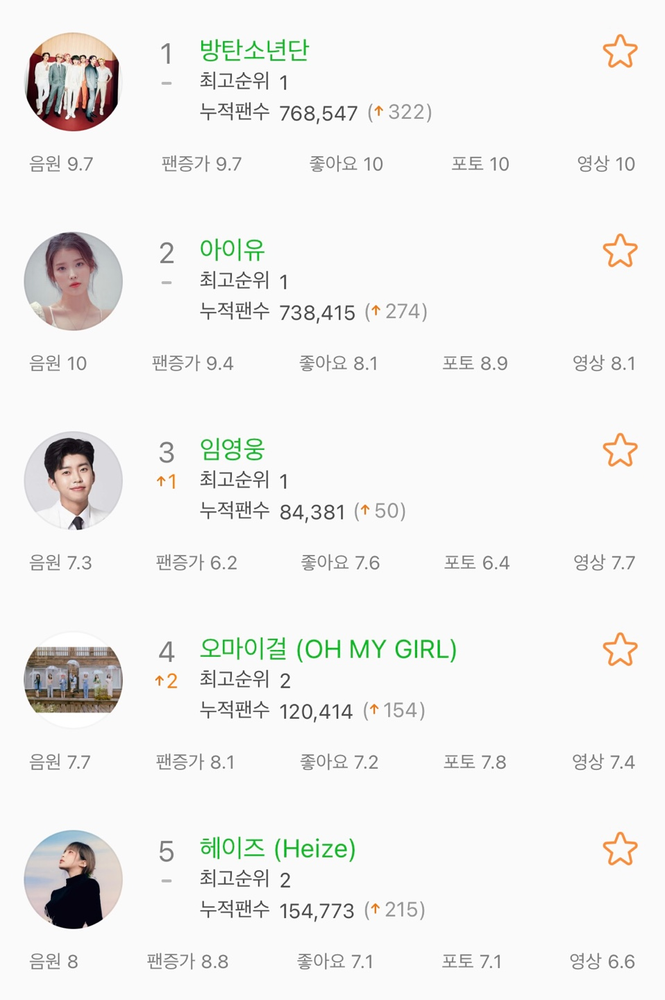\n",
    " 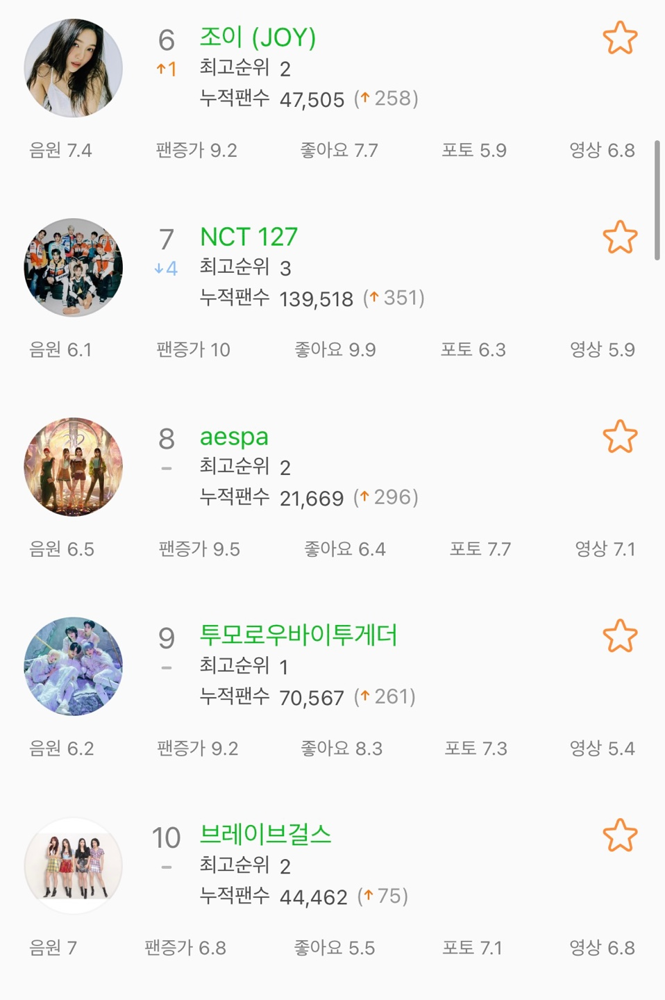\n",
    " 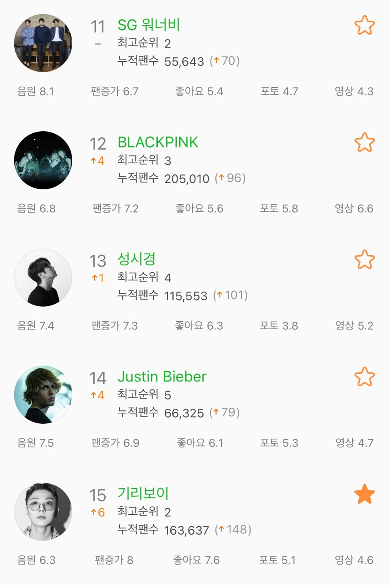\n",
    " 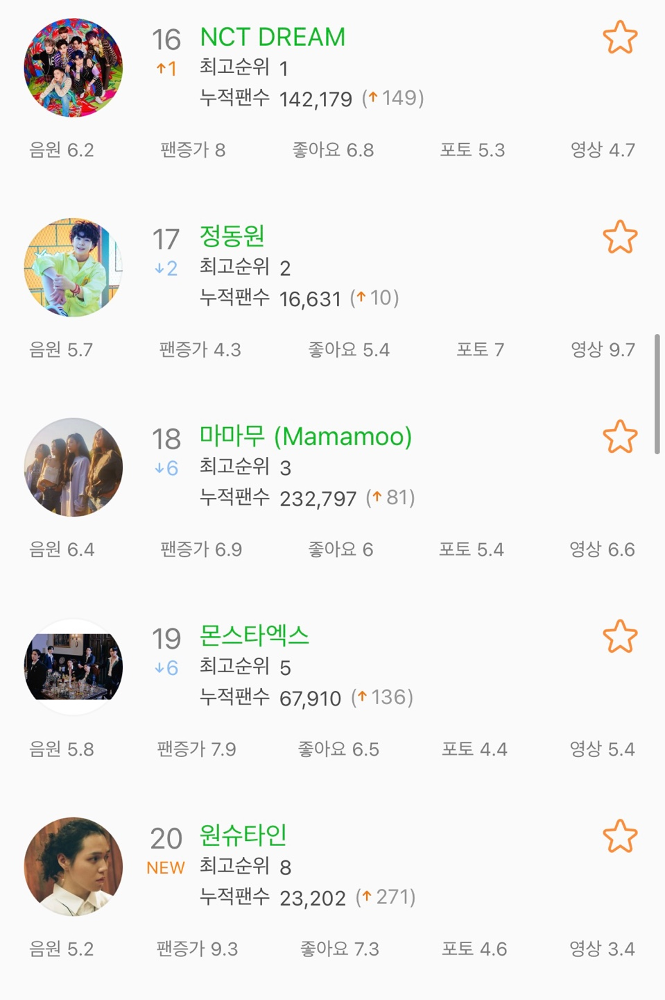 \n",
    "  \n",
    " 다음으로 내가 구현해본 차트이다.  \n",
    "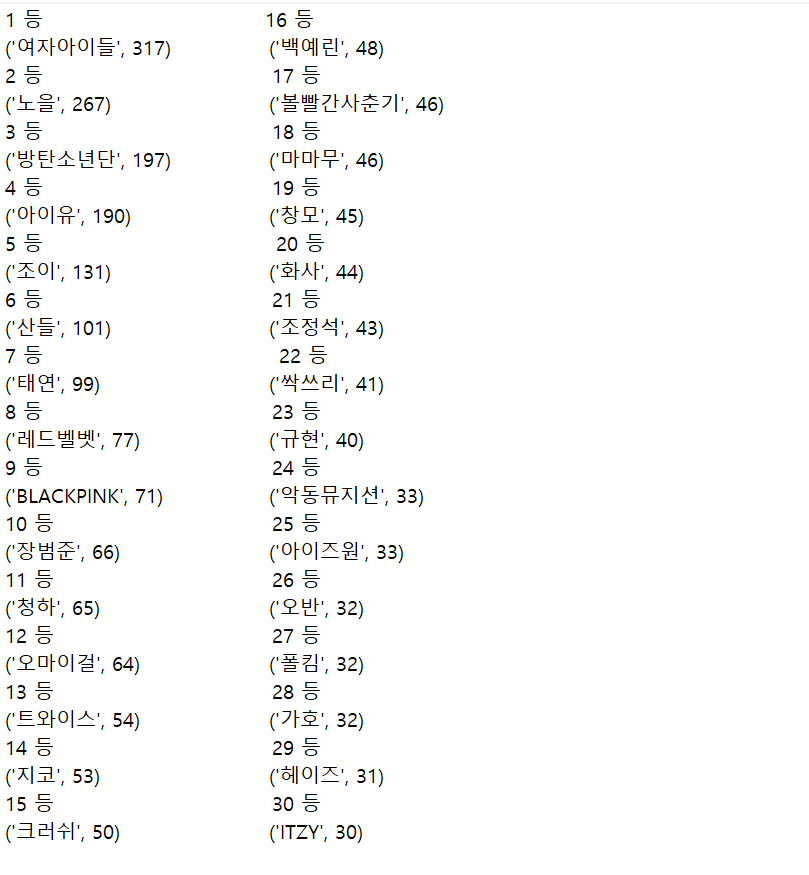 \n",
    " 다음으로 두 차트를 아티스트의 음악 장르로 나누어 분류해 보았다.(**TOP20까지**)   \n",
    " **멜론차트**  \n",
    " 아이돌 : 12 \n",
    "  힙합  :  3 \n",
    " 트로트 :  3 \n",
    " 발라드 :  2  \n",
    " **내가 만든 차트** \n",
    " 아이돌 : 9 \n",
    " 발라드 : 6 \n",
    "  힙합  : 5 \n",
    "  \n",
    " 확실히 멜론차트에는 팬층이 두터운 아이돌이 상위권을 차지하고 있었다. 반면, 내가 분석한 차트는 아이돌이 가장 많긴 했지만, 다른 장르의 아티스트들도 골고루 분포되어 있는 것을 확인할 수 있었다. 이를 토대로, 음원 스트리밍 사이트의 음원 차트는 꽤나 편향되어 있다는 점을 알 수 있다. 또한 TV프로그램 중 '미스터 트롯'이 흥행하면서 잠시나마 트로트의 인기가 급상승했기 때문에 멜론 차트에서 2명의 아티스트가 상위권에 있는 것을 확인할 수 있었지만, 내가 구성한 차트를 통해 일시적인 인기였음을 알 수 있다.  \n",
    "  \n",
    " 내가 재구성한 차트 또한, 단순하게 벅스 주간 차트와 블로그 포스팅 수를 크롤링한 자료를 활용하였으므로 정확한 지표라고 보긴 어렵다. 이에 추가로, 인스타그램 해시태그 수나, 앨범 판매량, 유튜브 조회수, 수상실적 등을 종합하면 더욱 확실한 차트를 구성할 수 있을 것이라 생각한다.  \n",
    " \n",
    " 결론: 내가 만든 차트와 음원 스트리밍 사이트의 실제 차트를 비교했을 때, 꽤나 차이가 있음을 확인할 수 있었다. 음원 스트리밍 사이트는 아이돌에 편향된 차트를 볼 수 있었지만, 내가 만든 차트에서는 다양한 장르의 아티스트들이 고루 분포함을 알 수 있다.\n",
    " \n",
    " \n",
    " \n"
   ]
  },
  {
   "cell_type": "markdown",
   "metadata": {},
   "source": [
    "# 7. 참고문헌\n",
    "\n",
    "-벅스 차트 크롤링  \n",
    "https://cafe.naver.com/itscholar/37846  \n",
    "-네이버 api  \n",
    "https://developers.naver.com/main/  \n",
    "-중복값을 세기 위한 try&except 문  \n",
    "https://infinitt.tistory.com/78 \n",
    "-Beautifulsoup 사용법 \n",
    "https://wikidocs.net/85739 \n",
    "-instagram 크롤링 \n",
    "https://mokeya.tistory.com/68 \n",
    "-dictionary 복사 \n",
    "https://blog.naver.com/hankrah/221889032981"
   ]
  },
  {
   "cell_type": "markdown",
   "metadata": {},
   "source": [
    "# 8. 별첨: (3)의 획득한 데이터 원본\n",
    "\n",
    "**별첨(3) 폴더 확인**\n",
    "\n",
    "# 9. 별첨: (4)의 가공된 데이터 원본\n",
    "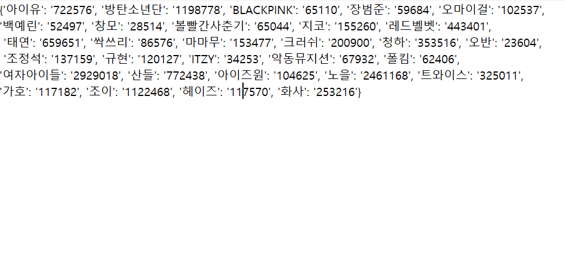\n",
    "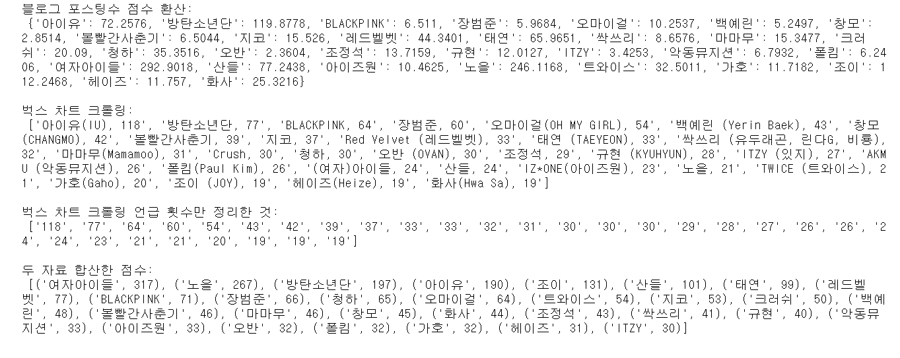\n",
    "\n",
    "# 10. 별첨: 본인이 직접 개발한 Python 소스코드 원본\n",
    "**1. dictionary화 시키기 위해 (3)에서 개발한 코드 **\n",
    "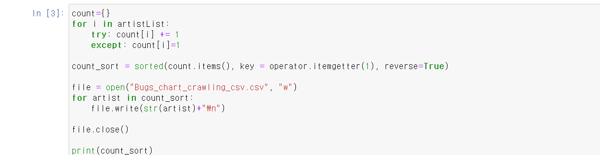  \n",
    "**2. (4)에서 데이터를 가공하기 위해 개발한 코드 **\n",
    "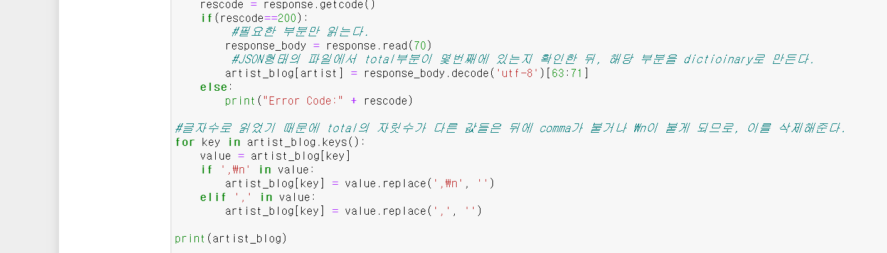\n",
    "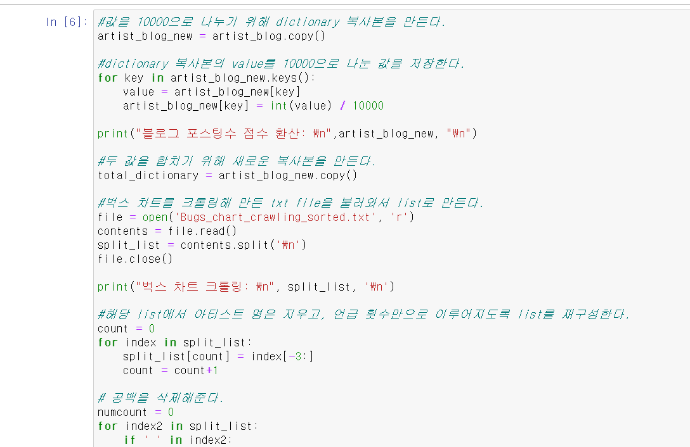\n",
    "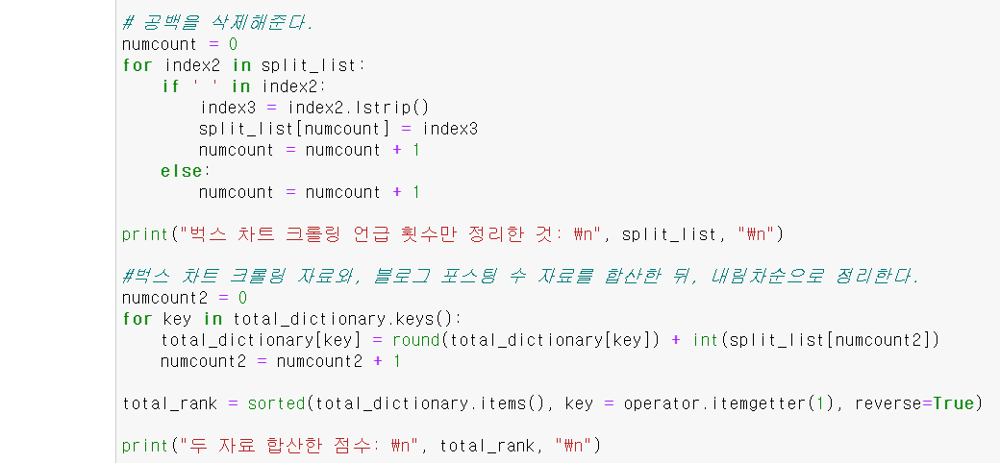"
   ]
  }
 ],
 "metadata": {
  "kernelspec": {
   "display_name": "Python 3",
   "language": "python",
   "name": "python3"
  },
  "language_info": {
   "codemirror_mode": {
    "name": "ipython",
    "version": 3
   },
   "file_extension": ".py",
   "mimetype": "text/x-python",
   "name": "python",
   "nbconvert_exporter": "python",
   "pygments_lexer": "ipython3",
   "version": "3.8.8"
  }
 },
 "nbformat": 4,
 "nbformat_minor": 4
}
